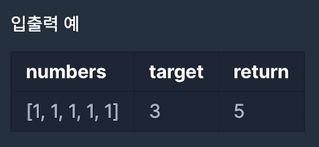

[[info | LEVEL 3 - '타겟 넘버' 문제 보러 가기 !]]
| https://programmers.co.kr/learn/courses/30/lessons/43165

## 문제 설명

n개의 음이 아닌 정수가 있습니다.  
이 수를 적절히 더하거나 빼서 타겟 넘버를 만들려고 합니다.  
예를 들어 [1, 1, 1, 1, 1]로 숫자 3을 만들려면 다음 다섯 방법을 쓸 수 있습니다.

```python
-1+1+1+1+1 = 3
+1-1+1+1+1 = 3
+1+1-1+1+1 = 3
+1+1+1-1+1 = 3
+1+1+1+1-1 = 3
```

사용할 수 있는 숫자가 담긴 배열 numbers, 타겟 넘버 target이 매개변수로 주어질 때 숫자를 적절히 더하고 빼서 타겟 넘버를 만드는 방법의 수를 return 하도록 solution 함수를 작성해주세요.

#### 제한 사항

- 주어지는 숫자의 개수는 2개 이상 20개 이하입니다.
- 각 숫자는 1 이상 50 이하인 자연수입니다.
- 타겟 넘버는 1 이상 1000 이하인 자연수입니다.

#### 입출력 예시



## 문제 접근 방식

더하고, 뺀다는 의미는 `-` 부호를 붙이냐 마느냐의 의미입니다.

모든 경우의 수를 찾는 문제이고 이전에 탐색했던 수에 `number * -1` 연산을 실행 한 뒤 한번 더 탐색을 실행하는 방식이기 때문에 `DFS` 탐색으로 문제에 접근했습니다.

구체적인 풀이는 다음과 같습니다.

결과를 도출한 이후 이전 상태로 돌려놓은 뒤 다른 조건으로 다시 탐색을 진행하는 방식으로 하나의 `DFS` 분기가 2가지 `DFS` 분기로 나누어지도록 문제를 해결했습니다.

> 이 문제에서 2가지 분기는 `+`, `-` 연산

## 풀이 코드

```python:title=Python
def solution(numbers, target):
    answer = 0
    candidates = []

    def DFS(number=0, i=0):
        nonlocal answer

        if i != 0:
            candidates.append(number)

        if len(candidates) == len(numbers):
            if sum(candidates) == target:
                answer += 1
            return

        DFS(numbers[i], i+1) # 첫 탐색
        candidates.pop() # 이전 상태로 되돌려둠
        DFS(numbers[i]*-1, i+1) # 다시 탐색
        candidates.pop()

    DFS()
    return answer
```
