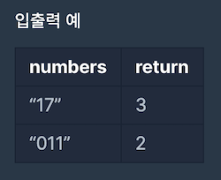

[[info | LEVEL 2 - '소수 찾기' 문제 보러 가기 !]]
| https://programmers.co.kr/learn/courses/30/lessons/42839

## 문제 설명

한자리 숫자가 적힌 종이 조각이 흩어져있습니다.  
흩어진 종이 조각을 붙여 소수를 몇 개 만들 수 있는지 알아내려 합니다.

각 종이 조각에 적힌 숫자가 적힌 문자열 numbers가 주어졌을 때, 종이 조각으로 만들 수 있는 소수가 몇 개인지 return 하도록 solution 함수를 완성해주세요.

#### 제한 사항

- numbers는 길이 1 이상 7 이하인 문자열입니다.
- numbers는 0~9까지 숫자만으로 이루어져 있습니다.
- 013은 0, 1, 3 숫자가 적힌 종이 조각이 흩어져있다는 의미입니다.

#### 입출력 예시



## 문제 접근 방식

주어진 숫자에 대해서 한자리수, 두자리수, ... `최대 7자리수`를 선택해 만들 수 있는 소수가 몇개인지 판별하는 알고리즘 문제입니다.

우선, 주어진 숫자에 대해서 만들 수 있는 모든 수를 만들려면 `순열`을 사용하여 숫자를 조합해야합니다.

예를 들어, `011`이라는 숫자가 주어졌을 때 만들 수 있는 수는 다음과 같습니다.

**숫자 1개를 선택할 경우**

- `0`, `1`

**숫자 2개를 선택할 경우**

- `1`, `10`, `11`

**숫자 3개를 선택할 경우**

- `11`, `101`, `110`

> 문제에서 '`11`과 `011`은 같은 숫자로 취급한다' 가정함

**각각의 수를 set을 사용해 중복을 제거하면 ?!**

- `0`, `1`, `10`, `11`, `110`, `101`

결과로 나온 `set`을 `list`로 포팅한 뒤, 순회하며 소수를 판별해 개수를 세면 끝입니다. !

`Python`에서는 이러한 `순열`를 손쉽게 사용할 수 있도록 도와주는 `itertools` 모듈을 제공합니다.  
`itertools` 모듈에는 `순열`과 `조합`을 사용할 수 있는 `permutations`와 `conbinations`를 제공합니다.  
이번 알고리즘 문제에서는 `permutations` 외장 함수를 사용합니다.

## 풀이 코드

```python:title=Python
import math
import itertools

# 소수인지 판별해주는 함수
def is_decimal(n):
    if n < 2: return False

    to = int(math.sqrt(n)) + 1
    for i in range(2, to):
        if n % i == 0: return False
    return True

def solution(number):
    candidate = set()

    for i in range(len(number)):
        numbers = set(map(int, map(''.join, itertools.permutations(number, i+1))))
        candidate |= numbers # 합집합

    answer = 0
    candidate = list(candidate) # 리스트 변환
    for n in candidate:
        if is_decimal(n):
            answer += 1
    return answer
```
