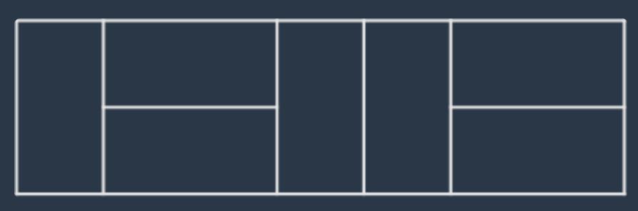
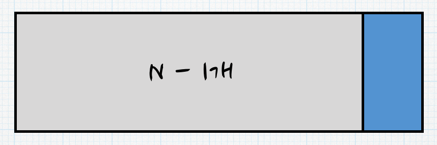
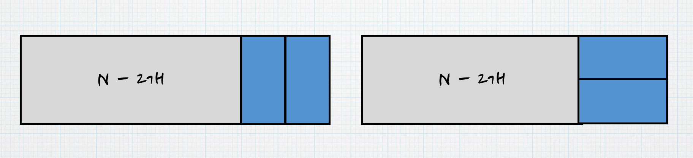

[[info | LEVEL 3 - '2xn 타일링' 문제 보러 가기 !]]
| https://programmers.co.kr/learn/courses/30/lessons/12900

## 문제 설명

가로 길이가 2이고 세로의 길이가 1인 직사각형모양의 타일이 있습니다.  
이 직사각형 타일을 이용하여 세로의 길이가 2이고 가로의 길이가 n인 바닥을 가득 채우려고 합니다.  
타일을 채울 때는 다음과 같이 2가지 방법이 있습니다.

- 타일을 가로로 배치 하는 경우
- 타일을 세로로 배치 하는 경우

예를들어서 n이 7인 직사각형은 다음과 같이 채울 수 있습니다.



직사각형의 가로의 길이 n이 매개변수로 주어질 때, 이 직사각형을 채우는 방법의 수를 return 하는 solution 함수를 완성해주세요.

#### 제한 사항

- 가로의 길이 n은 60,000이하의 자연수 입니다.
- 경우의 수가 많아 질 수 있으므로, 경우의 수를 1,000,000,007으로 나눈 나머지를 return해주세요.

## 문제 접근 방식

DP문제를 접근하기 위해서 케이스를 나눠봅시다.

케이스를 나눌 때는 문제를 다 풀기 직전의 상황부터 거꾸로 푸는 방법이 좋습니다. (TOP-DOWN 접근)

문제에서 바닥의 세로 길이는 2로 고정되어있고, 가로의 길이는 `60,000`이하의 자연수 입니다.  
따라서, 가로의 길이를 기준으로 케이스를 나누는 방향으로 진행하여야 합니다.

위의 문제에서의 경우의 수는 총 2가지입니다.

**첫번째 케이스(N-1)는 다음과 같습니다.**



채울 수 있는 가로의 길이는 1밖에 없으므로 1가지 경우만 나옵니다.

**두번째 케이스(N-2)는 다음과 같습니다.**



하지만 여기서 왼쪽 케이스는 위의 첫번째 케이스에 포함되는 모양입니다.

따라서, 왼쪽 케이스는 개수에 포함하지 않습니다.

**그렇다면 세번째 케이스는?**

`N-3개`인 경우의 모양을 만들면 위의 첫번째, 두번째 케이스에 모두 포함되는 모양이 나와 개수에 포함하지 않습니다.

**결과적으로 위의 상황을 점화식으로 만들면?!**

```python:title=Python
DP(n) = DP(n-1) + DP(n-2)
```

위의 점화식을 구하는 `Python` 코드를 작성하면 됩니다.

## 풀이 코드

```python:title=Python
import sys
sys.setrecursionlimit(60000) # 재귀 호출 범위를 늘려준다.

def solution(n):
    mem = [-1 for i in range(60001)] # 메모이제이션

    def dp(n):
        if mem[n] != -1: return mem[n]
        if n == 0: return 1 # 공집합도 1로본다
        if n == 1: return 1
        mem[n] = (dp(n-1) + dp(n-2)) % 1000000007
        return mem[n]

    return dp(n)
```

## 마무리

`Python`으로 위의 문제를 풀 때 한가지 주의할 점 2가지가 있습니다.

1. 재귀 호출 범위 늘려주기
2. `DP`를 적용하고 `메모이제이션`을 꼭 적용해주어야 시간초과 회피 가능

[[notice | 메모이제이션이란?]]
| DP 알고리즘에서 계산한 결과값을 저장한 후 다음에 해당 결과값이 필요할 때 저장한 값을 가져다 쓰는 기법.  
| 동일한 계산의 반복 수행을 제거하여 프로그램 실행 속도를 빠르게 해줍니다.
