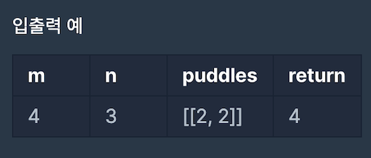

[[info | LEVEL 3 - '등굣길' 문제 보러 가기 !]]
| https://programmers.co.kr/learn/courses/30/lessons/42898

## 문제 설명

계속되는 폭우로 일부 지역이 물에 잠겼습니다.  
물에 잠기지 않은 지역을 통해 학교를 가려고 합니다. 집에서 학교까지 가는 길은 m x n 크기의 격자모양으로 나타낼 수 있습니다.

아래 그림은 m = 4, n = 3 인 경우입니다.


가장 왼쪽 위, 즉 집이 있는 곳의 좌표는 (1, 1)로 나타내고 가장 오른쪽 아래, 즉 학교가 있는 곳의 좌표는 (m, n)으로 나타냅니다.

격자의 크기 m, n과 물이 잠긴 지역의 좌표를 담은 2차원 배열 puddles이 매개변수로 주어집니다.  
집에서 학교까지 갈 수 있는 최단경로의 개수를 1,000,000,007로 나눈 나머지를 return 하도록 solution 함수를 작성해주세요.

#### 제한 사항

- 격자의 크기 m, n은 1 이상 100 이하인 자연수입니다.
  - m과 n이 모두 1인 경우는 입력으로 주어지지 않습니다.
- 물에 잠긴 지역은 0개 이상 10개 이하입니다.
- 집과 학교가 물에 잠긴 경우는 입력으로 주어지지 않습니다.

#### 입출력 예시




## 문제 접근 방식

이번 `등굣길` 문제의 해결법 핵심은 아래와 같습니다.

**'도착 지점으로의 경로 개수 = 왼쪽 루트 개수 + 위쪽 루트 개수'**

예를 들어, [2,3] 지점까지의 경로 개수를 구하고 싶다면 !

- 왼쪽 루트는 [(2-1), 3] = [1,3]
- 위쪽 루트는 [2, (3-1)] = [2,2]

[1,1] ~ [1,3]로 갈 수 있는 경로는 1가지  
[1,1] ~ [2,2]로 갈 수 있는 경로는 2가지

> [2,2]는 [2,1], [1,2] 2가지로 다시 분리

따라서, [2,3] 지점으로 갈 수 있는 경로의 수는 3가지입니다.

위와 같은 규칙을 찾아내는 것이 이번 `문제의 핵심`이라고 볼 수 있습니다 !

#### 점화식으로 표현하면 ?

```
DP(row, col) = DP(row-1, col) + DP(row, col-1)
```

#### 해결 방법

1. 배열은 0부터 시작하지만, 문제에서 [1,1]부터 시작하므로 [n+1, m+1]의 결과값을 저장할 `memo` 변수를 선언
2. 주어진 물 웅덩이의 위치를 `memo`에 `-1`로 저장
   - 주의할 점은 문제에서는 m, n을 m: 가로, n:세로로 정의했다는 것이다.  
     배열로 따지면 [n][m]의 형태로 지정한 것 !
3. 출발 지점 초기값 설정
4. 재귀를 사용하여 위의 점화식을 사용하여 구현
   > 단, 메모이제이션 기법을 사용하여 memo 변수에 값이 있다면 해당 값을 가져와 사용해야합니다.

## 풀이 코드

```python:title=Python
def solution(m, n, puddles):
    # 1부터 시작하는 (1,1) ~ (n, m) 2차원 배열
    memo = [[0 for _ in range(m+1)] for _ in range(n+1)] # 0으로 초기화

    # 주의 ! - 문제에서 주어지는 row, col는 반대!
    for col, row in puddles:
        memo[row][col] = -1 # 갈수 없는 물 웅덩이 표시
    memo[1][1] = 1 # 출발 지점 1로 지정

    def dp(row, col):
        if row < 1 or col < 1 or memo[row][col] < 0:
            return 0
        # 이미 계산한 값이 있으면 값을 바로 가져옴
        if memo[row][col] > 0:
            return memo[row][col]

        memo[row][col] = dp(row, col-1) + dp(row-1, col)
        return memo[row][col]

    return dp(n, m) % 1000000007
```
