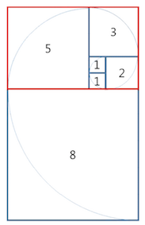

[[info | LEVEL 3 - '타일 장식물' 문제 보러 가기 !]]
| https://programmers.co.kr/learn/courses/30/lessons/43104

## 문제 설명

타일 장식물은 정사각형 타일을 붙여 만든 형태였는데, 한 변이 1인 정사각형 타일부터 시작하여 마치 앵무조개의 나선 모양처럼 점점 큰 타일을 붙인 형태였다.  
타일 장식물의 일부를 그리면 다음과 같다.



그림에서 타일에 적힌 수는 각 타일의 한 변의 길이를 나타낸다. 타일 장식물을 구성하는 정사각형 타일 한 변의 길이를 안쪽 타일부터 시작하여 차례로 적으면 다음과 같다.

[1, 1, 2, 3, 5, 8, ...]

문득 이러한 타일들로 구성되는 큰 직사각형의 둘레가 궁금해졌다.  
예를 들어, 처음 다섯 개의 타일이 구성하는 직사각형(위에서 빨간색으로 표시한 직사각형)의 둘레는 26이다.  
타일의 개수 N이 주어질 때, N개의 타일로 구성된 직사각형의 둘레를 return 하도록 solution 함수를 작성하시오.

#### 제한 사항

- N은 1 이상 80 이하인 자연수이다.

## 문제 접근 방식

문제에서 가장 먼저 파악해야할 것은 `타일 길이의 증가 규칙`과 N개 타일이 주어졌을 때 `가로, 세로 길이`를 어떻게 구할지 먼저 고민해봐야합니다.

[1, 1, 2, 3, 5, 8, ...]

우선 `첫번째`로 문제에서 주어지는 타일 한 변의 길이를 살펴보면 `피보나치 수열`을 이루는 것을 확인 할 수 있습니다.

`두번째`는 둘레를 구하려면 `가로`, `세로`의 길이를 구해야하는데 N개의 타일이 있을 때

- `작은 변`은 'N번째 타일의 길이'
- `긴 변`은 'N번째 타일의 길이 + N-1번째 타일의 길이'

위와 같은 규칙을 찾을 수 있습니다 !

따라서, 문제 접근을 요약하면 다음과 같습니다.

1. 타일의 개수가 피보나치 수열의 패턴으로 계속 증가함을 파악
   - 여기서, 성능 향상을 위해 `메모이제이션` 기법 사용
2. 긴 변 = '(N번째 타일)'이고 작은 변 = '(N-1번째 타일 + N번째 타일)'을 이용해 둘레를 구합니다.
3. 주의할 점은 타일이 `1개`일 때는 예외처리를 해주어야합니다.

## 풀이 코드

```python:title=Python
def solution(N):
    # 입력 범위만큼 DP 결과를 저장할 변수 선언
    mem = [-1 for _ in range(N+1)]

    # n번째 직사각형의 한 변 길이
    def fibonacci(n):
        if mem[n] != -1: return mem[n] # 메모이제이션
        if n == 1: return 1
        if n == 2: return 1
        mem[n] = fibonacci(n-2) + fibonacci(n-1)
        return mem[n]

    # 직사각형의 둘레를 구하는 함수
    def cal_square_round(n):
        long = fibonacci(n) # 긴 변
        short = fibonacci(n-1) + long # 짧은 변
        return short * 2 + long * 2

    # 타일이 1개일 때 예외 처리
    if N == 1: return 4

    answer = cal_square_round(N)
    return answer
```

## 마무리

`DP` 문제 유형이 가장 약했는 데 계속 풀다보니 기본적인 `DP` 문제는 풀 수 있는 자신감이 생긴 것 같습니다 🤘

하도 어려워서 `DP` 문제를 공부하는 방법을 찾아보다가 좋은 글이 있어 공유합니다.

[[simple | ]]
| `DP` 문제를 풀 때 가장 쉽고 편하게 생각하는 방법은 `메모이제이션`이니 `DP`니 하는 것은 전부 전혀 생각하지 않고, 그저 `brute-force하게 풀기`만 생각하는 거에요.  
| '일단 모든 경우를 다 테스트하는 코드를 짠 후에, 중복되는 함수 호출을 `메모이제이션`을 통해 최적화해서 빨리 돌게 만들자.' 라고만 생각하고 짜도 쉬운 문제들은 충분히 풀리거든요.  
| 이런 단계를 통해 DP의 원리와 문제를 푸는 방법에 익숙해진 다음에 좀 더 어려운 기법들과 문제들을 차근차근 풀어나가면서 연습하는게 DP를 공부하기 좋은 방법인 것 같아요.

> [백준 알고리즘 게시판 - 다이나믹 프로그래밍을 공부하는 방법](https://www.acmicpc.net/board/view/22717)
