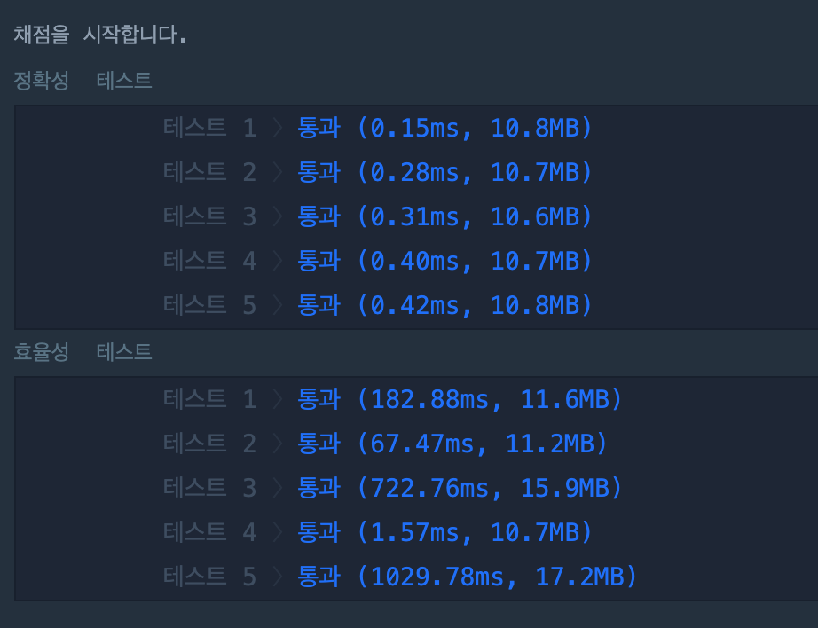

[[info | LEVEL 3 - '단속 카메라' 문제 보러 가기 !]]
| https://programmers.co.kr/learn/courses/30/lessons/42884

## 문제 설명

고속도로를 이동하는 모든 차량이 고속도로를 이용하면서 단속용 카메라를 한 번은 만나도록 카메라를 설치하려고 합니다.

고속도로를 이동하는 차량의 경로 routes가 매개변수로 주어질 때, 모든 차량이 한 번은 단속용 카메라를 만나도록 하려면 최소 몇 대의 카메라를 설치해야 하는지를 return 하도록 함수를 완성하세요.

## 문제 접근 방식

프로그래머스에서 `그리디 알고리즘`으로 분류해둔 문제입니다.

차량들이 카메라에 `최대한 많이 잡히는 구간`에 카메라를 설치하는 방법을 구현하면 됩니다.

문제를 해결하는 접근 방식은 총 2가지가 있습니다.

1. 카메라를 만났는지에 대한 `Check` 배열을 만들고 각 구간을 모두 검사하는 방법

2. 진출 지점 기준으로 정렬 후 카메라에 걸리는 지 확인하는 방법
   - 진출 지점에 카메라를 설치하는 이유는 다음 구간의 차량의 진입 시점과 비교하면 설치한 카메라에 걸리는 지 O(N)으로 확인이 가능하다

#### 1번 방법은 좋은 방법일까 ?

1번 방법대로 풀어도 프로그래머스 채점 기준에서는 아주 아슬아슬하게 통과는 할 수 있습니다 😂

```python:title=Python
def solution(routes):
    answer = 0
    routes.sort(key=lambda x:x[1])
    leng = len(routes)
    checked = [0] * leng

    for i in range(leng):
        if checked[i] == 0:
            camera = routes[i][1] # 진출 지점에 카메라를 갱신
            answer += 1
        for j in range(i+1, leng):
            if routes[j][0] <= camera <= routes[j][1] and checked[j] == 0:
                checked[j] = 1
    return answer
```

> 진출 지점 오름차순 기준으로 정렬 또는 진입 지점 내림차순으로 정렬에 따라 코드가 달라지지만 모두 풀이가 가능합니다.

하지만, 이 경우 모든 상황을 각각 다 확인하므로 O(n^2)의 시간이 걸려 2번 방법이 더 간결하고 문제를 빠르게 해결할 수 있습니다.



> 마지막 효율성 테스트는 1초를 넘었는데도 통과가 되네요 🤔

#### 2번 방식 풀이 과정

1. 진출 지점 기준으로 오름 차순 정렬합니다. (`routes[1]` 기준)
2. 최대 -30000이니 초기 카메라 위치를 -30001로 초기화 해줍니다.
3. `routes` 배열을 반복하면서 카메라가 진입 지점(`route[0]`)보다 작은지 확인합니다.
4. 작다면, 현재 카메라 위치로 해당 차량을 만나지 못했다는 의미이니  
   4-1. 카메라를 추가로 세우고  
   4-2. 가장 최근 카메라의 위치(`route[1]`)를 갱신합니다.

## 풀이 코드

```python:title=Python
def solution(routes):
    answer = 0
    routes.sort(key=lambda x: x[1]) # routes를 차량이 나간 지점 (진출) 기준으로 정렬
    camera = -30001 # -30001부터 카메라 위치를 찾습니다.

    for route in routes:
        if camera < route[0]:
            answer += 1
            camera = route[1]
    return answer
```
