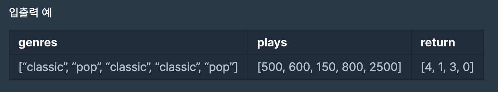

[[info | LEVEL 3 - '베스트 앨범' 문제 보러 가기 !]]
| https://programmers.co.kr/learn/courses/30/lessons/42579

## 문제 설명

스트리밍 사이트에서 장르 별로 가장 많이 재생된 노래를 두 개씩 모아 베스트 앨범을 출시하려 합니다.  
노래는 고유 번호로 구분하며, 노래를 수록하는 기준은 다음과 같습니다.

1. 속한 노래가 많이 재생된 장르를 먼저 수록합니다.
2. 장르 내에서 많이 재생된 노래를 먼저 수록합니다.
3. 장르 내에서 재생 횟수가 같은 노래 중에서는 고유 번호가 낮은 노래를 먼저 수록합니다.

노래의 장르를 나타내는 문자열 배열 genres와 노래별 재생 횟수를 나타내는 정수 배열 plays가 주어질 때, 베스트 앨범에 들어갈 노래의 고유 번호를 순서대로 return 하도록 solution 함수를 완성하세요.

#### 제한 사항

- genres[i]는 고유번호가 i인 노래의 장르입니다.
- plays[i]는 고유번호가 i인 노래가 재생된 횟수입니다.
- genres와 plays의 길이는 같으며, 이는 1 이상 10,000 이하입니다.
- 장르 종류는 100개 미만입니다.
- 장르에 속한 곡이 하나라면, 하나의 곡만 선택합니다.
- 모든 장르는 재생된 횟수가 다릅니다.

#### 입출력 예시



## 문제 접근 방식

**문제의 조건에 맞도록 원하는 구조를 생성한 뒤 정렬을 잘 사용하는 것이 포인트 !**  
`Python`의 `zip` 모듈을 사용하여 장르 종류와 재생횟수를 [장르 종류, 재생횟수]로 함께 묶은 뒤, `해시` 자료구조를 사용해 {장르 종류 : [고유번호, 재생횟수]} 형태를 생성합니다.

> 고유 번호를 재생횟수와 함께 묶는 이유는 문제의 결과가 index를 출력하는 것이기 때문

문제의 베스트 앨범 조건은 다음과 같습니다.

1. 속한 노래가 많이 재생된 장르를 먼저 수록합니다.
   - 장르의 총 재생횟수 순 내림차순 정렬
2. 장르 내에서 많이 재생된 노래를 먼저 수록합니다.
   - 재생횟수 순 내림차순 정렬
3. 장르 내에서 재생 횟수가 같은 노래 중에서는 고유 번호(인덱스)가 낮은 노래를 먼저 수록합니다.
   - 인덱스 오름차순

## 풀이 코드

```python:title=Python
from collections import defaultdict
def solution(genres, plays):
    # zip을 사용해 두 리스트를 합친다.
    genres_with_plays = list(zip(genres, plays))

    # {장르 종류 : [인덱스, 재생횟수]} 구조를 담을 albums 변수
    albums = defaultdict(list)
    idx = 0
    for genre, play in genres_with_plays:
        albums[genre].append((idx, play))
        idx += 1

    top_plays = []
    for key in albums:
        albums[key].sort(key = lambda x:x[0]) # 인덱스 오름차순 - 3번 조건
        albums[key].sort(key = lambda x:x[1], reverse=True) # 재생횟수 내림차순 - 2번 조건

        # 장르의 총 재생 횟수 구하기
        total = sum(int(v) for (idx, v) in albums[key])
        top_plays.append((key, total))

    # 많이 재생된 장르 순으로 정렬 - 1번 조건
    top_plays.sort(key=lambda x:x[1], reverse=True)

    answer = []
    for genre, total in top_plays:
        # 상위 2개만 slice
        top_rate = albums[genre][:2]
        for idx, play in top_rate:
            answer.append(idx)
    return answer
```

## 마무리

이번 프로그래머스 `베스트 앨범`은 2회차로 풀어본 문제입니다.  
문제를 다시 풀어본 뒤, 이전에 풀었던 풀이를 봤는데 다음과 같은 구조를 생성해서 문제를 해결했습니다.

```python:title=Python
# [[총 재생횟수, [[재생 횟수, 인덱스]]]]
[[3100, [[2500, 4], [600, 1]]], [1450, [[800, 3], [500, 0], [150, 2]]]]
```

'총 재생횟수, 재생 횟수, 인덱스' 를 `하나의 리스트`로 담아 문제를 해결했더라구요.

제가 풀었지만 이전 풀이를 보면서 느꼈던 건  
알고리즘은 풀었던 문제도 다시 풀면 다른 접근 방법도 보이기도하고 더 좋은 풀이를 찾을 수도 있어서 `해결했던 문제를 다시 풀어보는 것`도 좋다고 느꼈습니다.
