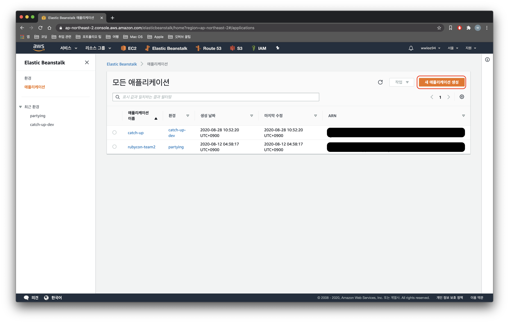
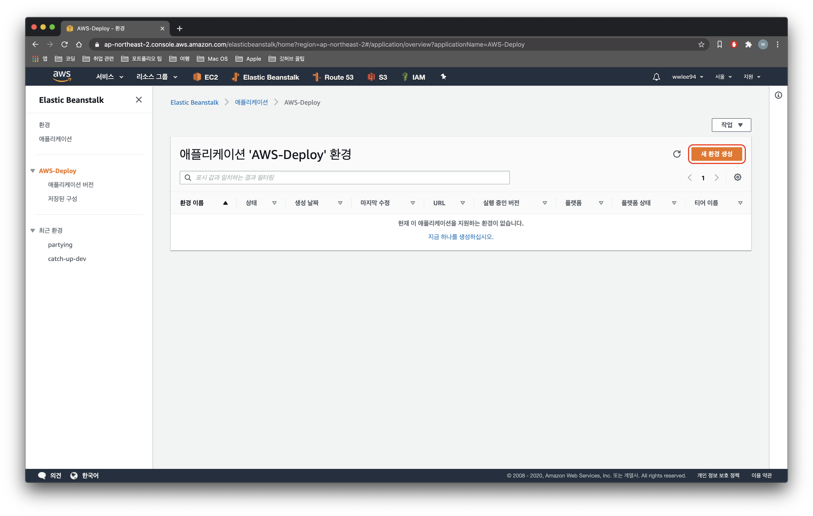
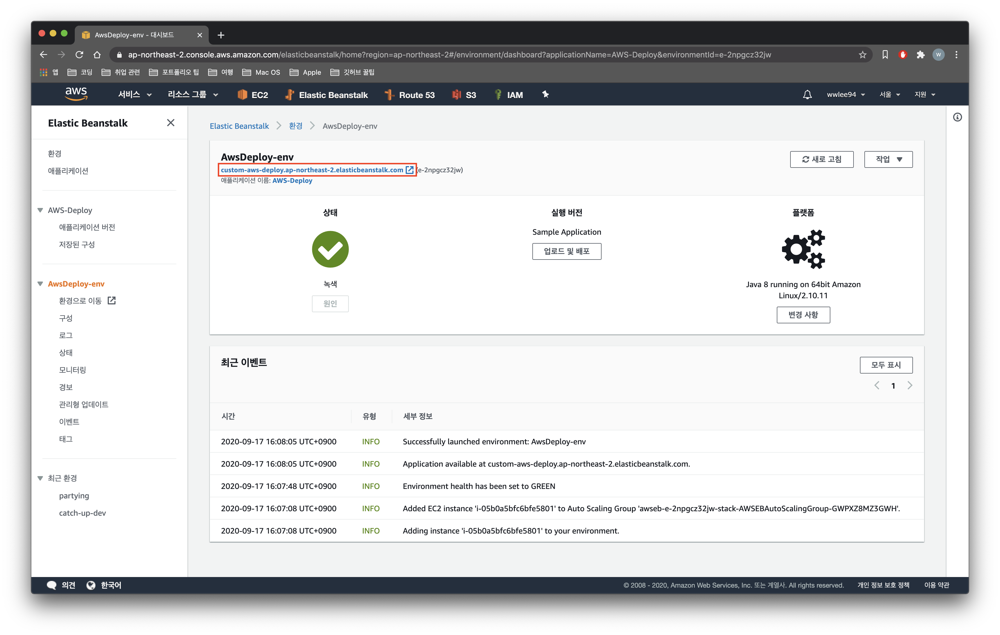

## 개요

저번 포스팅에서는 [AWS Elastic Beanstalk에서 HTTPS를 적용하는 방법](https://wwlee94.github.io/category/blog/aws-eb-https/)에 대해서 알아보았는데요.  
AWS EB로 서버를 배포하는 방법도 공유하면 좋을 것 같아서 준비했습니다 😆

---

AWS EB로 서버를 배포하는 방법은 2가지가 있습니다.

- 첫번째 방법은 직접 [AWS Elastic Beanstalk Console](https://aws.amazon.com/ko/elasticbeanstalk/)로 접근해서 `GUI`로 어플리케이션과 환경을 생성해서 배포 파일을 업로드 하는 방법이 있습니다.

- 두번째 방법은 [EB CLI](https://docs.aws.amazon.com/ko_kr/elasticbeanstalk/latest/dg/eb-cli3-install-advanced.html)를 사용해 터미널 커맨드로 어플리케이션과 환경을 생성한 뒤 배포하는 방법이 있습니다.

가장 먼저 `AWS EB`에 대해 알아본 뒤에 `AWS Console`을 이용해서 배포하는 방법, `AWS CLI`을 이용한 방법에 대해서 알아보겠습니다.

## AWS Elastic Beanstalk 란?

`AWS Elastic Beanstalk`는 AWS에 애플리케이션을 배포하는 가장 빠르면서 간편한 방법이며 AWS 상에 코드을 업로드하기만 하면 용량 프로비저닝, 로드 밸런싱, Auto Scaling, 애플리케이션 상태 모니터링에 대한 정보를 자동으로 처리해주는 서비스입니다.

해당 애플리케이션 운영에 필요한 AWS 리소스 정보를 통합해서 볼 수 있으며 각 개별 리소스에 자유롭게 접근이 가능합니다.  
.NET, JAVA, Node.js, PHP, Python, Ruby 등 다양한 애플리케이션을 지원합니다.

`AWS Elastic Beanstalk`에 대한 직접적인 추가 비용은 없습니다.  
다만, 애플리케이션을 저장 및 실행하는 데 필요한 AWS 리소스 (AWS EC2, AWS RDS 등등)에 대한 비용에 대해서만 지불하면 됩니다.

## 1. AWS Console 을 이용해서 배포하기

`AWS Console GUI`를 이용해 버튼 몇번으로 손쉽게 세팅할 수 있습니다.

우선 [AWS Elastic Beanstalk Console](https://aws.amazon.com/ko/elasticbeanstalk/) 로 접속합니다.

`AWS Elastic Beanstalk 시작하기` 버튼을 눌러서 들어간 뒤 어플리케이션을 새로 생성합니다.

#### 1) 어플리케이션 생성하기



어플리케이션 이름과 설명을 작성한 뒤 `생성` 버튼을 눌러 이동합니다.


이제 어플리케이션이 생성되었습니다 !

> 참 간단 하쥬 ..?

#### 2) 환경 생성하기

이제 어플리케이션을 생성했으니 `새로운 환경`을 생성할 차례입니다.

`새 환경 생성` 버튼을 눌러 이동합니다.



저는 간단한 Java 어플리케이션을 테스트 배포할 예정이므로 `웹 서버 환경`을 선택했습니다.


환경 설정 화면으로 넘어 왔습니다.

환경 이름과 도메인을 작성한 뒤, 도메인은 `가용성 확인` 버튼을 눌러 도메인 체크를 해주세요.


플랫폼은 Java 어플리케이션과 원하는 JDK 버전을 선택합니다.


---

**[선택] 추가 옵션 구성**

현재 화면은 AWS EB에서 제공하는 다양한 설정을 할 수 있는 화면입니다.

서버를 `단일 인스턴스`로도 생성할 수 있고 `사용자 지정` 옵션을 선택해 `AWS ALB`의 로드밸런싱을 설정할 수도 있습니다.

그외에 환경 변수 설정, 인스턴스 설정, 용량 설정, AWS RDS 설정 등등 다양한 설정이 가능합니다.


---

바로 배포 결과를 볼 수 있도록 우선 `샘플 애플리케이션`을 선택한 뒤 `환경 생성` 버튼을 눌러주세요.


#### 3) 샘플 어플리케이션 배포 확인하기

조금만 기다리면 샘플 어플리케이션이 배포가 완료되고 `초록색 체크` 표시가 활성화 됩니다 !

`빨간색 박스` 부분을 클릭해서 이동합니다.



그럼 다음고 같이 샘플 어플리케이션이 성공적으로 배포된 것을 확인할 수 있습니다.


#### 4) 서버 코드 배포하기

이후 새로운 버전으로 배포하길 원한다면 `업로드 및 배포` 버튼을 클릭합니다.


원하는 배포 파일을 선택해 첨부한 뒤 `배포` 버튼을 누르면 동일한 환경에 새로운 레이블로 배포가 진행됩니다.


좌측 사이드바의 `애플리케이션 버전`을 클릭해 들어가 보면 배포 되었던 여러 버전을 확인 할 수 있고 이전 버전으로도 언제든지 되돌아 갈 수 있습니다!


## 2. EB CLI를 이용해서 배포하기

모든 `AWS CLI` 기능들을 이용하기 위해서는 기본적으로 `IAM`에서 생성한 권한을 가지고 있어야합니다.

`IAM`에서 사용자를 생성하면 `aws-access-key` 와 `aws-secret-key`를 발급해줍니다.

위의 Secret 정보를 저장해두거나 `.csv` 파일로 저장해서 필요할 때 확인 할 수 있습니다.

이번 `EB CLI` 방법은 `IAM`에서 발급받은 `aws-access-key` 와 `aws-secret-key`를 가지고 있음을 전제로합니다.

#### 1) EB CLI 설치하기

`EB CLI`를 로컬 환경에서 설치하려면 [EB CLI 프로그램 설치](https://docs.aws.amazon.com/ko_kr/elasticbeanstalk/latest/dg/eb-cli3-install-advanced.html)가 필요합니다.

설치할때는 `pip`를 이용하는게 정신건강에 이롭습니다..


#### 2) 어플리케이션 생성하기

`eb init` 커맨드를 입력해 EB 초기화를 진행합니다.

여기서 초기화는 AWS EB에 `새로운 어플리케이션`을 생성하는 것과 동일한 작업입니다.

**[권한] 'aws-access-key' 와 'aws-secret-key'를 입력합니다.**

저는 이미 입력이 되어있기 때문에 권한을 물어보지 않습니다만 처음 실행하면 다음과 같이 `IAM`에서 발급받은 키를 물어봅니다.


키를 입력하면 다음과 같이 `AWS Console`로 진행할 때와 동일한 설정들을 세팅합니다.

각자의 환경에 맞추어 설정을 진행합니다.

설정 화면에서도 볼 수 있듯이 새로운 어플리케이션 뿐 아니라 기존 어플리케이션과 연동해서 동기화 할 수도 있습니다 !


#### 3) 환경 생성하기

`eb create` 커맨드를 입력해 새로운 환경을 생성합니다.

`AWS ALB`의 로드밸런싱은 종류가 3가지가 있는데 [해당 사이트](https://jins-dev.tistory.com/entry/AWS-%EC%9D%98-%EB%A1%9C%EB%93%9C%EB%B0%B8%EB%9F%B0%EC%84%9CLoad-Balancer-%EC%82%AC%EC%9A%A9%ED%95%B4%EB%B3%B4%EA%B8%B0-ELB-ALB)를 참고 바랍니다.


로드밸런싱 타입을 선택하면 다음과 같이 샘플 어플리케이션이 배포가 됩니다.


`AWS Console`을 들어가서 확인해보면 배포가 진행 중임을 확인할 수 있습니다.


#### 4) 서버 코드 배포하기

서버 코드를 배포하려면 `./elasticbeanstalk/config.yml` 파일에 있는 파일을 수정해야합니다.

`config.yml`파일에 배포할 파일의 경로를 작성해 준 뒤 `eb deploy` 커맨드를 입력하면 배포 끝입니다 !

```yml:title=config.yml
branch-defaults:
  default:
    environment: aws-eb-deploy-dev
    group_suffix: null
global:
  application_name: aws-eb-deploy
  branch: null
  default_ec2_keyname: null
  default_platform: Java 8
  default_region: ap-northeast-2
  include_git_submodules: true
  instance_profile: null
  platform_name: null
  platform_version: null
  profile: eb-cli
  repository: null
  sc: null
  workspace_type: Application
# *업로드할 파일 경로 설정 가능*
deploy:
  artifact: build/libs/rubycon-team2-0.0.1-SNAPSHOT.jar
```

## 마무리 

'AWS EB'로 서버를 배포하는 방법은 전혀 어렵지 않습니다.

'AWS EB'를 이용해서 서버를 손쉽게 배포해보세요!