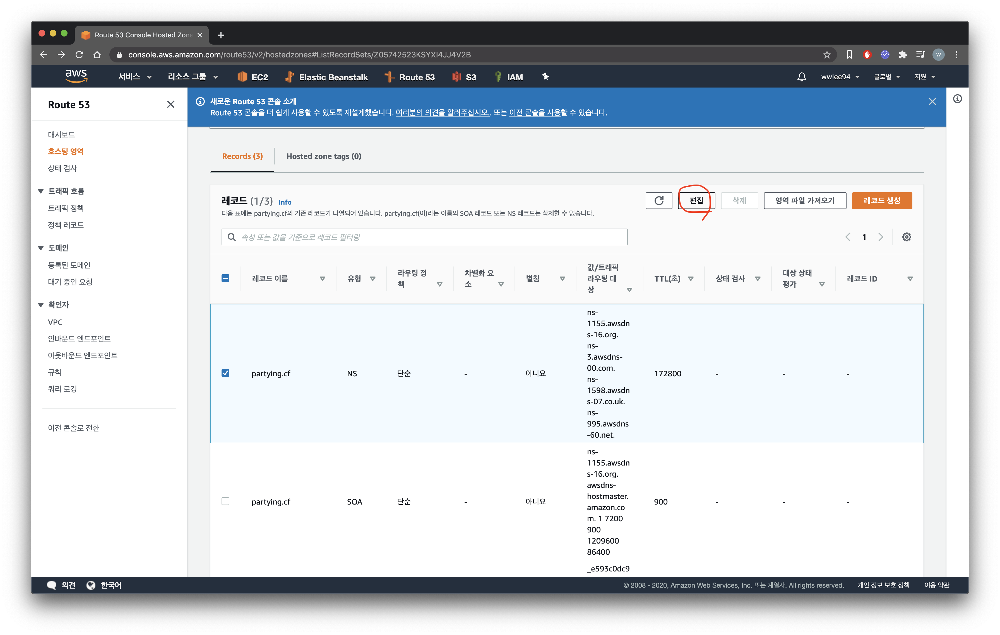
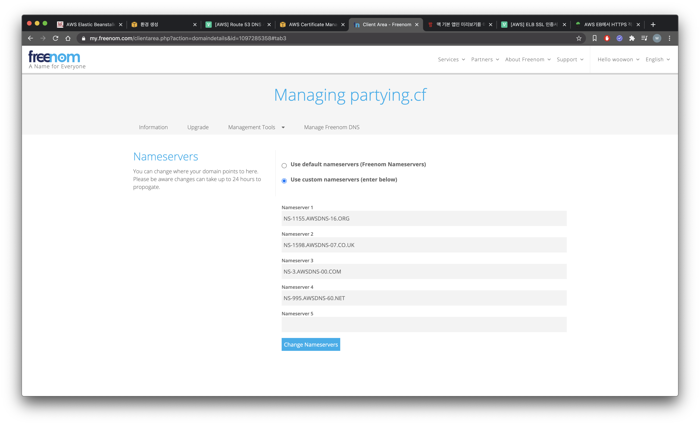

이번 포스팅에서는 AWS Elastic Beanstalk에서 HTTPS를 적용하는 방법에 대해서 다룹니다.

간단히 HTTPS에 대해서 알아본 뒤, 무료로 도메인을 구매하는 법, 구매한 도메인을 Route 53에 등록하는법, AWS EB에 HTTPS 프로토콜을 적용하는 방법을 순차적으로 다루겠습니다.

## HTTPS란?

기존의 HTTP는 전송하는 데이터를 암호화하지 않고 평문으로 통신을 하기 때문에 도청, 변조 등의 보안에 매우 취약한 프로토콜입니다.  
이를 보완하기 위해 나온 프로토콜이 `HTTPS`입니다.

`HTTPS`는 SSL 증명서를 통해 서버 또는 클라이언트의 신원을 확인하고, 데이터를 암호화, 인증, 안정성을 제공해주기 때문에 기존의 `HTTP` 프로토콜보다 안전합니다.

저의 경우는 개발하는 서비스의 보안의 문제점을 해결하기 위해서 + Facebook Login API가 배포 환경에서 `HTTPS`만 제공하기 때문에 `HTTPS`를 도입했습니다.

## AWS Elastic Beanstalk에 HTTPS를 적용하기 전에 !

사전에 준비해야할 것이 2가지가 있습니다.

1. DNS 서비스를 이용해 도메인 구매하기 (무료도 있음)
2. Route 53에 구매한 도메인 등록하기

✔ Amazon 서비스에서 발급해주는 SSL 인증서는 무료인 대신에, 해당 도메인의 DNS 서버로 Route 53을 사용해야하며 Route 53을 사용하기 위해서는 도메인이 필요합니다.

### 1. DNS 서비스에서 도메인 구매하기

#### 1) DNS(Domain Name System)란?

`DNS`는 도메인 이름을 네트워크 주소로 바꾸거나 그 반대의 변환을 수행해주는 시스템입니다.  
즉, `DNS`는 요청 받은 도메인 이름을 조회해 해당 도메인 이름과 연결된 IP 주소를 알려줍니다.

#### 2) 도메인 구매하기

Route 53에서 인기있는 도메인(`.com`, `.net` 등등)을 구매해도 좋지만 금액을 주고 구매해야합니다.

저는 https://my.freenom.com 라는 곳에서 무료도 `partying.cf`라는 도메인을 발급 받았습니다.

### 2. Route 53에 구매한 도메인 등록하기

도메인을 구입한 이후에는 구매한 도메인의 DNS 서버로 Route 53을 지정해야합니다.

https://console.aws.amazon.com/route53/v2/home#GetStarted 에 접속해서 '호스팅 영역'으로 이동합니다.

도메인 정보를 입력하고 '호스팅 영역 생성' 버튼을 누릅니다.

Route 53에 도메인을 등록했으면 '편집' 버튼을 누릅니다.

생성된 레코드의 'Value' 탭에는 4개의 도메인이 자동으로 생성됩니다.  
해당 도메인이 제가 구입한 도메인(partying.cf)이 사용할 '네임서버'입니다.  
AWS Route 53에서 제공되는 네임서버(NS) 레코드를 도메인을 구매한 홈페이지로 들어가서 네임서버 정보를 입력해주어야합니다.

### 3. AWS ACM 공인인증서 발급 받기

`ACM`은 AWS Certificate Manager의 줄임말로, AWS의 인증서 관리를 위한 서비스입니다.  
이 서비스에서는 공인인증서, 사설인증서 등을 모두 생성할 수 있고 이곳에서 생성된 공인인증서를 통해서 `HTTPS`를 적용할 수 있습니다.

https://ap-northeast-2.console.aws.amazon.com/acm/home

먼저, AWS ACM 서비스로 들어가서 공인 인증서를 요청합니다.

다음 화면으로 넘어가면 도메인 이름을 추가하는 창이 나타납니다.

`partying.cf`

- 기본 도메인을 적용

`*.partying.cf`

- 모든 서브 도메인을 포함해 적용

저는 `Freenom`이라는 사이트에서 도메인을 직접 구매했고 수정할 권한이 있기에 `DNS 검증`을 선택해 진행하였습니다.

최종적으로 검토 화면이 나타나면 입력된 내용을 확인 한 뒤 '확인 및 요청' 버튼을 누릅니다.

이제 도메인 검증할 준비가 완료되었습니다.

아직 해당 도메인을 검증할 방법이 없기 때문에 검증 상태가 `검증 보류`로 나타납니다.  
도메인의 DNS 구성에 CNAME 기록을 Route 53에 추가하여 검증할 수 있으며, 검증 이름 및 값은 아래와 나옵니다.
하지만, 직접 추가하지 않아도 `Route 53에서 레코드 생성` 버튼을 클릭하면 자동으로 Route 53에 등록이 됩니다.

실제 검증이 되기 까지는 5분 이내로 걸립니다.  
검증이 완료 되고 다음과 같이 `발급 완료` 상태로 변하면 성공입니다 !

추가적으로 Route 53으로 가보면 CNAME이 자동으로 생성된 화면을 볼 수 있습니다.

### 4. AWS Elastic Beanstalk에 ACM 인증서 등록하기

이제 Elastic Beanstalk 화면으로 이동합니다.

https://ap-northeast-2.console.aws.amazon.com/elasticbeanstalk/home

`HTTPS`를 적용할 원하는 어플리케이션의 만들어진 환경으로 이동합니다.

'구성' 버튼을 눌러 이동합니다.

드래그하면서 내리면 '로드밸런서' 탭이 나타납니다.

'편집'을 눌러서 이동합니다.

로드밸런서 기본 설정으로는 HTTP 포트인 80만 등록되어 있을 것입니다.  
'리스너 추가' 버튼을 눌러 이동합니다.

입력하는 모달창이 나타나는데 다음과 같이 입력합니다.

- 포트 : 443
- 프로토콜 : HTTPS
- SSL 인증서 : 이전에 발급했던 AWS 공인 인증서

작성 이후 '추가' 버튼을 누릅니다.

다음과 같이 443 포트가 생성 대기 중이라고 뜨면 됩니다.  
아래로 드래그해서 '적용' 버튼을 누릅니다.

리스너 설정이 반영되어 적용 중인 모습입니다.  
상태가 '확인'으로 변하면 설정 적용이 잘 되었다는 의미입니다 !

## 참고

Route 53을 A 레코드(별칭)을 이용하여 AWS EB로 배포한 인스턴스와 연결 시켜줄 수 있습니다.

## 결과

등록한 도메인으로 `HTTPS`로 접속해보면 잘 적용이 된 것을 볼 수 있습니다.

## 마무리

이상으로 AWS EB로 배포했던 서비스에 HTTPS를 적용하는 방법을 알아보았습니다.

과정이 AWS Console로 이루어져 이미지가 많다보니..

포스팅 시간이 길어졌지만 하나의 플로우를 이해하게 되어서 기쁩니다 😆

좋은 참고 자료가 되었으면 좋겠습니다.
