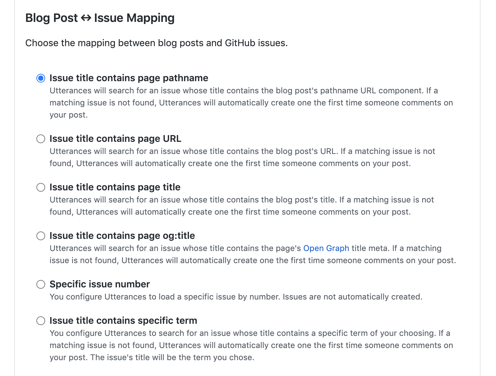
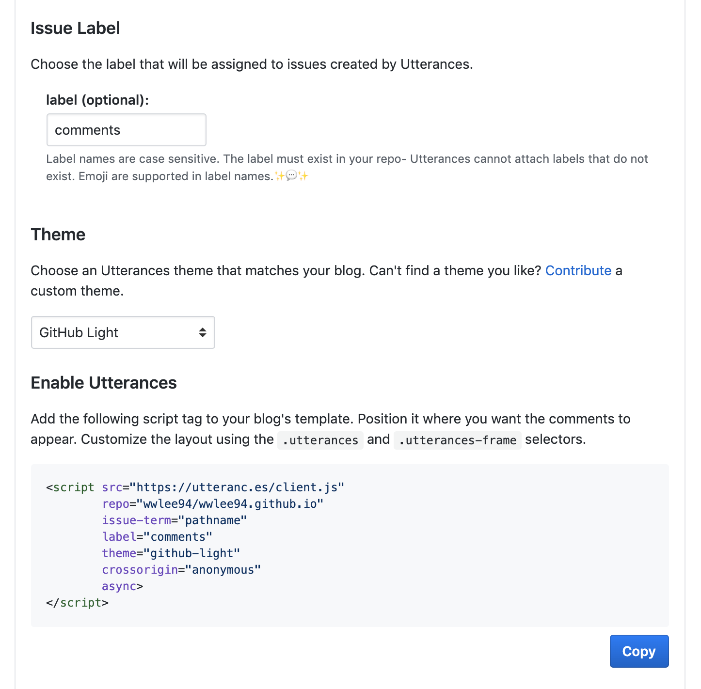
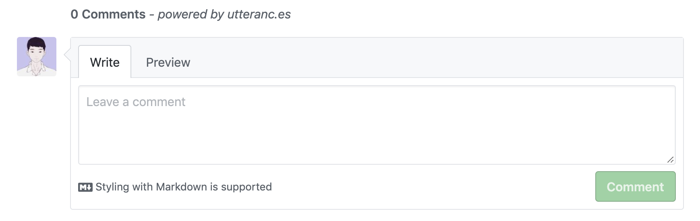

## 소셜 댓글 서비스란?

댓글을 직접 구현하지 않고 위젯의 형태로 서비스에 삽입할 수 있는 댓글 전문 서비스로 여러 개인 블로그에 사용됩니다.

정적 사이트에 댓글 기능을 넣기 위한 가장 편리하고 간단한 방법이라고 할 수 있습니다.

## 어떤 서비스을 선택할까?

여러 서비스들을 알아보던 중 가장 많이 쓰이고 `SEO(검색엔진최적화)` 측면에서 유리한 `Disqus`라는 소셜 댓글 서비스를 찾았습니다.  
`Disqus`의 경우는, [댓글을 남기는 사람에게 SEO 혜택이 돌아가는 구조](https://hackya.com/kr/%EB%94%94%EC%8A%A4%EC%BB%A4%EC%8A%A4-%EB%8C%93%EA%B8%80%EC%9D%98-%EB%86%80%EB%9D%BC%EC%9A%B4-seo-%ED%98%9C%ED%83%9D/) 로 구성되어 있고 유명한 서비스에 고품질의 백링크를 얻을 수 있다는 장점이 있었습니다.

> 백링크란? 다른 사이트에서 내 사이트가 링크된 것

하지만, `Disqus` 위젯이 정적인 사이트에서 돌아감에도 무겁다는 후기가 있어서 다른 서비스를 서칭하던 도중 `utterances`라는 또 다른 소셜 댓글 서비스를 찾았습니다.  
`Disqus`에 비해 가볍고 깔끔한 UI와 거대한 `GitHub` 플랫폼 계정과 연동 가능하고 댓글 알림 기능까지 제공해주어 저는 `utterances`를 선택하게 되었습니다 !

## 그렇다면 utterances 위젯을 도입해보자 !

[[notice | utterances 설치 전에]]
| 먼저 GitHub Repo를 생성해주고 따라와주세요 !  
| 저는 이슈 받을 Repo와 블로그 Repo를 동일하게 지정하였습니다.

### 1. utterances app 을 설치합니다.

**https://utteranc.es** 에 접속해 깃 레퍼지토리를 utterances와 연동해줍니다.


저는 모든 레퍼지토리에 대해서 연동할 필요는 없으므로 `블로그`를 위한 깃 레퍼지토리만 허용 해주었습니다.

### 2. Blog Post ↔️ Issue Mapping 방식 선택

utterances는 게시글 하나에 래퍼지토리의 이슈 하나가 연동되는 시스템입니다.  
따라서, 게시글(Posts)와 지퍼지토리의 이슈(Issue)를 어떻게 매핑할 것인지 선택 해야합니다.



매핑 종류는 총 6가지로 각자 원하는 블로그 구조에 맞게 선택하여 진행하면 됩니다.

저는 1번 `Pathname`을 선택했습니다.

1. Pathname
   - 포스트의 `pathname`으로 이슈를 생성합니다.  
     Ex) posts/{포스팅 이름}

### 3. utterances 설정 코드 적용하기



각자 원하는 `Label (깃 이슈 라벨)` 명칭과 `Theme (테마)`을 선택하고 `Copy` 버튼을 클릭하여 댓글이 들어가길 원하는 위치에 붙여 넣어 주면 됩니다.

### 만약 React를 사용한다면?

다음과 같은 `Utterances` 컴포넌트를 작성합니다.

```typescript:title=Utterances.tsx
import React, { createRef, useLayoutEffect } from 'react';

const src = 'https://utteranc.es/client.js';

export interface IUtterancesProps {
  repo: string;
  theme: string;
}

const Utterances: React.FC<IUtterancesProps> = React.memo(({ repo, theme }) => {
  const containerRef = createRef<HTMLDivElement>();

  useLayoutEffect(() => {
    const utterances = document.createElement('script');

    const attributes = {
      src,
      repo,
      theme,
      'issue-term': 'pathname',
      label: '✨💬 comments ✨',
      crossOrigin: 'anonymous',
      async: 'true',
    };

    Object.entries(attributes).forEach(([key, value]) => {
      utterances.setAttribute(key, value);
    });

    containerRef.current!.appendChild(utterances);
  }, [repo]);

  return <div ref={containerRef} />;
});

Utterances.displayName = 'Utterances';

export default Utterances;
```

이후에 `Utterances` 컴포넌트를 호출하여 원하는 위치에 삽입하면 끝 !

```typescript
...
<Utterances repo='wwlee94/wwlee94.github.io' theme='github-light' />
```

## 결과 화면



궁금한 사항이 있으시면 댓글로 남겨주세요 !  
긴 글 봐주셔서 감사합니다 🙇🏻‍♂️

## 참고 문서

[Disqus의 리소스 ](https://blueshw.github.io/2020/05/20/disqus-to-utterances)  
[Gatsby에 utterances 도입하기](https://imch.dev/posts/build-a-blog-with-gatsby-and-typescript-part-4)
