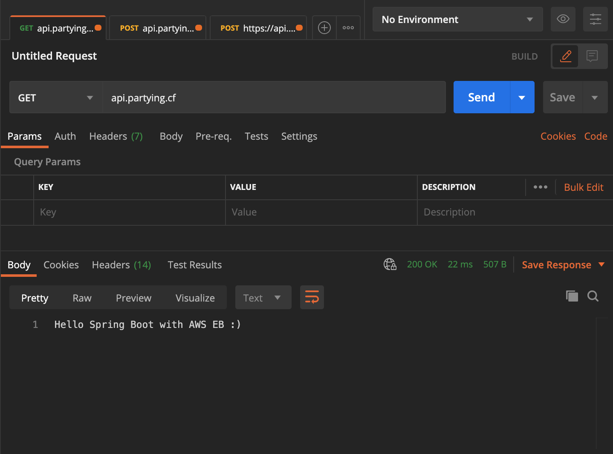
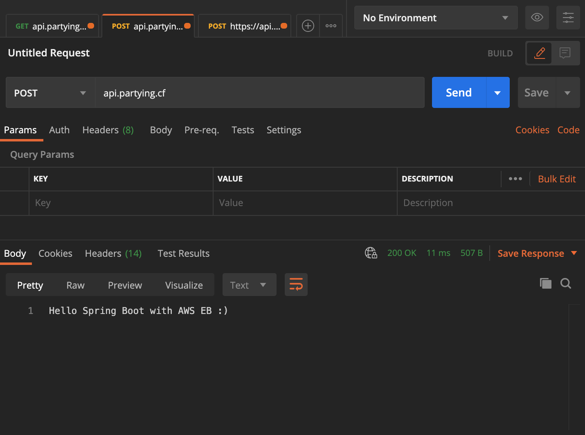
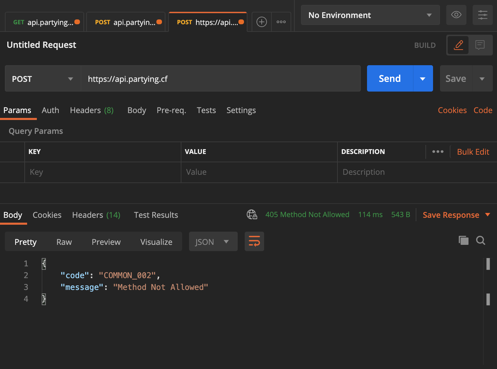
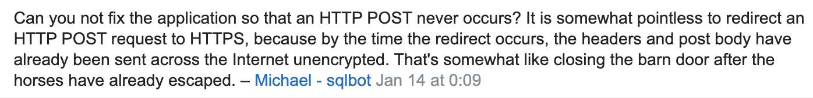

## 개요

최근 저는 [루비콘 멘토링 프로젝트](https://lubycon.io/magazines) 라는 곳에서 2기 멘토링에 참여하여 프로젝트를 진행하고 있습니다 !

프로젝트는 `Spring` 기반으로 API를 구축한 뒤 `Github CI/CD` 기능을 이용해 빌드 및 `AWS EB` 배포 자동화를 구축하였는데요.

서버는 `Application` 레벨의 로드밸런서를 이용하여 `HTTPS`를 적용하였고 `HTTP` 프로토콜로 접근하게 되면 `HTTPS`로 리다이렉트하는 방식으로 서버를 구축해두었습니다.

이후, 배포한 서버에 간단한 API 테스팅을 진행해 보았는데 다음과 같은 이슈가 발생하였습니다.

#### 이슈 발생

- HTTP POST 메서드를 호출하면 리다이렉트 이후 HTTPS GET 메서드로 `변환되어 호출`되는 이슈

**1. 정상적인 GET 메서드 호출**

- `api.partying.cf` -> `http://api.partying.cf`로 요청됨 !
  

**2. HTTP -> HTTPS 리다이렉트 되면서 GET 메서드로 변형된 POST 호출**

**3. 첫 호출 시 HTTPS POST로 호출하면 정상 호출**

- `Party-ing` API 서버의 `/` POST는 없으므로 에러 메시지는 정상 호출 ✔️
  

#### 리다이렉트시 메서드가 변경되는 이유

스프링의 Default 리다이렉트 HTTP 상태 코드는 `302`이고 AWS ALB의 Default 리다이렉트 HTTP 상태 코드도 `302` 입니다.

애초에 `302` 코드는 `GET` 또는 `HEAD` 이외의 요청에 대해서 사용자가 요청 조건을 변경 할 수 있기에 사용자를 확인할 수 없는 경우 리디렉션 된 요청에서 메서드를 변경할 수 없도록 지정한다는 [RFC2616 HTTP 스펙](https://www.w3.org/Protocols/rfc2616/rfc2616-sec10.html#sec10.3.3)이 있는 것으로 확인했습니다.

---

또한, `Stackoverflow`에서 다음과 같은 의견도 존재했습니다. (어느 개인의 의견입니다.)

링크 : https://stackoverflow.com/questions/59719772/redirection-of-http-to-https-in-the-aws-application-load-balancer-converts-post

HTTP POST 요청을 HTTPS로 리다이렉션하는 것은 리다이렉션이 발생할 때 헤더와 게시물 본문이 이미 암호화되지 않은 상태로 인터넷을 통해 전송 되었기 때문에 의미가 없는 행동이라는 의견입니다.

#### 그럼에도 동일한 HTTP 메서드로 요청하려면?

_그렇다면 만약 리다이렉트 되더라도 기존의 메서드 그대로 사용하려면 어떻게 해야할까?_  
답은 `307` HTTP 상태 코드를 이용하는 것입니다.

_그럼 현재 서버들은 왜 307 대신 302를 계속 사용하고 있을까?_  
그 이유는 현재의 최신 브라우저들은 `307` HTTP 상태 코드를 처리할 수 있지만, 오래된 브라우저들은 `307` 코드를 처리할 수 없기 때문에 호환성 때문에 계속 `302` 를 사용한다고 합니다.

#### AWS ALB에서 리다이렉트 코드를 변경할 수 있을까?

아쉽지만.. 😭

AWS ALB에서는 `307` HTTP 상태 코드를 지원하지 않는 것을 확인했습니다.

링크 : [Amazon ALB - Redirect changes http method to GET](https://stackoverflow.com/questions/56893149/amazon-alb-redirect-changes-http-method-to-get)

## 마무리

저는 위의 이슈가 서버 구조를 잘못 짰거나 코드에 문제가 있다고 생각했지만, 애초에 RFC 스펙에서 설계하고 예상된 동작임을 확인했습니다.

제가 공유한 내용들이 도움이 됬기를 바라면서 이만 마치겠습니다 :)

## 참고 사이트

1. [What is the correct behavior expected of an HTTP POST => 302 redirect to GET?](https://stackoverflow.com/questions/17605915/what-is-the-correct-behavior-expected-of-an-http-post-302-redirect-to-get)
2. [Why doesn't HTTP have POST redirect?](https://softwareengineering.stackexchange.com/questions/99894/why-doesnt-http-have-post-redirect)
