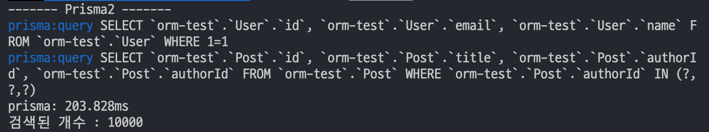
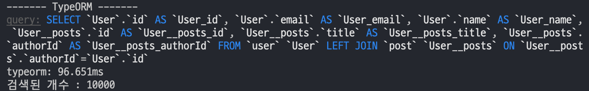

## 개요

최근 [Prography](http://prography.org/) 라는 IT 대외동아리 모임에 참여하여 프로젝트를 `NodeJS`런타임과 `Express`를 사용하여 개발을 진행했습니다.

같은 팀원과 의견을 나누면서 팀 개발에는 `JavaScript`보다 `TypeScript`언어가 적합하다고 생각해 채택했고  
`ORM`(Object Relatinal Mapping)은 `Prisma`와 `TypeORM`를 고민하던 중 아래와 같은 이유로 `Prisma`를 채택했습니다. (Prisma2 버전)

1. Node.js 와 TypeScript 를 위한 Auto-generated & Type-safe 한 `Querybuilder`를 제공해준다.

2. DB 마이그레이션, 덤프, 데이터 제어를 위한 CRUD 형태의 API 기능 제공

   - `schema.prisma` 데이터 모델 파일을 수정해 데이터 모델과 DB 마이그레이션을 자동으로 수행 가능

3. `Prisma Studio` 라는 GUI Database Tool 제공

## 베타 버전의 한계 ?

위와 같은 이유로 `Prisma`를 채택하여 개발을 진행했지만 다음과 같은 몇 가지 베타 버전의 문제점을 마주하게 되었습니다. 😭

1. [Multi-field primary ID 이슈](https://github.com/prisma/prisma-client-js/issues/710)

   > 현재 이슈 등록 후 .8버전이 나오면서 해결 완료 !

2. [Prisma Fluent API의 성능에 대한 의문](https://github.com/prisma/prisma/issues/1984)

   > Fluent API로 쿼리를 날리면 쿼리문이 Join되지 않고 여러 쿼리로 분리되서 호출됨 (DB 요청 비용 증가)

3. 환경 별 설정 분리의 불편함

   > Prisma migrate 기능의 Default PATH가 prisma/.env 경로로 고정되어 있다 (변경 불가 😂)

   따라서, dotenv cli를 사용해 `.env`파일을 직접 지정해 주어야하는 불편함 (너무 불편..)

## Prisma 와 TypeORM 성능 비교

[[info | 조건 ]]
| 서로 다른 DB 두개를 생성해 각각 총 10000개의 posts 데이터를 생성하여 테스트를 진행했습니다.
| 개인적으로 진행한 테스트이기 때문에 오차가 발생할 수 있습니다.

#### 모델링

##### 1. Prisma Model

```graphql:title=Prisma-Model
model Post {
  id        Int     @id @default(autoincrement())
  title     String
  author    User?   @relation(fields: [authorId], references: [id])
  authorId  Int?
}

model User {
  id    Int     @id @default(autoincrement())
  email String  @unique
  name  String?
  posts Post[]
}
```

##### 2. TypeORM Model

```typescript:title=TypeORM-Model
@Entity()
export class Post {
  @PrimaryGeneratedColumn()
  id!: number;

  @Column()
  title!: string;

  @Column()
  authorId!: string;

  @ManyToOne(type => User, user => user.posts)
  author!: User;
}

@Entity()
export class User {
  @PrimaryGeneratedColumn()
  id!: number;

  @Column()
  email!: string;

  @Column()
  name!: string;

  @OneToMany(type => Post, post => post.author)
  posts!: Post[];
}
```

#### 테스트

##### 1. Prisma 코드

```typescript:title=Prisma2
console.log('------- Prisma2 -------');
console.time('prisma');
await prisma.user.findMany({
  include: { posts: true },
});
console.timeEnd('prisma');
```

**결과**



##### 2. TypeORM 코드

```typescript:title=TypeORM
createConnection().then(async connection => {
  console.log('------- TypeORM -------');
  const repository = connection.getRepository(User);

  console.time('typeorm');
  const users2 = await repository.find({ relations: ['posts'] });
  console.timeEnd('typeorm');
});
```

**결과**



## 결론

`Prisma` (180-240ms), `TypeORM` (90-120ms) 여러번 실행해보니 대략적인 결과가 나왔습니다.

시간 차이가 나는 이유는 아무래도 `Prisma`는 쿼리를 2번 나누어 보내고, `TypeORM`은 Join 시킨 1번의 쿼리로 보내서 차이가 생기는 것 같습니다.

`Prisma`가 `Optimize`가 잘 안되어 있는 건지..?

확실치 않지만 아무래도 베타 버전이기에 사용을 고민하는 개발자분이 있다면 깊게 고민하시고 기술을 선택하셨으면 합니다 !

#### UPDATE

현재는 베타 버전에서 Prisma 2.0 알파 버전으로 업데이트 됨에 따라 베타 버전보다 더 안정적인 모습을 보여줄 수 있을 거라 생각합니다.

**버전 종류**
- https://www.npmjs.com/package/prisma2/v/2.0.0-alpha.719?activeTab=versions

**버전 릴리스 업데이트 내용**
- https://github.com/prisma/prisma/releases