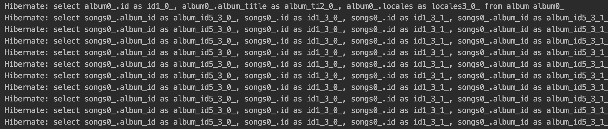
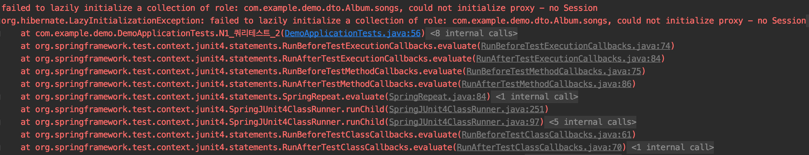
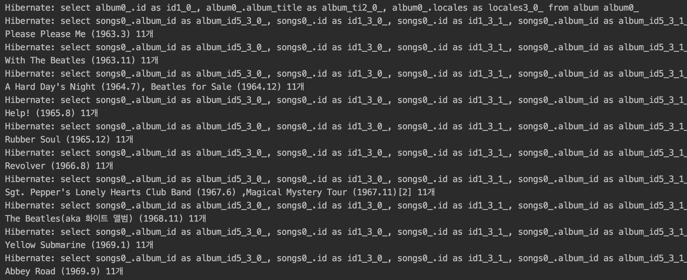
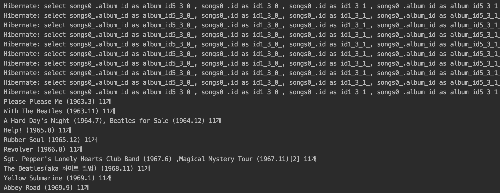
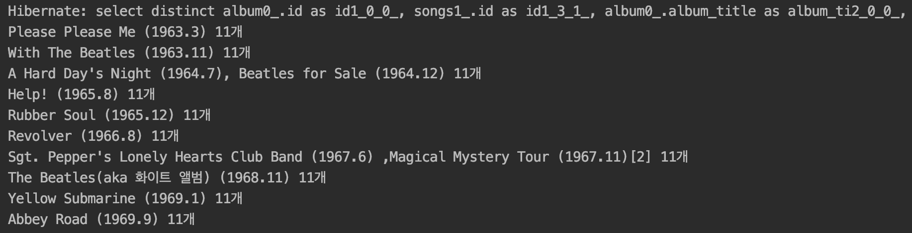

## 개요

평소 Spring 프로젝트를 개발하며 1:N 관계를 갖는 엔티티 클래스를 작성할때 아무런 의심없이 `JPA`를 쉽게 사용했습니다.  
그러던 중, 스프링 스터디에서 N+1 쿼리 문제에 대한 이야기가 나왔고 개인 프로젝트에서 확인해 봤더니

**1:N 관계를 갖는 엔티티의 하위 엔티티를 조회할 때마다 엄청난 쿼리가 발생하고 있었습니다**

이번 포스팅에서는 `Spring JPA`를 사용하다보면 쉽게 마주할 수 있는 `N+1 쿼리`에 대해 원인과 해결 방법에 대해서 알아보고  
`N+1 쿼리` 원인에 대해서 설명하면서 `JPA`의 글로벌 패치 전략인 `LAZY` 방식과 `EAGER` 방식이 어떻게 다르게 동작하는지도 함께 알아보겠습니다.

## N+1 쿼리 문제는 언제 발생할까 ?

발생하는 경우는 다음과 같은 2가지 경우가 있습니다.

두 개의 엔티티가 `1:N` 관계를 가지며 `JPQL`로 객체를 조회할 때

1. `EAGER` 전략으로 데이터를 가져오는 경우
2. `LAZY` 전략으로 데이터를 가져온 이후에 가져온 데이터에서 하위 엔티티를 다시 조회하는 경우

예제를 통해 살펴봅시다 !

[[info | JPQL이란 ?]]
| JPQL이란 플랫폼에 독립적인 객체지향 쿼리 언어입니다.  
| 자바 코드에서 데이터베이스를 조회할 때 특정 SQL이나 저장 엔진에 종속되지 않게 도와줍니다.

## N+1 쿼리 예제

#### 엔티티 모델링

**Album Model**

```java:title=Java
public class Album {
    @Id
    @GeneratedValue(strategy = GenerationType.IDENTITY)
    private long id;

    @Column(nullable = false)
    private String albumTitle;

    @Column(nullable = false)
    private String locales;

    // @OneToMany(mappedBy = "album", cascade = CascadeType.ALL, fetch = FetchType.EAGER) // 2번 상황
    @OneToMany(mappedBy = "album", cascade = CascadeType.ALL, fetch = FetchType.LAZY) // 1번 상황
    private List<Song> songs = new ArrayList<>();
}
```

**Song Model**

```java:title=Java
public class Song {
    @Id
    @GeneratedValue(strategy = GenerationType.IDENTITY)
    private long id;

    @Column(nullable = false)
    private String title;

    @Column(nullable = false)
    private int track;

    @Column(nullable = false)
    private int length;

    @ManyToOne(fetch = FetchType.LAZY)
    @JoinColumn(name = "album_id")
    private Album album;
}
```

#### 하위 엔티티를 조회하지 않는 경우

**Album의 Song에 접근하지 않은 경우**

```java:title=Java
@Test
public void N1_쿼리테스트_1() throws Exception{
    List<Album> albums = albumRepository.findAll();
}
```

#### LAZY 방식 결과

하위 엔티티에 접근하지 않았기 때문에 `Album`만 가져오는 것을 볼 수 있습니다.


#### EAGER 방식 결과

**N+1 발생 !**

`JPQL`에서 동작한 쿼리를 통해서 `Album`에 데이터를 조회합니다.  
그 이후 `JPA`에서는 글로벌 패치 전략(`Eager`로딩)을 보고 `Album`의 `Song` 대해서 추가적인 로딩 작업을 진행해 `N+1 문제`를 발생시킵니다.


## 하위 엔티티를 조회하는 경우

`Lazy` 로딩을 하기 위해서는 해당 `Entity` 가 영속 상태여야 합니다.  
보통 `Repository` 에서 리스트로 가져오면 영속이 끊긴 상태로 가져오기 때문에 `Lazy` 전략 테스팅 시 `@Transactional` 꼭 사용해야합니다 !

`@Transactional`을 사용하지 않으면 다음과 같은 에러가 발생합니다.



**Album의 Song에 접근하는 경우**

```java:title=Java
@Test
@Transactional // 테스팅에서 LAZY 전략시 필수
public void N1_쿼리테스트_2() throws Exception{
    List<Album> albums = albumRepository.findAll();
    for (Album album : albums) {
        System.out.println(album.getSongs().size()); // Song에 접근 !
    }
}
```

#### LAZY 방식 결과

**N+1 발생 !**

처음엔 `Album` 리스트만 조회했지만 `Album` 엔티티에서 하위 엔티티인 `Song` 엔티티로 접근했기 때문에 Lazy 로딩이 일어나면서 `N+1 문제` 발생


#### EAGER 방식 결과

**N+1 발생 !**

`하위 엔티티를 조회하지 않는 경우`의 `Eager` 방식 결과와 동일하게 `N+1 문제`가 발생하는 것을 볼 수 있습니다.


## 해결 방법

미리 쿼리로 테이블을 조인해서 가져오기 때문에 `Lazy`, `Eager` 두개의 전략에 해당되는 해결법입니다.

#### 1. 패치 조인(Fetch Join)

```java:title=Java
@Query("select DISTINCT a from Album a join fetch a.songs")
List<Album> findAllJoinFetch();
```

```java:title=Java
@Test
@Transactional // 테스팅에서 LAZY 전략시 사용해야 동작
public void fetchJoin테스트() throws Exception{
    List<Album> albums = albumRepository.findAllJoinFetch();
    for (Album album : albums) {
        System.out.println(album.getSongs().size()); // Song에 접근 !
    }
}
```



패치 조인의 단점은 2가지가 있습니다.

1. `JPA`가 제공하는 `Pagable` 기능 사용 불가 (페이징 API)
2. `1:N` 관계가 2개인 엔티티를 패치 조인 사용 불가
   > 임시 해결법은 `List -> Set`으로 변경하는 것

#### 2. Batch Size 조절

설정한 `Size`만큼 데이터를 미리 로딩합니다. (`where in`을 사용하여)  
`JPA`의 페이징 API 기능과 함께 사용할 때 유용하게 사용 가능할 듯 합니다.

```java:title=Java
@BatchSize(size = 5)
@OneToMany(mappedBy = "album", cascade = CascadeType.ALL, fetch = FetchType.EAGER)
private List<Song> songs = new ArrayList<>();
```

## 마무리

Spring JPA의 N+1 문제에 대해 알아보고, 발생하는 경우와 해결 방법에 대해서 알아보았습니다.

긴글 봐주셔서 감사합니다. 🙇🏻‍♂️
