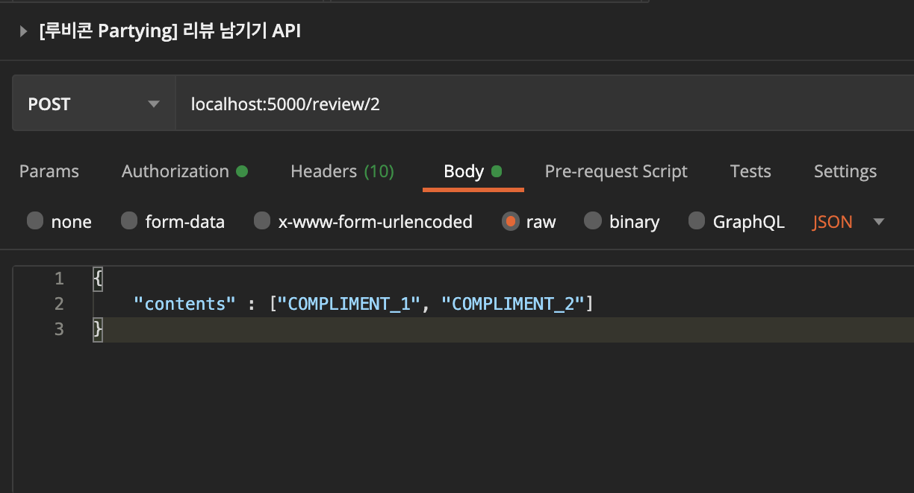
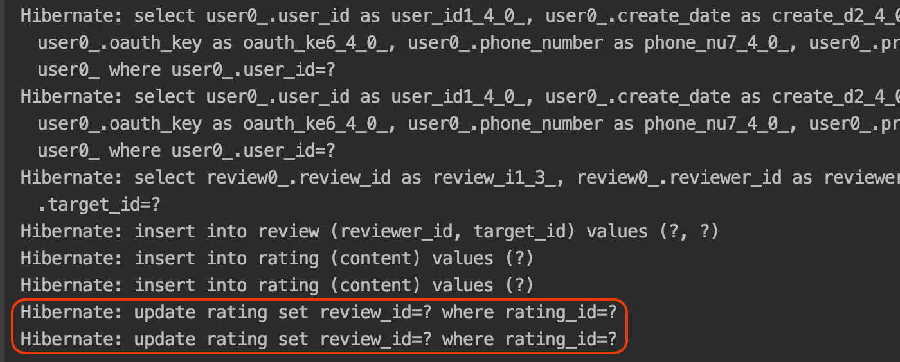
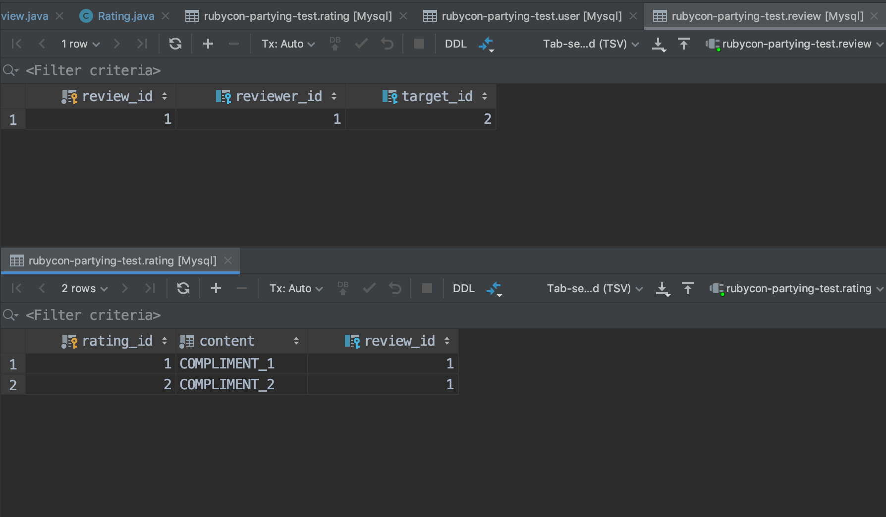
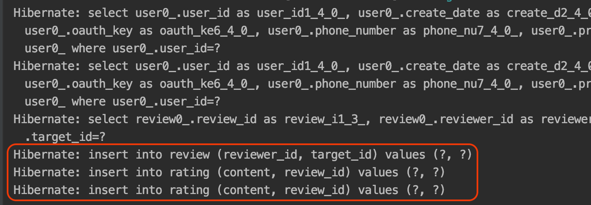

## 개요

`루비콘 2기` 'Party-ing' 프로젝트를 진행하던 도중 `1:N` 관계를 가지는 엔티티를 Save 할 때 2개의 테이블에 데이터는 잘 생성되었으나 Save 쿼리문 뿐 아니라 Update 쿼리문이 추가로 발생되는 이슈를 경험해서 해결 방법을 공유하고자 합니다.

## 현재 이슈 발생 상황

엔티티 정보는 다음과 같습니다.

**Review 엔티티**

- reviewer 유저가 target 유저에게 리뷰를 남겼다는 정보를 가지는 관계 엔티티

```java:title=Java
public class Review {
    @Id
    @GeneratedValue(strategy = GenerationType.IDENTITY)
    private Long reviewId;

    @ManyToOne(fetch = FetchType.LAZY)
    @JoinColumn(name = "reviewerId")
    private User reviewer;

    @ManyToOne(fetch = FetchType.LAZY)
    @JoinColumn(name = "targetId")
    private User target;

    @OneToMany(cascade = CascadeType.ALL, orphanRemoval = true)
    @JoinColumn(name = "reviewId")
    private List<Rating> rating;

    public static Review of(User reviewer, User target, List<Rating> rating) {
        return Review.builder()
                .reviewer(reviewer)
                .target(target)
                .rating(rating)
                .build();
    }
}
```

**Rating 엔티티**

- 하나의 리뷰 내용을 가지고 있는 엔티티

```java:title=Java
public class Rating {
    @Id
    @GeneratedValue(strategy = GenerationType.IDENTITY)
    private Long ratingId;

    @Column(nullable = false, length = 45)
    @Enumerated(EnumType.STRING)
    private Content content;

    public static Rating of(Content content){
        return Rating.builder()
                .content(content)
                .build();
    }
}
```

**실행되는 서비스 코드**

```java:title=Java
/**
* 특정 사용자에게 리뷰하기
* @param reviewerId : 리뷰 하는 사용자 ID (현재 사용자)
* @param targetId : 리뷰 할 사용자 ID
* @param reviewDto : 리뷰 내용 DTO
*/
@Transactional
public void review(Long reviewerId, Long targetId, ReviewRequest reviewDto) {
    User reviewer = userRepository.findById(reviewerId)
            .orElseThrow(UserNotFoundException::new);
    User target = userRepository.findById(targetId)
            .orElseThrow(UserNotFoundException::new);

    Optional<Review> optional = reviewQueryRepository.exists(reviewerId, targetId);
    if (optional.isPresent()) throw new ReviewDuplicatedException();

    Review review = Review.of(reviewer, target, new ArrayList<>());

    List<Rating> ratingList = reviewDto.getRatingList();
    ratingList.forEach(rating -> review.getRating().add(rating));

    reviewRepository.save(review);
}
```

#### 실행 결과 

API 콜을 보내서 위의 서비스 코드를 실행시키면 다음과 같은 쿼리문이 발생합니다.





DB 테이블 정보를 보면 결과는 정상적으로 동작하는 것을 확인할 수 있습니다.



Insert 쿼리 작업만으로 테이블을 생성할 수 있음에도 왜 Update 쿼리가 추가로 발생하는지 의아했습니다.

그것도 Insert 쿼리와 Update 쿼리문의 개수도 각각 2개씩으로 동일했습니다.

`'결과만 잘 동작하면 되지 않나?'`

라며 가볍게 넘길 수는 없는 문제라고 생각합니다.

왜냐하면, DB에 요청하는 쿼리가 결국엔 2배가 되었다는 소리이고 기존 성능에서 2배로 감소했다는 의미이기 때문입니다.

## 발생 원인?

그렇다면 위와 같은 이슈가 발생되는 원인은 뭘까?

이러한 이유는 `1:N` 관계가 `단방향`이기 때문입니다.

`Rating` 엔티티에 `reviewId` 컬럼이 추가되기는 했지만, 단방향이기 때문에 `Rating`은 `Review`의 존재를 모릅니다.

그래서 개별 행 단위로는 `reviewId`가 없는 채로 `Rating` 테이블에 Insert되고 먼저 DB에 저장된 이후 Update를 통해서 `reviewId`를 추가합니다.

## 그렇다면 해결 방법은?

RDB와 동일한 동작을 원한다면 JPA 엔티티 간의 관계를 `1:N 단방향` 매핑이 아닌 `1:N 양방향` 매핑으로 변경시켜야합니다.

**Review 엔티티**

```java:title=Java
public class Review {
    @Id
    @GeneratedValue(strategy = GenerationType.IDENTITY)
    private Long reviewId;

    @ManyToOne(fetch = FetchType.LAZY)
    @JoinColumn(name = "reviewerId")
    private User reviewer;

    @ManyToOne(fetch = FetchType.LAZY)
    @JoinColumn(name = "targetId")
    private User target;

    // mappedBy 추가, 조인 컬럼 삭제
    @OneToMany(mappedBy = "review", cascade = CascadeType.ALL, orphanRemoval = true)
    private List<Rating> rating;

    public static Review of(User reviewer, User target, List<Rating> rating) {
        return Review.builder()
                .reviewer(reviewer)
                .target(target)
                .rating(rating)
                .build();
    }
}
```

**Rating 엔티티**

```java:title=Java
public class Rating {
    @Id
    @GeneratedValue(strategy = GenerationType.IDENTITY)
    private Long ratingId;

    @Column(nullable = false, length = 45)
    @Enumerated(EnumType.STRING)
    private Content content;

    // Rating 엔티티에 Review 필드를 추가 (양방향 연결)
    @ManyToOne(fetch = FetchType.LAZY)
    @JoinColumn(name = "reviewId")
    private Review review;

    // 수정
    public static Rating of(Content content, Review review){ 
        return Rating.builder()
                .content(content)
                .review(review)
                .build();
    }
}
```

**실행되는 서비스 코드**

```java:title=Java
/**
* 특정 사용자에게 리뷰하기
* @param reviewerId : 리뷰 하는 사용자 ID (현재 사용자)
* @param targetId : 리뷰 할 사용자 ID
* @param reviewDto : 리뷰 내용 DTO
*/
@Transactional
public void review(Long reviewerId, Long targetId, ReviewRequest reviewDto) {
    User reviewer = userRepository.findById(reviewerId)
            .orElseThrow(UserNotFoundException::new);
    User target = userRepository.findById(targetId)
            .orElseThrow(UserNotFoundException::new);

    Optional<Review> optional = reviewQueryRepository.exists(reviewerId, targetId);
    if (optional.isPresent()) throw new ReviewDuplicatedException();

    Review review = Review.of(reviewer, target, new ArrayList<>());

    List<Rating> ratingList = reviewDto.getRatingList(review); // 수정
    ratingList.forEach(rating -> review.getRating().add(rating));

    reviewRepository.save(review);
}
```

#### 실행 결과 




## 결론

`1:N 단방향` 매핑은 설정도 간편하고 직관적이지만, Update가 오버헤드로 작용합니다.

`@OneToMany`만 붙히는 `1:N 단방향` 조인 테이블 방식과 `@JoinColum`만 붙히는 `1:N 단방향` 조인 컬럼 방식 모두 피해야합니다.

따라서, 1:N에서 N이 큰 상황 또는 모든 상황에서 오버헤드가 없는 `1:N 양방향` 매핑을 사용하는게 성능에 좋을 것 같습니다 !