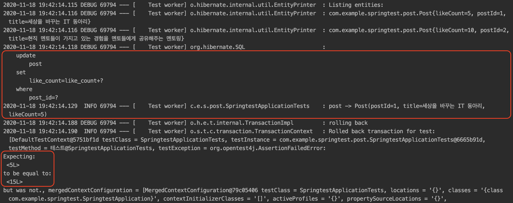
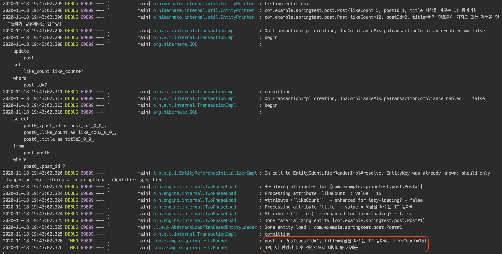
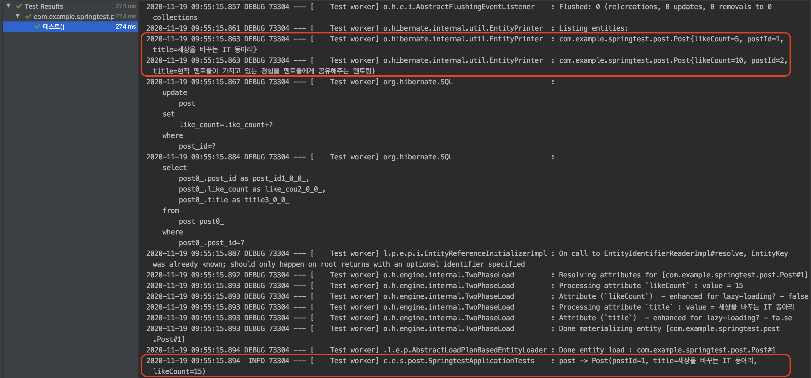
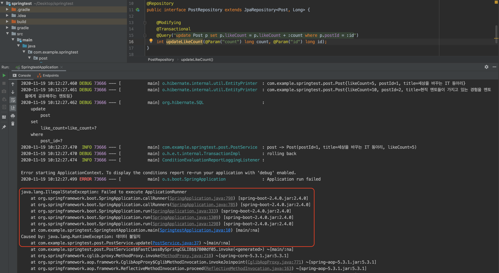
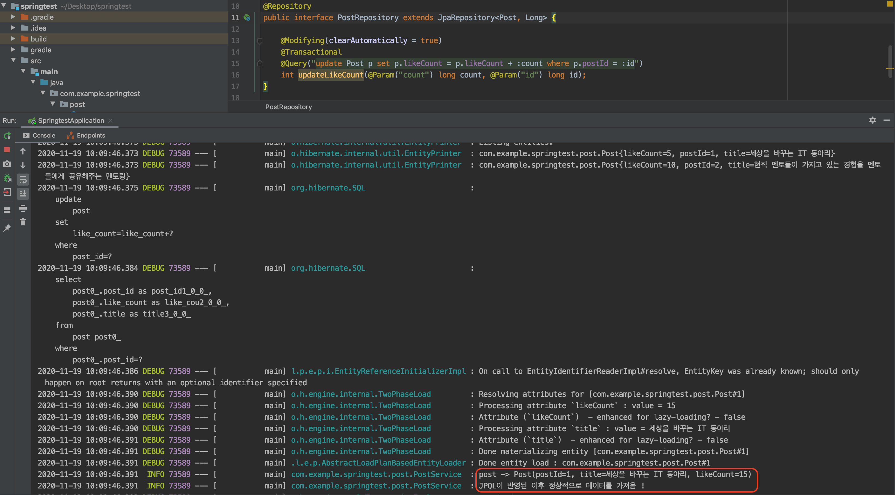

## 개요

`자바 ORM 표준 JPA 프로그래밍`이라는 책으로 스터디를 진행하던 도중 공유 되었던 이슈를 포스팅으로 공유하고자 합니다.

먼저, 공유된 이슈가 어떤 상황인지 이야기하고 `@Transactional` 어노테이션을 사용할 때 발생한 이슈와 `JPQL`을 사용할 때 발생한 이슈에 대해서 알아보겠습니다.

## 무엇을 테스트 하려 했는지? (예시)

- 포스팅의 좋아요 수 정보를 증가시키기 위해 JPQL로 업데이트하려고 했다.
  > 코드 리팩토링의 과정에서 변경 감지를 이용하지 않고 JPQL을 사용했다.

그러나, JPQL로 업데이트 한 이후에 해당 엔티티를 조회했더니 운영 환경, 테스트 환경의 결과가 달랐다.

## 엔티티, 코드 정보

**Post 엔티티**

```java:title=Java

@Getter
@Setter
@Entity
@NoArgsConstructor
@AllArgsConstructor
@Builder
@DynamicUpdate
@ToString
public class Post {

  @Id
  @GeneratedValue(strategy = GenerationType.IDENTITY)
  private Long postId;

  private String title;

  private long likeCount;
}
```

**PostRepository**

```java:title=Java
@Repository
public interface PostRepository extends JpaRepository<Post, Long> {

  @Modifying
  @Transactional
  @Query("update Post p set p.likeCount = p.likeCount + :count where p.postId = :id")
  int updateLikeCount(@Param("count") long count, @Param("id") long id);
}
```

## 문제 상황 2가지

결과가 다른 2가지의 상황이 있습니다.

1. 테스트 환경에서 쓴 코드
2. 운영 환경에서 동작을 확인하려고 쓴 코드

각각 다음과 같습니다.

**1. 테스트 환경에서 쓴 코드**

```java:title=Java
@SpringBootTest
@Slf4j
class SpringtestApplicationTests {

  @Autowired
  private PostRepository postRepository;

  @Test
  @Transactional
  public void 테스트(){

  Post post1 = Post.builder()
      .title("세상을 바꾸는 IT 동아리")
      .likeCount(5)
      .build();
  Post post2 = Post.builder()
      .title("현직 멘토들이 가지고 있는 경험을 멘토들에게 공유해주는 멘토링")
      .likeCount(10)
      .build();
  postRepository.saveAll(Arrays.asList(post1, post2));

  postRepository.updateLikeCount(10, 1);

  Post post = postRepository.findById(1L).orElseThrow(null);

  log.info("post -> {}", post.toString());
  assertThat(post.getLikeCount()).isEqualTo(15);
  }
}
```

**2. 운영 환경에서 동작을 확인하려고 쓴 코드**

```java:title=Java
@RequiredArgsConstructor
@Slf4j
public class Runner implements ApplicationRunner {

  private final PostRepository postRepository;

  @Override
  public void run(ApplicationArguments args) throws Exception {
    update();
  }

  @Transactional
  public void update(){

    Post post1 = Post.builder()
          .title("세상을 바꾸는 IT 동아리")
          .likeCount(5)
          .build();
    Post post2 = Post.builder()
          .title("현직 멘토들이 가지고 있는 경험을 멘토들에게 공유해주는 멘토링")
          .likeCount(10)
          .build();
    postRepository.saveAll(Arrays.asList(post1, post2));

    postRepository.updateLikeCount(10, 1);

    Post post = postRepository.findById(1L).orElseThrow(null);

    log.info("post -> {}", post.toString());
    if (post.getLikeCount() == 15){
        log.info("JPQL이 반영된 이후 정상적으로 데이터를 가져옴 !");
    } else {
        throw new RuntimeException("데이터 불일치");
    }
  }
}

```

## 결과는?

#### 테스트 환경



#### 운영 환경



---

이미지를 봤을 때는 운영 환경의 결과가 맞고 테스트 환경이 틀린 결과로 보이지만

여기에는 2가지 문제점이 존재합니다.

#### 2가지 문제점에 대하여

- 정말로 JPQL로 Update를 진행하고 난 뒤 Select로 가져온 데이터는 Update가 반영된 데이터가 가져와졌을까?

**위의 질문에 운영 환경의 결과는 틀리고, 테스트 환경의 결과는 맞습니다.**

JPQL의 쿼리는 항상 영속성 컨텍스트를 거치지 않고 바로 DB에 쿼리를 날립니다.

현재는 운영 환경, 테스트 환경에 모두 `@Transactional`을 걸어둔 상태이므로 하나의 트랜잭션으로 동작해야합니다.

하나의 트랜잭션이 정상적으로 동작했다면, JPQL은 DB 데이터는 변경했지만, 영속성 컨텍스트의 데이터는 변경시키지 않았으므로 Select시에 변경 되기 전의 데이터를 가져오는 것이 맞습니다.

여기서, 'JPQL을 사용한 이후 조회할 때 DB와 영속성 컨텍스트간의 동기화가 이루어지지 않았다'는 첫번째 문제점을 발견할 수 있습니다.

> 첫번째 문제점

그리고 운영 환경에서는 하나의 트랜잭션이 아닌 별도의 트랜잭션이 동작했기 때문에 JPQL을 실행한 이후 조회된 데이터에는 JPQL이 반영된 결과가 나왔다는 것을 알 수 있습니다.

> 트랜잭션이 다르므로 영속성 컨텍스트도 다르니 찾는 엔티티가 없어서 다시 DB에서 데이터를 조회했을 것

결국, '운영 환경에서의 `@Transactional`이 동작하지 않았다는 것'도 알 수 있습니다.

> 두번째 문제점

#### 첫번째 문제점

- JPQL을 사용한 이후 조회할 때 DB와 영속성 컨텍스트간의 동기화가 이루어지지 않은 이슈

그렇다면, JPQL을 실행한 이후 영속성 컨텍스트의 데이터를 동기화 시킬 방법이 있을까?

##### 해결 방법

```java:title=Java
@Repository
public interface PostRepository extends JpaRepository<Post, Long> {

  @Modifying(clearAutomatically = true) // 쿼리 실행 이후 영속성 컨텍스트를 초기화시켜준다.
  @Transactional
  @Query("update Post p set p.likeCount = p.likeCount + :count where p.postId = :id")
  int updateLikeCount(@Param("count") long count, @Param("id") long id);
}
```

**✔︎ 첫번째 문제점 해결**



#### 두번째 문제점

- 운영 환경에서 `@Transactional`이 동작하지 않았던 이슈

##### 해결 방법

Spring Boot에서 프록시는 `CGLIB`으로 동작합니다.

> 바이트 코드를 생성하여 런타임 시점에 적용하는 방식

동일한 `Bean(Class)`에서 `Spring AOP CGLIB`이 동작하지 않기 때문에 위의 `update()`메서드를 외부에서 생성하여 호출해야합니다.

```java:title=Java
@RequiredArgsConstructor
@Slf4j
@Component
public class Runner implements ApplicationRunner {

  private final PostService postService;

  @Override
  public void run(ApplicationArguments args) throws Exception {
    postService.update();
  }
}
```

---

**운영 환경에서도 정상 동작하는 트랜잭션**

- `@Modifying`만 설정하고 위의 방법으로 트랜잭션을 걸었을 경우 트랜잭션이 잘 동작하니 초기 테스트 환경처럼 정상적으로 에러가 발생합니다.

  

**✔︎ 두번째 문제점 해결**

- `@Modifying(clearAutomatically = true)`를 적용시키면 운영 환경 또한 잘 동작하는 것을 확인할 수 있습니다.

  

**참고**

- https://cheese10yun.github.io/spring-transacion-same-bean
- https://mommoo.tistory.com/92

## 결론

이처럼 스터디때 공유된 내용은 쉽게 실수할 수 있는 문제 2가지가 모두 있었습니다.

정확한 개념을 알고 있는 것이 중요하다는 것을 다시 한번 깨달았고 저도 생각하지 못했던 이슈를 공유하는 유익한 시간이었던 것 같습니다 !
