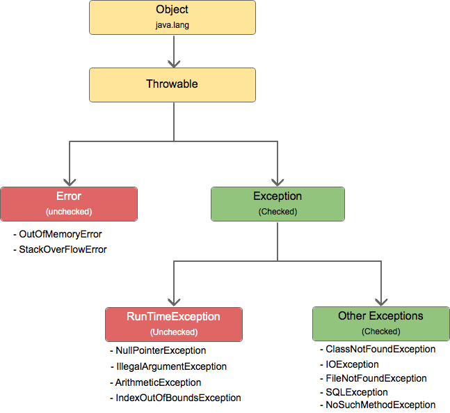

## 개요

이번 4장에서는 배울 것들은 다음과 같습니다.

1. 스프링의 데이터 액세스 기능에 담겨 있는 예외 처리와 관련된 접근 방법에 대해서 알아봅니다.

2. 이를 통해, 예외를 처리하는 베스트 프랙티스를 살펴봅니다.

## 잘못 사용되는 예외 처리

#### 1. 예외를 잡고 아무것도 하지 않는 경우

아래의 경우는 예외가 어디서 발생했는지 알지 못하기 때문에 예외가 발생하는 것보다 더 위험합니다.

```java:title=Java
try {
    // ...
}
catch(SQLException){}
```

#### 2. 예외를 출력만 하는 경우

배포 서버(운영 서버)에 올라가게 되는 경우 누군가 계속 모니터링하지 않는 이상 심각한 상황을 만듭니다.

모든 예외는 `적절하게 복구`되든지, `작업을 중단`시키고 개발자에게 `분명하게 통보`되어야 합니다.

```java:title=Java
try {
    // ...
}
catch(SQLException e){
    System.out.println(e);
    e.printStackTrace();
}
```

## 예외의 종류와 특징

자바에서 throw를 통해 발생시킬 수 있는 예외는 크게 3가지가 있습니다.

#### 1. Error

첫째는 `java.lang.Error` 클래스의 서브클래스들입니다.  
`Error`는 시스템에 비정상적인 상황이 발생된 경우로 주로 `자바 VM`에서 발생됩니다.  
그래서, 애플케이션 단에서는 이런 에러에 대한 처리는 신경쓰지 않아도 됩니다.

#### 2. Exception

`Error`와 달리 애플리케이션 단에서 예외가 발생한 경우에 사용됩니다.

Exception 클래스는 다시 `체크 예외`, `언체크 예외`로 구분됩니다.

**1. Checked Exception (체크 예외)**

- 컴파일 시점에서 에러가 발생하는 경우
- 반드시 예외를 처리해야함

사용할 메서드가 `Checked Exception` 예외를 던진다면, `catch`문으로 잡든지 다시 `throws`를 정의해서 메소드 밖으로 던져야합니다.

**2. Unchecked Exception (언체크 예외)**

- 런타임 시점에서 에러가 발생하는 경우
- 예외 처리를 강제하지 않음
- `RuntimeException`라고 불림

프로그램의 오류가 있을 때 발생하도록 의도된 예외로 예상하지 못한 상황에서 발생하는 것이 아니기 때문에 굳이 `catch`나 `throws`를 사용하지 않아도 됩니다.

#### 예외 관계도



## 예외 처리 방법

#### 1. 예외 복구

첫번째 방법은 예외 상황을 파악하고 문제를 해결해서 `정상 상태로 돌려놓는 방법`입니다.

예외가 처리됐으면 애플리케이션에서는 다시 정상적으로 설계된 흐름에 따라 진행되어야 합니다.

#### 2. 예외 처리 회피

두번째 방법은 예외 처리를 자신이 담당하지 않고 `자신을 호출한 쪽으로 던져버리는 것`입니다. (예외 버블링)

예외를 회피할 때는 자신을 사용하는 쪽에서 예외를 다루는 것이 최선의 방법이라는 의도와 확신이 있어야합니다.

#### 3. 예외 전환

세번째 방법은 예외 회피와 달리, 발생한 예외를 그대로 넘기는 게 아니라 `적절한 예외로 전환`해서 던지는 방법입니다.

예외 전환 방법은 다음과 같이 2가지가 있습니다.

1. 중첩 예외로 만들기

   보통 전환하는 예외에 원래 발생한 예외를 담아서 만듭니다.

   ```java:title=Java
   catch(SQLException e){
       // ...
       throw DuplicateUserIdException(e);
   }
   ```

2. 예외를 포장(Wrap)하기

   주로 예외 처리를 강제하는 `체크 예외`를 `언체크 예외`로 바꾸는 경우에 사용합니다.

   대표적으로 런타임 예외인 `EJBException` 가 있습니다.

   ```java:title=Java
   try {
       // ...
   } catch(SQLException e){
       throw new EJBException(e);
   }
   ```

복구가 가능한 예외는 `try/catch`를 사용해 에러를 처리해야하고

복구가 불가능한 예외는 런타임 예외로 포장해서 메소드 밖으로 `throw`해서 에러를 처리합니다.  
`런타임 예외 처리`의 경우 장점도 있지만, 컴파일 시점에 예외를 강제하지 않기 때문에 `개발자가 예외 상황을 고려하지 못할 가능성`이 있습니다.

## 예외 전환

예외를 다른 것으로 바꾸어 던지는 예외 전환의 목적은 설명 했듯이 2가지 입니다.

1. 런타임 예외로 포장해서 던지면 호출하는 쪽에서 필요하지 않은 `try/catch`를 줄여주는 것

2. 로우레벨의 예외를 좀 더 의미 있고 추상화된 예외로 바꿔서 던져주는 것

#### JDBC의 한계

DB 종류에 상관없이 사용할 수 있는 데이터 액세스 코드를 작성하는 일은 쉽지 않습니다.  
표준화된 JDBC API가 DB 개발 방법을 더 편리하게 도와주지만 DB를 자유롭게 변경해서 사용할 수 있는 유연한 코드를 보장해주지는 못합니다.  
그 이유로는 2가지 문제가 있습니다.

**1. 비표준 SQL**

첫번째 문제는 `JDBC 코드에서 사용하는 SQL`입니다.
대부분의 DB는 표준을 따르지 않는 비표준 문법과 기능도 제공합니다.  
이러한 비표준 문법은 해당 DB의 특별한 기능을 사용하거나 최적화된 SQL을 사용할 때 유용합니다.

이런 비표준 SQL을 지원하기 위해선 DAO는 DB별로 종속적인 코드가 되어버려 문제가 생깁니다.

**2. 호환성 없는 SQLException의 DB 에러 정보**

두번째 문제는 `SQLException` 입니다.  
DB에 따라 발생할 수 있는 예외의 원인과 종류가 제각각이라는 점입니다.

#### DB에 독립적으로 예외 처리

**DB에 독립적으로 예외를 처리하기 위한 해결 방안은 ?**

스프링은 `DataAccessException`이라는 `SQLException`을 대체하는 런타임 예외를 제공할 뿐아니라 `DataAccessException`의 서브 클래스로 세분화된 예외를 제공합니다.

**예외의 종류 (일부)**

1. SQL 문법 때문에 발생하는 에러 - `BadSqlGrammerException`
2. DB 커넥션을 가져오지 못한 경우 - `DataAccessResourceFailureException`
3. 데이터의 제약 조건 위배, 일관성을 지키지 않은 작업을 수행 - `DataIntegrityViolationException`
4. 중복 키 때문에 발생한 경우 - `DuplicatedKeyException`

문제는 `DB마다 에러 코드가 제각각`이라는 점입니다.

스프링은 DB별 에러 코드를 분류해서 스프링이 정의한 예외 클래스와 매핑해놓은 에러 코드 매핑정보 테이블을 만들어두고 이를 이용합니다.

그래서 `JdbcTemplate`은 DB 종류에 상관없이 동일한 예외를 받을 수 있습니다.

```xml:title=XML
<bean id="Oracle" class="org.springframework.jdbc.support.SQLErrorCodes">
    <property name="badSqlGrammerCodes">
        <value> 900, 903, 904, 917, 936, 942, 17006</value>
    </property>
    <property name="invalidResultSetAccessCodes">
        <value> 17003 </value>
    </property>
    <property name="duplicateKeyCodes">
        <value> 1 </value>
    </property>
    <property name="dataIntegrityViolationCodes">
        <value> 1400, 1722, 2291, 2292 </value>
    </property>
    <property name="dataAccessResourceFailureCodes">
        <value> 17002, 17447 </value>
    </property>
    ...
</bean>
```

#### 데이터 액세스 기술에 따른 예외 처리

`DataAccessException`은 DB별 예외 처리뿐 아니라 JDBC 외의 자바 `데이터 액세스 기술`에서 발생하는 예외에도 적용됩니다.

JDBC 이외에 자바 데이터 액세스 기술에는 `JPA`(ORM), `MyBatis`(SQL Mapper) 등이 있습니다.
