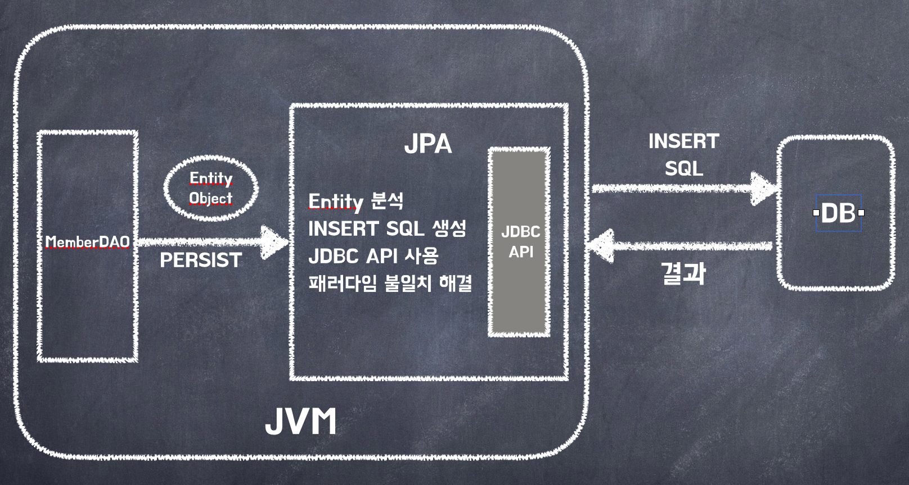
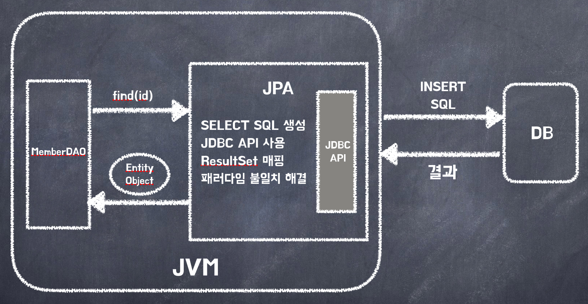
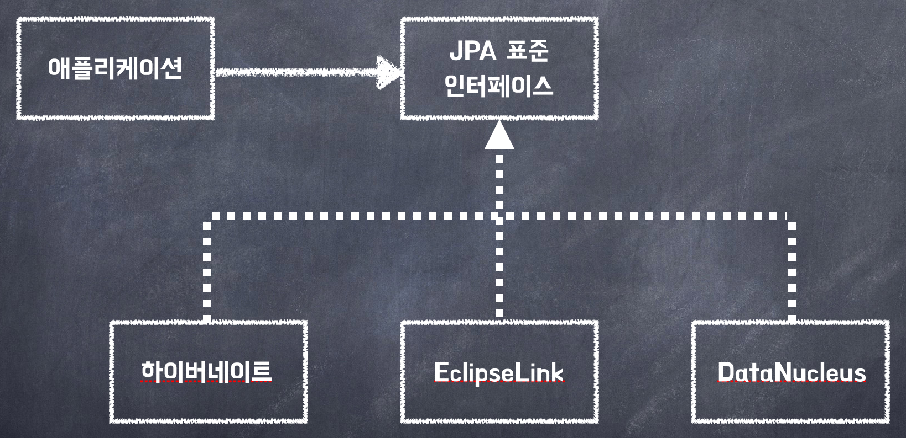

## 개요

SQL을 직접 다룰 때, 어떤 문제가 발생하는지, 객체와 관계형 데이터베이스 사이에는 어떤 차이가 있는지, JPA는 무엇인지 알아봅시다.

## SQL을 직접 다룰 때 발생하는 문제점

#### 1. 반복과 반복 ...

JDBC API를 이용하여 SQL을 직접 다루는 경우는 어떻게 동작할까?

회원 조회 기능을 만들어보자.

1. 회원 조회용 SQL을 작성한다.
2. JDBC API를 이용해 SQL을 실행한다.
3. 조회 결과를 Member 객체로 매핑한다.

**그럼 추가, 수정, 삭제는 ..?**

뿐만 아니라 `테이블 마다` 이런 비슷한 일을 반복해야합니다.

지루함과 반복의 연속 .. 🤦🏻‍♂️

#### 2. SQL에 의존적인 개발

만약 위의 회원 정보에 연락처, 이메일 등을 추가해달라는 요구사항이 있을 경우엔?

1. 등록 코드 변경
2. 조회 코드 변경
3. 수정 코드 변경

위의 3가지 작업을 코드에서 `개발자가 직접` 수정해야합니다.

또는, 회원은 `어떤 한 팀(Team)`에 무조건 속해야한다는 요구사항이 들어올 경우엔?

미리 만들어두었던 회원만 가져오는 SQL 말고 [회원, 팀]을 같이 가져오는 `새로운 SQL`을 작성해야합니다.

데이터 접근 계층을 사용해서 SQL을 숨겨도 어쩔 수 없이 DAO를 열어서 어떤 SQL이 실행되는 지 확인해야합니다. (강한 의존 관계)

#### 3. JPA와 문제 해결

JPA는 이런 문제를 어떻게 해결할까?

JPA를 사용하면 개발자가 직접 SQL을 작성하는 것이 아니라 JPA가 객체 매핑 정보를 보고 개발자 대신 적절한 SQL을 생성해서 데이터베이스에 전달합니다.

## 2. 패러다임의 불일치

객체지향 프로그래밍은 추상화, 캡슐화, 정보은닉, 상속, 다형성 등 시스템의 복잡성을 제어할 수 있는 기능을 제공합니다.

RDB는 데이터 중심으로 구조화되어 있고 추상화, 상속, 다형성 같은 개념이 없습니다.

위와 같이 객체와 RDB는 지향하는 목적이 서로 다르므로 둘의 기능과 표현 방법이 다릅니다.

이것을 객체와 RDB의 `패러다임 불일치` 문제라고 합니다.

이러한 불일치는 개발자가 직접 중간에서 해결해야하는데, 문제는 개발자가 너무 많은 시간과 코드를 소비하는데 있습니다.

#### 1. 상속

JPA는 상속과 관련된 패러다임 불일치를 해결해줍니다.

JPA를 사용해서 Item을 상속한 Album 객체를 저장한다고 가정하면?

1. 저장 시엔 ITEM, ALBUM 두 테이블에 나누어 저장해주고 - `persist()`

   ```sql
    INSERT INTO ITEM ...
    INSERT INTO ALBUM ...
   ```

2. 조회 시엔 ITEM, ALBUM 테이블을 조인해서 필요한 데이터를 조회해줍니다. - `find()`
   ```sql
   SELECT I.*, A.*
   FROM ITEM I
   JOIN ALBUM A ON I.ITEM_ID = A.ITEM_ID
   ```

#### 2. 연관 관계

객체는 참조를 사용해서 다른 객체와 연관관계를 가지고 참조에 접근해서 연관된 객체를 조회합니다.

반면에, 테이블은 외래 키를 사용해서 다른 테이블과 연관관계를 가지고 조인을 사용해서 연관된 테이블을 조회합니다.

JPA는 이러한 연관관계 관련 패러다임 불일치를 해결해줍니다.

```java
member.setTeam(team); // 회원과 팀 연관 관계 설정
jpa.persist(member); // 회원과 연관관계 함께 저장
```

JPA는 `team의 참조`를 외래 키로 변환해서 적절한 INSERT SQL을 실행하고 조회할 때도 `외래 키 -> 참조` 로 변환해줍니다.

기존에는 개발자가 직접 외래 키 변환을 해주었지만 JPA가 처리해줍니다.

#### 3. 객체 그래프 탐색

객체에서 회원이 소속된 팀을 조회할 때 참조를 사용해서 연관된 팀을 찾으면 되는데 이것을 `객체 그래프 탐색`이라 합니다.

```java:title=Java
member.getOrder().getOrderItem()... // 자유로운 객체 그래프 탐색
```

객체는 이렇게 마음껏 참조를 통해서 그래프를 탐색할 수 있어야하지만, SQL을 직접 다루면 처음 실행하는 SQL에 따라서 객체 그래프 탐색 범위가 고정됩니다.

결국, 다음처럼 상황에 따라 여러 벌 만들어서 사용해야합니다.

```java:title=Java
memberDAO.getMember();
memberDAO.getMemberWithTeam();
memberDAO.getMemberWithOrderWithDelivery();
// ...
```

**그렇다면 JPA는 이 문제를 어떻게 해결할까?**

JPA는 연관된 객체를 사용하는 시점에서야 적절한 SELECT SQL을 실행합니다.

이 기능은 실제 객체를 사용하는 시점까지 데이터베이스 조회를 미룬다고해서 `지연 로딩 (Lazy Loading)`이라고 합니다.

```java:title=Java
// 처음 조회 시점에 SELECT MEMBER SQL
Member member = jpa.find(Member.class, memberId);

Order order = member.getOrder();
order.getOrderDate();   // Order를 사용하는 시점에 SELECT ORDER SQL
```

#### 4. 비교

데이터베이스는 각 로우를 기본키 값으로 비교합니다.  
반면에, 객체는 동일성(identity), 동등성(equality) 비교라는 2가지 방법이 있습니다.

- 동일성 비교는 `==` 비교 - `주소값 비교`
- 동등성 비교는 `equals` 비교 - `객체 내부의 값 비교`

**JPA에서 조회한 객체의 비교는 어떻게 이루어질까?**

JPA는 같은 트랜잭션일 때 같은 객체가 조회되는 것을 보장합니다.

```java:title=Java
String memberId = "100";
Member member1 = jpa.find(Member.class, memberId);
Member member2 = jpa.find(Member.class, memberId);

// member1과 member2는 동일성 비교에 성공
member1 == member2; //같다.
```

#### 5. 정리

패러다임 불일치가 커지면 객체 모델링을 힘을 잃고 점점 데이터 중심의 모델로 변해갑니다.

이러한 이슈에 대해 JPA는 패러다임의 불일치 문제를 해결해주고 정교한 객체 모델링을 유지하게 도와줍니다 !

## 3. JPA란 무엇인가?

- `JPA (Java Persisitence API)`는 자바 진영의 ORM 기술 표준

- `ORM (Object Relational Mapping)`은 객체와 테이블을 매핑해서 패러다임의 불일치를 개발자 대신 해결해준다.

**객체를 저장하는 코드**

```java:title=Java
jpa.persist(member); // 저장
```



**객체를 조회하는 코드**

```java:title=Java
Member member = jpa.find(memberId); // 조회
```



#### 1. JPA 소개

EJB 3.0에서 하이버네이트를 기반으로 새로운 자바 ORM 기술 표준이 만들어졌는데 이것이 바로 `JPA`입니다.

**JPA 표준 인터페이스와 구현체**



#### 2. JPA를 사용해야하는 이유

1. 생산성

   - INSERT SQL을 작성하고 JDBC API 사용하는 지루하고 반복적인 일을 JPA가 대신 처리

2. 유지보수

   - 엔티티에 필드 추가시 등록, 수정, 조회 관련 코드 모두 변경했지만, JPA를 사용하면 이런 과정을 JPA가 대신 처리

3. 패러다임 불일치 해결

   - 상속, 연관관계, 객체 그래프 탐색, 비교하기 같은 패러다임 불일치 해결

4. 성능

   - 다양한 성능 최적화 기회 제공
   - 어플리케이션과 데이터베이스 사이에 존재함으로 여러 최적화 시도 가능 (1차 캐시 등등)

5. 데이터 접근 추상화와 벤더 독립성

   - RDB는 같은 기능도 벤더마다 사용법이 다르다.
   - JPA는 이러한 차이를 추상화된 데이터 접근 계층을 제공해 특정 DB에 종속되지 않게 도와줌

6. 표준
   - 자바 진영의 ORM 기술 표준이기 때문에 다른 구현 기술로 손쉽게 변경 가능

## Q&A

1. JPA는 성능이 느리지 않나?

   - 지금 시대에 자바가 느리다고 말하는 것과 비슷함  
     다양한 성능 최적화를 지원해 SQL을 직접 사용할 때보다 좋은 성능을 낼 수 있음  
     하지만, 잘 이해하지 못하고 사용하면 `N+1` 쿼리 문제로 성능저하가 발생할 수 있음

2. 통계 쿼리처럼 복잡한 쿼리는 어떻게 처리하나?

   - 복잡한 쿼리는 SQL을 직접 작성하는 것이 더 쉬움  
     `마이바티스`, `JdbcTemplate`을 혼용하는 것도 좋은 방법

3. 마이바티스와 어떤 차이?

   - `마이바티스`나 `JdbcTemplate`을 보통 `SQL Mapper`라고 부름  
     객체와 SQL을 매핑, 하지만 SQL에 의존적임  
     JPA는 의존성을 피할 수 있음

4. `하이버네이트` 프레임워크를 신뢰할 수 있나?

   - 2001년에 공개 후 테스트 케이스 4000개, 코어 코드는 10만 라인이 되는 성숙한 ORM 프레임워크

5. 러닝 커브는 높은편?
   - JPA는 러닝 커브가 높은 편 !
