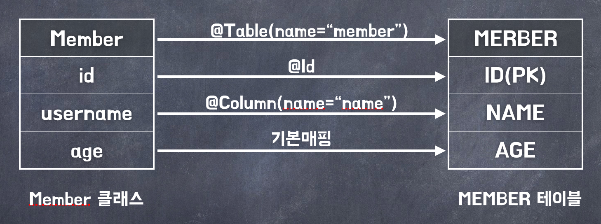
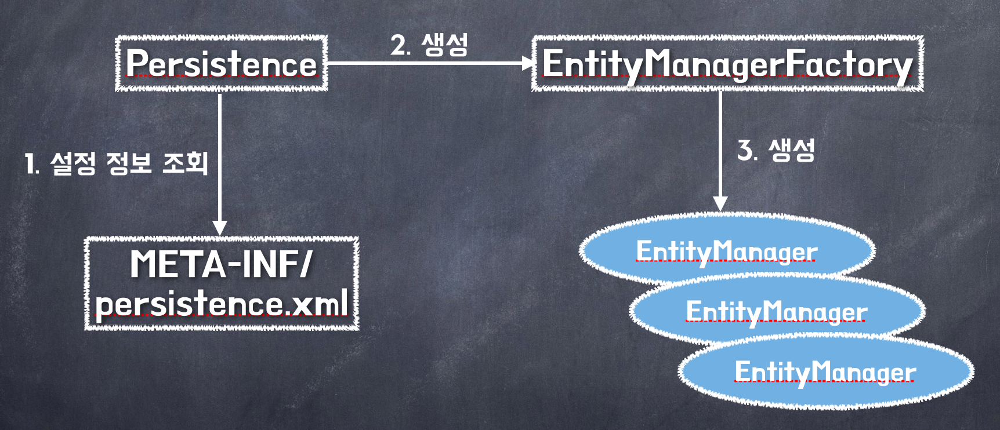

## 1. 객체 매핑 시작

**매핑 정보가 포함된 회원 클래스**

```java:title=Java
import javax.persistence.*;

@Entity
@Table(name="MEMBER")
@Getter
@Setter
public class Member {

    @Id
    @Column(name = "ID")
    private Long id;

    @Column(name = "NAME")
    private String username;

    private Integer age;
}
```



## 2. 데이터 베이스 방언

JPA는 특정 데이터베이스에 종속적이지 않은 기술이여서 다른 데이터베이스로 손쉽게 교체할 수 있습니다.

그런데, 각 데이터 베이스가 제공하는 SQL 문법과 함수가 조금씩 다르다는 문제점이있습니다.

- 데이터 타입

  - 가변 문자 타입으로 MySQL은 VARCHAR, 오라클은 VARCHAR2

- 다른 함수명

  - 문자열 자르는 함수로 SQL 표준은 SUBSTRING(), 오라클은 SUBSTR()

- 페이징 처리
  - MySQL은 LIMIT, 오라클은 ROWNUM

SQL 표준을 지키지 않거나 특정 데이터베이스만의 고유한 기능을 JPA에서는 `Dialect(방언)`이라고 한다.

## 3. 애플리케이션 개발

**시작 코드**

```java:title=Java
import javax.persistence.*;
import java.util.List;

public class JpaMain {

    public static void main(String[] args) {

        //엔티티 매니저 팩토리 생성
        EntityManagerFactory emf = Persistence.createEntityManagerFactory("jpabook");
        EntityManager em = emf.createEntityManager(); //엔티티 매니저 생성
        EntityTransaction tx = em.getTransaction(); //트랜잭션 기능 획득

        try {

            tx.begin(); //트랜잭션 시작
            logic(em);  //비즈니스 로직
            tx.commit();//트랜잭션 커밋

        } catch (Exception e) {
            e.printStackTrace();
            tx.rollback(); //트랜잭션 롤백
        } finally {
            em.close(); //엔티티 매니저 종료
        }

        emf.close(); //엔티티 매니저 팩토리 종료
    }
}
```



코드는 크게 3부분으로 나뉘어 있습니다.

1. 엔티티 매니저 설정
2. 트랜잭션 관리
3. 비즈니스 로직

#### 1. 엔티티 매니저 설정

**엔티티 매니저 팩토리 생성**

애플리케이션의 설정 정보를 사용해서 엔티티 매니저 팩토리를 생성합니다.

JPA 구현체에 따라서 따라 데이터베이스 `커넥션 풀`도 생성하므로 생성 비용이 아주 큽니다.

따라서, `엔티티 매니저 팩토리`는 애플리케이션 전체에서 딱 한 번만 생성하고 `공유해서 사용`해야합니다.

```java:title=Java
EntityManagerFactory emf = Persistence.createEntityManagerFactory("jpabook");
```

**엔티티 매니저 생성**

엔티티 매니저를 사용해서 엔티티를 데이터베이스에 등록/수정/삭제/조회할 수 있습니다.

`엔티티 매니저`는 데이터베이스 커넥션과 밀접한 관계가 있으므로 스레드간에 `공유하거나 재사용하면 안됩니다.`

엔티티 매니저는 데이터베이스 연결이 꼭 필요한 시점까지 커넥션을 얻지 않고 트랜잭션을 시작할 때 커넥션을 획득합니다.

```java:title=Java
EntityManager em = emf.createEntityManager();
```

#### 2. 트랜잭션 관리

JPA를 사용하면 항상 트랜잭션 안에서 데이터를 변경해야합니다.
트랜잭션 없이 데이터를 변경하면 예외 발생하고 트랜잭션을 시작하려면 엔티티 매니저에서 트랜잭션 API를 받아와야 합니다.

```java:title=Java
EntityTransaction tx = em.getTransaction(); //트랜잭션 기능 획득

try {

    tx.begin(); //트랜잭션 시작
    logic(em);  //비즈니스 로직
    tx.commit();//트랜잭션 커밋

} catch (Exception e) {
    tx.rollback(); //트랜잭션 롤백
}
```

정상 동작하면 트랜잭션을 `커밋(commit)`, 예외가 발생하면 `롤백(rollback)`합니다.

#### 3. 비즈니스 로직

회원 엔티티를 하나 생성한 다음 엔티티 매니저를 통해 데이터베이스에 등록, 수정, 삭제, 조회합니다.

**수정**

`em.update()`를 호출할 것 같은데 없고 단순하게 엔티티의 `값만 변경`합니다.

JPA는 어떤 엔티티가 변경되었는지 `추적`하는 기능을 갖추고 있습니다.

## JPQL

JPA는 SQL을 추상화한 `JPQL(Java Persistence Query Language)` 이라는 객체지향 쿼리 언어를 제공합니다.

- `JPQL` : 엔티티 객체를 대상으로 쿼리, JPQL은 데이터베이스 테이블을 알지 못함
- `SQL` : 데이터베이스 테이블을 대상으로 쿼리

**JPQL 예시**

```java:title=Java
List<Member> members = em.createQuery("select m from Member m", Member.class).getResultList();
```
