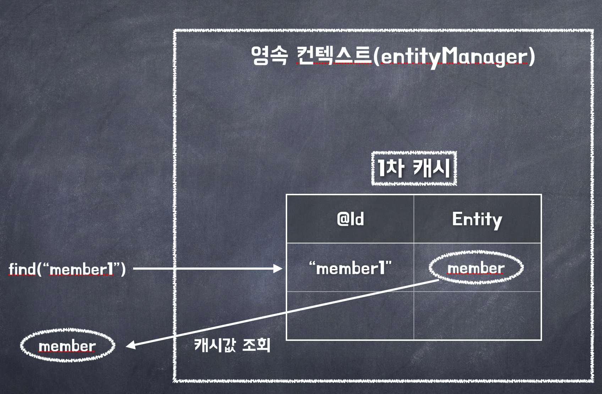
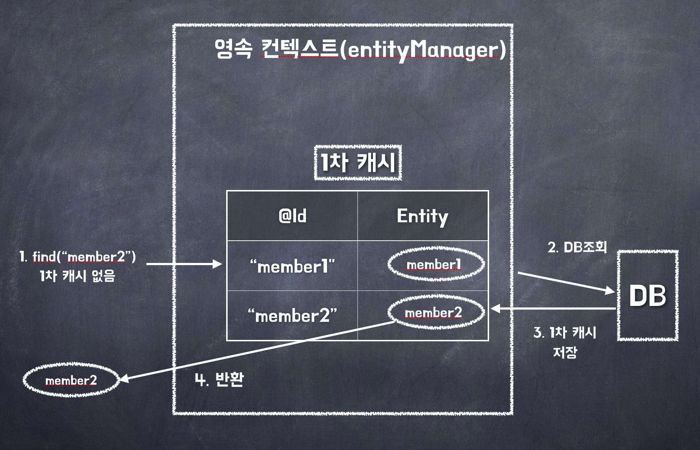
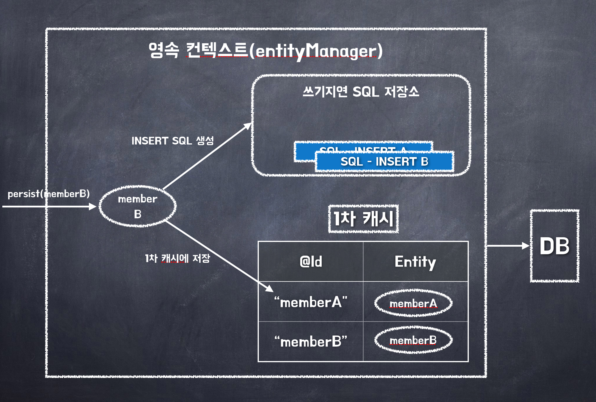
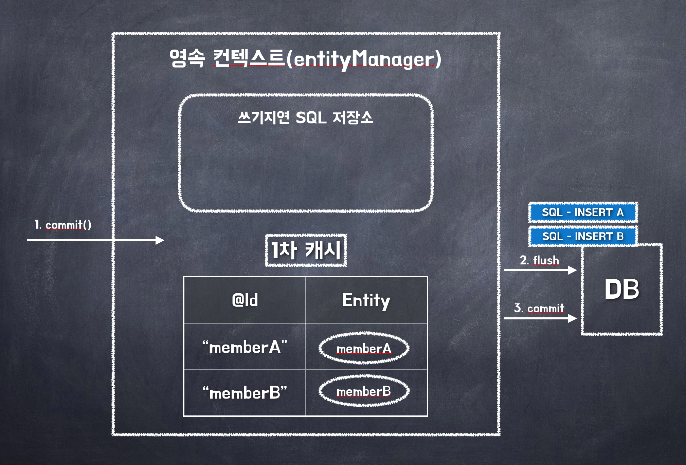

## 1. 영속성 컨텍스트란?

JPA를 이해하는데 가장 중요한 용어는 `영속성 컨텍스트(persistence context)`입니다.

해석하자면, '엔티티를 영구 저장하는 환경'이라는 뜻입니다.

논리적인 개념에 가까우며 엔티티 매니저를 생성할 때 하나 만들어집니다.

엔티티 매니저를 통해 영속성 컨텍스트에 접근하고 관리할 수 있습니다.

## 2. 엔티티의 생명주기

엔티티에는 4가지 상태가 존재합니다.

| 상태                  | 내용                                         |
| :-------------------- | :------------------------------------------- |
| 비영속(new/transient) | 영속성 컨텍스트와 전혀 관계가 없는 상태      |
| 영속(merged)          | 영속성 컨텍스트에 저장된 상태                |
| 준영속(detached)      | 영속성 컨텍스트에서 저장되었다가 분리된 상태 |
| 삭제(removed)         | 삭제된 상태                                  |

#### 비영속

```java:title=Java
// 객체를 생성한 상태(비영속)
Member member = new Member();
member.setId(100L);
member.setUsername("회원1");
```

#### 영속

영속상태 = 영속성 컨텍스트에 의해 관리된다는 뜻입니다.

`em.find()`나 `JPQL`를 사용해서 조회한 엔티티도 영속 상태 !

```java:title=Java
em.persist(member); // 객체를 영속성 컨텍스트에 저장
```

#### 준영속

영속성 컨텍스트가 관리하던 영속 상태의 엔티티를 영속성 컨텍스트가 관리하지 않으면 '준영속 상태'입니다.

- `em.detach()` 호출로 준영속 상태 명시적 호출
- `em.close()`를 호출해서 영속성 컨텍스트를 닫음
- `em.clear()`로 영속성 컨텍스트 초기화

```java:title=Java
em.detach(member);
```

#### 삭제

엔티티를 영속성 컨텍스트와 데이터베이스에서 삭제 !

```java:title=Java
em.remove(member);
```

## 3. 영속성 컨텍스트의 특징

1. 영속성 컨텍스트와 식별자 값

   - 엔티티를 식별자 값(@id로 테이블의 기본 키와 매핑한 값)으로 구분
   - 영속 상태는 식별자 값이 반드시 있어야 함 -> 식별자 값이 없으면 예외 발생

2. 영속성 컨텍스트와 데이터베이스 저장

   - JPA는 보통 트랜잭션을 커밋하는 순간 영속성 컨텍스트에 새로 저장된 엔티티를 데이터베이스에 반영하는데 이것을 `플러시(flush)`라 합니다.

3. 영속성 컨텍스트가 엔티티를 관리하는 것의 장점 5가지
   - 1차 캐시
   - 동일성 보장
   - 트랜잭션을 지원하는 쓰기 지연
   - 변경 감지
   - 지연 로딩

#### 1. 엔티티 조회

- 영속성 컨텍스트는 내부에 캐시를 가지고 있음
  - `1차 캐시`
- 영속 상태의 엔티티는 모두 이곳에 저장 !

**엔티티 조회**

```java:title=Java
Member member = em.find(Member.class, 100L);
```

`em.find()` 호출되면 `1차 캐시`에서 엔티티 조회 ! -> 엔티티가 1차 캐시에 없으면 `데이터베이스` 조회

**1차 캐시에서 엔티티 조회**

```java:title=Java
Member member = new Member();
member.setId(100L);
member.setUsername("회원1");

// 1차 캐시에 저장됨
em.persist(member);

// 1차 캐시에서 조회
Member findMember = em.find(Member.class, 100L);
```



**데이터베이스에서 엔티티 조회**

- 엔티티가 1차 캐시에 없으면 엔티티 매니저는 데이터베이스를 조회해서 엔티티를 생성함
- 1차 캐시에 저장한 후에 영속 상태의 엔티티를 반환함



#### 2. 엔티티 등록

```java:title=Java
EntityManager em = emf.createEntityManager();
EntityTransaction transaction = em.getTransaction();

transaction.begin();    // 트랜잭션 시작

em.persist(memberA);
em.persist(memberB);
// 여기까지 INSERT SQL을 데이터베이스에 보내지 않는다.

transaction.commit();   // 트랜잭션 커밋
```

- 엔티티 매니저는 트랜잭션을 커밋하기 직전까지 데이터베이스의 엔티티를 저장하지 않음
- 내부 쿼리 저장소에 INSERT SQL을 차곡차곡 모음
- 트랜잭션 커밋할 때 모아둔 SQL 쿼리를 데이터베이스에 보냄
- 트랜잭션을 지원하는 `쓰기 지연`



**트랜잭션 커밋시 플러시, 동기화 동작**



#### 3. 엔티티 수정

- JPA는 엔티티를 수정할 때는 단순히 엔티티를 조회해서 원하는 데이터를 변경하면 OK
- `update()`라는 메소드는 존재하지 않음
- `변경 감지` 기능을 사용해서 데이타베이스에 자동 반영
  - 플러시 시점에 스냅샷과 엔티티를 비교해서 `변경 감지`함

**업데이트 기본 전략**

JPA의 업데이트 기본 전략은 모든 필드를 업데이트함 !

- 모든 필드를 사용하면 수정 쿼리가 항상 같음.
- 동일한 쿼리를 보내면 데이터베이스는 이전에 파싱된 쿼리는 재사용.

#### 4. 엔티티 삭제

엔티티를 삭제하려면 먼저 삭제 대상 엔티티를 조회해야 한다.

```java:title=Java
Member memberA = em.find(Member.class, 100L);  // 삭제 대상 엔티티 조회
em.remove(memberA);     // 엔티티 삭제
```

- 엔티티를 즉시 삭제하는 것이 아님
- 삭제 쿼리를 `쓰기 지연` SQL 저장소에 등록
- `em.remove(memberA)`를 호출하는 순간 영속성 컨텍스트에서 제거

## 4. 플러시

플러시는 영속성 컨텍스트의 변경내용을 데이터베이스에 반영하는 동작

플러시 동작 절차는 아래와 같다.

1. 변경 감지가 동작하여 영속성 컨텍스트에 있는 모든 엔티티를 `스냅샷과 비교` 하여 수정된 엔티티 검출 및 수정 쿼리를 `쓰기 지연 저장소에 등록`
2. 쓰기 지연 저장소의 쿼리를 DB에 전송

플러시하는 방법은 3가지가 있음.

1. `em.flush()` 를 직접 호출
2. `트랜잭션 커밋 시` 플러시 자동 호출
3. `JPQL 쿼리 실행 시` 플러시가 자동 호출 
   - 식별자를 기준으로 조회하는 `find()`의 경우에는 호출 X 

### 플러시 모드 옵션

플러시는 2개의 옵션을 가지고 있음

- `FlushModeType.AUTO` : 커밋이나 쿼리를 실행할 때 플러시( default )
- `FlushModeType.COMMIT` : 커밋할 때만 플러시

주의할점
- 플러시는 영속성 컨텍스트와 DB간의 동기화 작업일 뿐, 영속성 컨텍스트가 관리하는 엔티티를 지우는것이 아님.

## 5. 준영속

준영속이란 영속상태의 엔티티가 영속성 컨텍스트에서 분리된것을 의미

> 준영속 상태의 엔티티는 영속성 컨텍스트가 제공하지 않기 때문에 앞에서 본 기능들을 사용할 수 없다.

준영속 상태로 만드는 방법은 3가지가 있음

1. em.detach(entity): 특정 엔티티를 준영속 상태로 만드는 메서드
2. em.clear(): 영속성 컨텍스트를 왼전히 초기화
3. em.close(): 영속성 컨텍스트를 종료

### 엔티티를 준영속 상태로 전환: detach()

`detach()` 메서드는 더 이상 영속 컨텍스트가 관리하지 않는 상태로 만들기 때문에 아래와 같은 동작이 수행된다.

- `1차 캐시 제거`
- `쓰기 지연 SQL 저장소에서 관련 SQL 제거`

### 영속성 컨텍스트 초기화: clear()

`em.clear()` 는 영속성 컨텍스트를 초기화해서 해당 영속성 컨텍스트의 모든 엔티티를 준영속 상태로 만든다.

### 영속성 컨텍스트 종료: close()

`em.close()`는 엔티티매니저를 아예 종료함으로써 준영속으로 만드는 것

### 준영속 상태의 특징

준영속 상태의 특징은 아래와 같다.

- 거의 비영속 상태에 가깝다
    - 영속성 컨텍스트가 관리하지 않으므로 제공하는 기능을 누릴수 없기 때문
- 식별자 값을 가지고 있다
    - 한번 영속 상태였던 적이 있기에 식별자 값을 가지고 있음
- 지연 로딩을 할 수 없다
    - 지연 로딩 역시 영속성 컨텍스트를 통한 기능이기에 사용을 못함

## 병합

병합은 준영속 상태의 엔티티를 다시 영속 상태로 변경하는 것

`persist`의 동작과 비슷하지만, `merge`는 인자로 받는 엔티티가 비영속, 준영속을 따지지 않고 받음.

단지, 1차 캐시에서 조회가 안되면 DB를 조회하여 캐싱한다고 보면 됨

> 영속성 컨텍스트의 save or update 이라고 생각 !