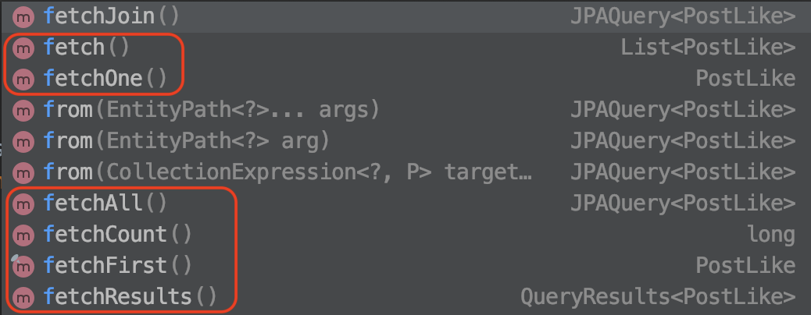

# QueryDSL

## 1. Criteria VS QueryDSL

JPA가 공식 지원하는 JPA Criteria는 JPQL을 자바 코드로 작성하도록 도와주는 빌더 클래스 API이다.  
`문법 오류`를 컴파일 단에서 잡아주고, `인텔리센스` 기능을 제공해주는 장점이 있지만 Criteria의 단점은 직관적이지 않고 복잡하다는 것..!

**Criteria 예시**

```java:title=Java
//Criteria 사용준비
CriteriaBuilder cb = em.getCriteriaBuilder();
CriteriaQuery<Member> query = cb.createQuery(Member.class);

//루트 클래스 (조회를 시작할 클래스)
Root<Member> m = query.from(Member.class);

//쿼리생성
CriteriaQuery<Member> cq = query.select(m).where(cb.equal(m.get("username"), "회원");
Member member = em.createQuery(cq).getMember();
```

> 어떤 JPQL이 생성될지 파악하기 쉽지 않다.

이 단점을 보안해줄 오픈소스 프로젝트가 바로 `QueryDSL`이다.

- JPA에서 공식 지원하는 라이브러리는 아니지만 직관적이고 편리함
- JPA, JDO, JDBC, Lucene, Hibernate, Search, 몽고DB, 자바컬렉션 등 지원

## 2. QueryDSL 설정

**필요 라이브러리**

예제에 사용된 QueryDSL 버전은 3.6.3 버전

```xml:title=pom.xml
<!-- QueryDSL -->
<dependency>
    <groupId>com.mysema.querydsl</groupId>
    <artifactId>querydsl-jpa</artifactId>
    <version>3.6.3</version>
</dependency>

<dependency>
    <groupId>com.mysema.querydsl</groupId>
    <artifactId>querydsl-apt</artifactId>
    <version>3.6.3</version>
</dependency>
```

**참고**

QueryDSL이 `4.x` 버전대로 올라오면서 package 명이 바뀌었음

- `com.mysema.querydsl` -> `com.querydsl`

| 파일명        | 설명                                                     |
| ------------- | -------------------------------------------------------- |
| querydsl-jpa  | QueryDSL JPA 라이브러리                                  |
| querydsl-apt  | 쿼리 타입(Q)를 생성할 때 필요한 라이브러리               |
| querydsl-core | QueryDSL 다양한 타입, 유틸, 어노테이션이 담긴 라이브러리 |

**Gradle 기반 설정**

QueryDSL을 사용하려면 Criteria 메타 모델처럼 엔티티를 기반으로 쿼리 타입이라는 쿼리용 클래스를 생성해야 한다.

Gradle 4.6 버전 이후로 `Annotation Processor`를 제공

`Annotation processor` 는 애노테이션이 선언된 클래스처리를 별도의 프로세서에서 처리하여 성능 향상이 가능하다.

4.6 이전은 `querydsl-apt` 외에 `Lombok` 등 `Annotation Processor` 를 사용하는 라이브러리가 추가될 때마다 `-processor` 에 클래스를 추가해줘야하는 번거로움이 있었지만 알아서 별다른 설정을 하지 않아도 Gradle에서 적절한 설정을 사용해줌.

> 설정이 매우 간편!

```groovy:title=build.gradle
dependencies {
    // QueryDSL (모든 모듈에서 필요한 설정)
    implementation("com.querydsl:querydsl-jpa")
    implementation("com.querydsl:querydsl-core")
    // querydsl JPAAnnotationProcessor 사용 지정
    annotationProcessor("com.querydsl:querydsl-apt:${dependencyManagement.importedProperties['querydsl.version']}:jpa")
    annotationProcessor("jakarta.persistence:jakarta.persistence-api")
    annotationProcessor("jakarta.annotation:jakarta.annotation-api")
}
```

## 3. 시작

#### QueryDSL 사용방법

1. EntityManager를 생성
2. JPAQuery 객체 생성
3. 사용할 쿼리 타입(Q)를 생성하는데 생성자에는 별칭을 줌

```java:title=Java
public static void queryDSL() {

    EntityManager em = emf.createEntityManager();

    JPAQuery query = new JPAQuery(em);
    QMember qMember = new QMember("m");     // 생성되는 JPQL의 별칭이 m
    List<Member> members = query
            .from(qMember)
            .where(qMember.username.eq("회원"))
            .orderBy(qMember.username.desc())
            .list(qMember);
}
```

#### JPQL과 QueryDSL 비교

**JPQL**

```sql
select m from Member m
where m.name = ?1
order by m.name desc
```

**QueryDSL**

```java
List<Member> members = query
            .from(qMember)
            .where(qMember.username.eq("회원"))
            .orderBy(qMember.username.desc())
            .list(qMember);
```

#### 기본 Q 타입 생성

쿼리 타입(Q)은 사용하기 편리하도록 기본 인스턴스를 보관하고 있다.

```java
QMember qMember = new QMember("m");     // 직접 지정
QMember qMember = QMember.member;       // 기본 인스턴스
```

따라서, 다음과 같이 쓰면 더 간결해짐!

```java
import static com.package.path.QMember.member; // 기본 인스턴스

public void basic(){

    EntityManager em = emf.createEntityManager();

    JPAQuery query = new JPAQuery(em);
    List<Member> members = query
            .from(member)
            .where(member.username.eq("회원"))
            .orderBy(member.username.desc())
            .list(member);
}
```

## 4. 검색 조건 쿼리

#### QueryDSL의 기본 쿼리 기능

```java:title=Java
JPAQuery query = new JPAQuery(em);
QItem item = QItem.item;
List<Item> list = query.from(item)
        .where(item.name.eq("좋은상품").and(item.price.gt(20000)))
        .list(item); // 조회할 프로젝션 지정
```

**실행된 JPQL**

```sql
select item
from Item item
where item.name = ?1 and item.price > ?2
```

QueryDSL의 where절에는 `and` 나 `or`를 사용할 수 있다.

다음처럼 여러 검색조건을 사용해도 됨  
단, 이때는 `and` 연산이 적용

```java
.where(item.name.eq("좋은상품"), item.price.gt(20000))
```

#### 기본 조건절

```java
item.price.between(10000, 20000);     // 가격이 10000원~20000원 아이템

item.name.contains("상품1");        // "상품1" 이름을 포함하는 아이템

item.name.startsWith("단어");       // "단어"로 시작하는 아이템
```

IDE 인텔리센스 지원이 됨으로 쉽게 원하는 메소드를 찾을 수 있다.

## 5. 결과 조회

파라미터로 프로젝션 대상을 넘겨준다.

| 메소드         | 설명                                                       |
| -------------- | ---------------------------------------------------------- |
| uniqueResult() | 조회 결과가 한 건 일때 사용, 없으면 null, 하나 이상은 예외 |
| singleResult() | uniqueResult()와 같지만 하나 이상이면 첫번째 반환          |
| list()         | 결과가 하나 이상일 경우, 없으면 빈 컬렉션                  |

**참고**

QueryDSL 버전이 `4.x` 버전으로 올라감에 따라 결과 조회 쿼리도 변경이 있음

`4.0.1` 버전까지는 list 조회 시 `list()`, `singleResult()` 등의 메서드를 사용했지만

`4.0.2` 버전부터는 `fetch()` 메서드로 이름이 변경되었다.



## 6. 페이징과 정렬

- 정렬은 `orderBy` 사용
  - asc(), desc()
- 페이징은 `offset`, `limit` 사용

#### 실제 페이징 처리

```java:title=Java
QueryModifiers queryModifiers = new QueryModifiers(20L, 0L); // limit, offset
SearchResults<Member> result = query.from(qMember)
        .restrict(queryModifiers)
        .listResults(qMember); // 4.0.2 이후 fetchResults()

long total = result.getTotal();     // 검색된 전체 데이터 수
long limit = result.getLimit();
long offset = result.getOffset();
List<Member> members = result.getResults(); // 조회된 데이터
```

`listResults()`를 사용하면 전체 데이터 조회를 위한 `count 쿼리`를 한번 더 실행한다는 것 기억 !

## 7. 그룹

그룹핑할 수 있는 `groupBy` 메서드도 지원

그룹화된 결과를 제한하려면 `having`을 사용하면 된다.

```java:title=Java
query.from(item)
    .groupBy(item.price)
    .having(item.price.gt(1000))
    .list(item); // fetch()
```

## 8. 조인

- innerJoin(join), leftJoin, rightJoin, fullJoin을 사용할 수 있다.
- JPQL의 on 사용할 수 있다.
- 성능 최적화를 위한 fetch 조인도 사용할 수 있다.

#### 기본 문법

1. 첫 번째 파라미터에 조인 대상을 지정.
2. 두 번째 파라미터에 별칭으로 사용할 쿼리 타입을 지정.

```java:title=Java
QOrder order = QOrder.order;
QMember member = QMember.member;
QOrderItem orderItem = QOrderItem.orderItem;

query.from(order)
    .join(order.member, member)
    .leftJoin(order.orderItems, orderItem)
    .list(order) // fetch()
```

#### 조인에 ON 사용

```java:title=Java
query.from(order)
    .leftJoin(order.orderItems, orderItem)
    .on(orderItem.count.gt(2))
    .list(order);
```

#### 페치 조인 사용

```java:title=Java
query.from(order)
    .innerJoin(order.member, member).fetch() // 4.0.2 이후 fetchJoin()
    .leftJoin(order.orderItem, orderItem).fetch()
    .list(order)
```

## 9. 서브쿼리

`JPASubQuery`를 생성해서 사용.

- 결과가 하나면 unique()
  > 4.0.2 이후 fetchOne()
- 여러 건이면 list()를 사용
  > 4.0.2 이후 fetch()

#### 결과가 단 건

```java:title=Java
query.from(item)
    .where(item.price.eq( // 단 건이니 eq
        new JPASubQuery().from(itemSub).unique(itemSub.price.max())
    ))
    .list(item);
```

#### 결과가 여러 건

```java:title=Java
query.from(item)
    .where(item.in( // 여러 건이니 in
        new JPASubQuery().from(itemSub)
            .where(item.name.eq(itemSub.name))
            .list(itemSub)
    ))
    .list(item);
```

## 10. 프로젝션과 결과 반환

- 프로젝션이란?
  - select 절에 조회 대상을 지정하는 것

#### 프로젝션 대상이 하나

```java:title=Java
List<String> result = query.from(item).list(item.name);

for (String name : result) {
    System.out.println("name = " + name);
}
```

#### 여러 컬럼 반환과 튜플

```java:title=Java
List<Tuple> result = query.from(item).list(item.name, item.price);
//List<Tuple> result = query.from(item).list(new QTuple(item.name, item.price)); // 동일

for (Tuple tuple : result) {
    System.out.println("name = " + tuple.get(item.name));
    System.out.println("price = " + tuple.get(item.price));
}
```

#### 빈 생성 (Bean population)

쿼리 결과를 엔티티가 아닌 특정 객체로 받고 싶으면 빈 생성 기능을 사용하면 된다!

QueryDSL은 아래와 같은 다양한 방법을 제공

- 프로퍼티 접근
- 필드 직접 접근
- 생성자 사용

#### 생성자 방식 예시

```java:title=Java
QItem item = QItem.item;
List<ItemDTO> result = query.from(item)
    .list(
        Projections.constructor(ItemDTO.class, item.name, item.price)
    );
```

## 11. 수정, 삭제 배치 쿼리

QueryDSL도 수정(JPAUpdateClause), 삭제(JPADeleteClause) 쿼리를 지원한다.

주의사항은 JPQL 배치 쿼리와 같이 영속성 컨텍스트 무시하고 데이타베이스에 직접 쿼리한다는 점에 유의 !

## 12. 동적 쿼리

`BooleanBuilder` 사용하여 특정 조건에 따른 동적 쿼리를 편리하게 생성할 수 있다.

```java:title=Java
SearchParam param = new SearchParam();
param.setName("시골개발자");
param.setPrice(10000);

QItem item = QItem.item;

BooleanBuilder builder = new BooleanBuilder();
if (StringUtils.hasText(param.getName())) {
    builder.and(item.name.contains(param.getName()));
}

if (param.getPrice() != null) {
    builder.and(item.price.gt(param.getPrice()));
}

List<Item> result = query.from(item)
            .where(builder)
                .list(item);
```

# 네이티브 SQL

JPA 구현체들은 특정 데이터 베이스에 종속적인 기능을 지원함

> 종속적인 기능을 제공하는데 한계가 있다.

다양한 이유로 JPQL을 사용할 수 없을 때 JPA는 SQL을 직접 사용할 수 있는 기능을 제공하는데, 이것을 `Native SQL` 이라고 한다.

네이티브 SQL을 사용하면 엔티티를 조회할 수 있고 JPA가 지원하는 영속성 컨텍스트의 기능을 그대로 사용할 수 있다.

> JDBC API 를 직접 사용하면 단순히 데이터의 나열을 조회할 뿐

네이티브 SQL도 JPQL을 사용할 때와 마찬가지로 `Query`, `TypeQuery`(Named Native Query 의 경우)를 반환한다.

따라서 JPQL API를 그대로 사용할 수 있다.

## 1. 네이티브 SQL 사용

```java:title=Java
// 결과 타입 정의
public Query createNativeQuery(String sqlString, Class resultClass);

// 결과 타입 정의할 수 없을 때
public Query createNativeQuery(String sqlString);

// 결과 매핑 사용
public Query createNativeQuery(String sqlString, String resultSetMapping);
```

#### 엔티티 조회

```java:title=Java
//SQL 정의
String sql =
        "SELECT ID, AGE, NAME, TEAM_ID " +
        "FROM MEMBER WHERE AGE > ?";

Query nativeQuery = em.createNativeQuery(sql, Member.class)
                        .setParameter(1, 20);

List<Member> resultList = nativeQuery.getResultList();
```

JPA는 공식적으로 이름 기반 파라미터를 제공하지 않음.  
하지만, 하이버네이트는 이름 기반 파라미터를 제공!

**중요한 점**

- 네이티브 SQL로 SQL만 직접 사용할 뿐, 나머지는 JPQL을 사용할 때와 같다.
- 조회된 엔티티도 영속성 컨텍스트에서 관리된다.

#### 값 조회

```java:title=Java
// SQL 조회
String sql =
            "SELECT ID, AGE, NAME, TEAM_ID " +
            "FROM MEBER WHERE AGE > ?"

Query nativeQuery = em.creatNativeQuery(sql)
                        .setParamter(1, 10);

List<Object[]> resultList = nativeQuery.getResultList();
```

#### 결과 매핑 사용

위의 2가지 방법은 값을 나열해서 조회하는 방식

매핑이 복잡해지면 `@SqlResultSetMapping`을 사용해서 여러 엔티티와 값을 한번에 매핑할 수 있다.

## 2. Named 네이티브 SQL

JPQL처럼 네이티브 SQL도 Named 네이티브 SQL을 사용해서 정적 SQL을 미리 작성한 뒤 불러와서 사용할 수 있다.

## 3. 네이티브 SQL 정리

네이티브 SQL은 JPQL이 자동 생성하는 SQL을 개발자가 수동으로 직접 정의하는 것

> 따라서, JPA가 제공하는 기능 대부분을 그대로 사용 가능

대신, 네이티브 SQL은 관리하기가 쉽지 않고 데이터베이스에 종속된 쿼리를 작성하기 때문에 이식성이 떨어지는 점에 유의

그리고 네이티브 SQL로도 부족함을 느낀다면 `MyBatis` 또는 `JdbcTemplate` 같은 `SQL 매퍼`와 JPA를 함께 사용하는 것도 고려할만하다.

## 4. 스토어드 프로시저

JPA는 2.1부터 스토어드 프로시저를 지원한다.

#### 스토어드 프로시저에 대해

[[info | 스토어드 프로시저란?]]
| SQL 명령문들을 하나의 함수처럼 실행하기 위한 쿼리의 집합

**장점**

- 개발 측면
  - 반복적인 작업을 피할 수 있다.
  - 개발 언어에 비의존적
- 성능 측면
  - 최적화되고 캐시되어 사용됨
  - 네트워크 트래픽을 감소

**참고**

- https://hanhyx.tistory.com/19
