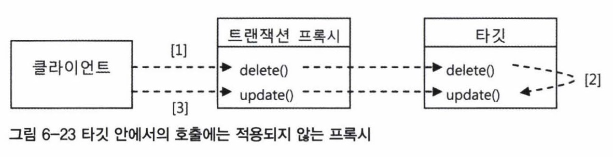
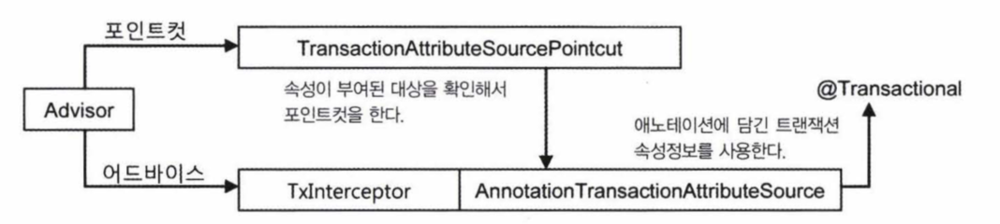

## 개요

`토비의 스프링` AOP의 마지막 챕터를 정리한 포스팅입니다.

## 트랜잭션 정의

`트랜잭션`이라고 모두 같은 방식으로 동작하는 것은 아닙니다.  
물론 트랜잭션의 기본 개념인 '더 이상 쪼갤 수 없는 최소 단위의 작업'이라는 개념은 항상 유효합니다.  
트랜잭션 경계 안에서 진행된 작업은 `commit()`을 통해 모두 성공하든지 아니면 `rollback()`을 통해 모두 취소 되어야합니다.  
그런데 이 밖에도 트랜잭션의 동작방식을 제어할 수 있는 4가지 속성이 있습니다.

#### 트랜잭션 전파

`트랜잭션 전파`(transaction propagation)이란 트랜잭션의 경계에서 이미 진행 중인 트랜잭션이 있을 때 또는 없을 때 어떻게 동작할 것인가를 결정하는 방식입니다.

대표적으로 다음과 같은 `전파 속성`을 줄 수 있습니다.

##### PROPAGATION REQUIRED

진행 중인 트랜잭션이 없으면 새로 시작하고, 이미 시작된 트랜잭션이 있으면 이에 참여합니다.  
'DefaultTransactionDefinition'의 트랜잭션 전파 속성이 `PROPAGATION_REQUIRED` 입니다.

##### PROPAGATION REQUIRES NEW

항상 새로운 트랜잭션을 시작합니다.  
즉, 앞에서 시작된 트랜잭션이 있든 없든 상관없이 새로운 트랜잭션을 만들어서 독자적으로 동작합니다.

##### PROPAGATION NOT SUPPORTED

이 속성을 사용하면 트랜잭션없이 동작하도록 만들 수도 있습니다.  
진행 중인 트랜잭션이 있어도 무시합니다.

---

이렇게 트랜잭션 매니저를 통해 트랜잭션을 시작하려고 할 때, `getTransaction()`이라는 메소드를 사용하는 이유는 바로 항상 트랜잭션을 새로 시작하는 것이 아니기 때문입니다.  
새로 시작할 수도 있고, 현재 진행 중인 트랜잭션에 참여해서 동작할 수도 있습니다.

#### 격리 수준

모든 DB 트랜잭션은 `격리수준`(isolation level)을 가지고 있어야합니다.

서버 환경에서는 여러 개의 트랜잭션이 동시에 진행될 수 있기 때문입니다.  
순차적으로 진행되어 독립적이면 좋겠지만 `성능`이 크게 떨어질 수 밖에 없습니다.  
따라서, 적절하게 격리수준을 조정해서 가능한 한 많은 트랜잭션을 `동시에 진행`시키면서도 문제가 발생하지 않게 하는 `제어가 필요`합니다.

격리수준은 기본적으로 DB에 설정되어 있지만 JDBC 드라이버나 DataSource 등에서 재설정할 수 있고, 필요하다면 트랜잭션 단위로 격리수준을 조정할 수 있습니다.

##### 제한 시간

트랜잭션을 수해하는 `제한 시간`(timeout)을 설정할 수 있습니다.  
'DefaultTransactionDefinition'의 기본 설정은 제한시간이 없고 `제한 시간`은 트랜잭션을 직접 시작할 수 있는 `PROPAGATION_REQUIRED`, `PROPAGATION_REQUIRES_NEW`와 함께 사용해야만 의미가 있습니다.

##### 읽기 전용

`읽기 전용`(read-only)으로 설정해두면 트랜잭션 내에서 데이터를 조작하는 시도를 막아줄 수 있고 데이터 액세스 기술에 따라서 `성능이 향상`될 수도 있다.

## 트랜잭션 인터셉터와 트랜잭션 속성

메소드 별로 다른 트랜잭션 정의를 적용하려면 어드바이스의 기능을 확장해야합니다.  
메소드 이름 패턴에 따라 다른 트랜잭션 정의가 되도록 구현하는 것과 비슷합니다.

스프링에서 제공하는 클래스로 편리하게 트랜잭션 경계설정 어드바이스로 사용할 수 있도록 'TransactionInterceptor'을 제공합니다.

'TransactionInterceptor'은 'PlatformTransactionManager'와 'Properties' 타입의 두 가지 프로퍼티를 갖고 있습니다.

> Properties는 트랜잭션 속성 3가지 + rollbackOn()이라는 속성을 가집니다.

그리고 스프링이 제공하는 'TransactionInterceptor'에는 기본적으로 두 가지 종류의 예외 처리 방식이 있다.

- 런타임 예외 : 트랜잭션은 롤백됩니다.
- 체크 예외 : 예외상황으로 해석하지 않고 일종의 비즈니스 로직에 따른, 의미가 있는 리턴 방식의 한 가지로 인식해서 트랜잭션을 커밋합니다.

이러한 동작의 `이유`는 스프링의 기본적인 예외처리 원칙에 따라 비즈니스적인 의미가 있는 예외상황만 체크 예외를 사용하고, 그 외의 모든 복구 불가능한 순수한 예외의 경우는 런타임 예외로 포장돼서 전달하는 방식을 따른다고 가정하기 때문입니다.

#### 포인트컷과 트랜잭션 속성의 적용 전략

**1. 트랜잭션 포인트컷 표현식은 타입 패턴이나 빈 이름을 이용합니다.**

**2. 공통된 메소드 이름 규칙을 통해 최소한의 트랜잭션 어드바이스와 속성을 정의합니다.**

**3. 프록시 방식 AOP는 같은 타킷 오브젝트 내의 메소드를 호출할 때는 적용되지 않습니다.**

프록시 방식의 AOP에서는 프록시를 통한 부가기능의 적용은 클라이언트로부터 호출이 일어날 때만 가능합니다.  
자기 자신의 메소드를 호출할 때는 프록시를 통한 부가기능의 적용이 일어나지 않습니다.



- `[1], [3]`은 클라이언트로부터 메소드가 호출되면 프록시를 통해 타깃에게 전달되므로 트랜잭션 경계설정 기능이 부여됩니다.
- `[2]`는 타깃 오브젝트 내로 들어와서 다른 메소드를 호출하는 경우에는 프록시를 거치지 않고 직접 타깃의 메소드가 호출되어 부가기능이 적용되지 않습니다.

타깃 안에서의 호출에는 프록시가 적용되지 않는 문제를 `해결할 수 있는 방법`은 두 가지가 있습니다.

1. 스프링 API를 이용해 프록시 오브젝트에 대한 레퍼런스를 가져온 뒤에 같은 오브젝트의 메소드 호출도 `프록시를 이용하도록 강제`하는 방법
2. `AspectJ`와 같은 타깃의 `바이트코드를 직접 조작`하는 방식의 AOP 기술을 적용

## 트랜잭션 속성 적용

#### 트랜잭션 경계 설정의 일원화

- 트랜잭션 경계설정의 부가기능을 여러 계층에서 중구난방으로 적용하는 것은 좋지 않습니다.
- 비즈니스 로직을 담고 있는 서비스 계층 오브젝트의 메소드가 트랜잭션 경계를 부여하기에 가장 적절한 대상입니다.
- 테스트와 같은 특별한 이유가 아니고는 다른 계층이나 모듈에서 `DAO`를 직접 접근하는 것은 차단해야합니다.
- Service 계층을 통해서 접근하는 것이 좋습니다.

## 애노테이션 트랜잭션 속성과 포인트컷

포인트컷 표현식과 트랜잭션 속성을 이용해 트랜잭션을 일괄적으로 적용하는 방식은 복잡한 트랜잭션 속성이 요구되지 않는 한 잘 들어맞습니다.  
그런데 가끔은 클래스나 메서드 단위의 세밀하게 튜닝된 트랜잭션 속성을 적용해야 하는 경우에는 매번 포인트컷이나 어드바이스를 추가해야하기 때문에 적합하지 않습니다.

이런 세밀한 트랜잭션 속성의 제어를 위해 스프링은 '직접 타깃에 애노테이션을 지정하는 방법'을 제공합니다.

#### 트랜잭션 애노테이션

**@Transaction**

다음 코드는 `@Transaction`를 정의한 코드입니다.

```java:title=Java
@Target({ElementType.METHOD, ElementType.TYPE}) // 애노테이션을 사용할 대상을 지정
@Retention(RetentionPolicy.RUNTIME) // 애노테이션 정보가 언제까지 유지되는지
@Inherited // 상속을 통해서도 애노테이션 정보를 얻을 수 있도록
@Documented
// 트랜잭션 속성의 모든 항목을 엘리먼트로 지정 가능, 디폴트 값이 설정되어 있으므로 모두 생략이 가능
public @interface Transactional {
	String value() default "";
	Propagation propagation() default Propagation.REQUIRED;
	Isolation isolation() default Isolation.DEFAULT;
	int timeout() default TransactionDefinition.TIMEOUT_DEFAULT;
	boolean readOnly() default false;
	Class<? extends Throwable>[] rollbackFor() default {};
	String[] rollbackForClassName() default {};
	Class<? extends Throwable>[] noRollbackFor() default {};
	String[] noRollbackForClassName() default {};
}
```

`@Transaction`의 타깃은 `메소드`와 `타입`입니다.  
따라서 메소드, 클래스, 인터페이스에 사용할 수 있고 `@Transaction`은 기본적으로 `트랜잭션 속성을 지정`하는 것이지만, 동시에 `포인트컷의 자동 등록`에도 사용됩니다.

---

다음 그림은 `@Transactional`을 사용했을 때 어드바이저의 동작 방식입니다.



`@Transactional` 방식을 이용하면 포인트컷과 트랜잭션 속성을 `애노테이션 하나로 지정`할 수 있습니다.  
그리고 트랜잭션 속성은 타입 레벨에 일괄적으로 부여할 수도 있지만 메소드 단위로 세분화해서 트랜잭션 속성을 다르게 지정할 수도 있기 때문에 매우 `세밀한 트랜잭션 속성 제어`가 가능해집니다.

#### 대체 정책

스프링은 `@Transactional`을 적용할 때 4단계의 대체(fallback)정책을 이용하게 해줍니다.

4단계 대체 정책은 다음과 같습니다.

1. 타깃 메소드에 @Transactional이 있는지 확인
2. @Transactional이 부여되어 있다면 이를 속성으로 사용
3. 없다면, 다음 대체 후보인 타깃 클래스에 부여된 @Transactional를 찾음
4. 메소드 레벨에는 없지만, 클래스 레벨에 @Transactional이 존재하면 이를 메소드의 트랜잭션으로 사용

**@Transactional 대체 정책의 예**

`[x]`는 검색의 `우선 순위`입니다.

> 낮을 수록 높은 우선순위

```java:title=Java
// [4]
public interface Service {
	// [3]
	void method1();
	// [3]
	void method2();
}

// 타깃 클래스 [2]
public class Servicelmpl implements Service {
	// [1]
	public void method1() (
	// [1]
	public void method2() {
}
```

`@Transactional`도 타깃 클래스보다는 인터페이스에 두는 게 바람직합니다.  
하지만 인터페이스를 사용하는 프록시 방식의 AOP가 아닌 방식으로 트랜잭션을 적용하면 인터페이스에 정의한 `@Transactional`은 무시되기 때문에 안전하게 타깃 클래스에 `@Transactional`을 두는 방법을 권장합니다.

단, 인터페이스에 `@Transactional`를 두면 구현 클래스가 바뀌더라도 트랜잭션 속성을 유지할 수 있다는 장점이 있습니다.

> 확신이 있다면 인터페이스에 ! 아니면 타깃 클래스에 선언 !

## 트랜잭션 지원 테스트

#### 트랜잭션 동기화와 테스트

- 트랜잭션 추상화 기술의 핵심은 트랜잭션 매니저와 트랜잭션 동기화입니다.
  - 트랜잭션 매니저 : PlatformTransactionManager 인터페이스를 구현한 트랜잭션 매니저를 통해 구체적인 트랜잭션 기술의 종류에 상관없이 일관된 트랜잭션 제어가 가능
  - 트랜잭션 동기화 : 트랜잭션 동기화 기술이 있었기에 시작된 트랜잭션 정보를 저장소에 보관해뒀다가 DAO에서 공유 가능

트랜잭션 동기화 기술은 트랜잭션 전파를 위해서도 다음과 같은 중요한 역할을 합니다.

1. 진행 중인 트랜잭션이 있는지 확인
2. 트랜잭션 전파 속성에 따라서 이에 참여할 수 있도록 만들어줌

이 모든 것은 `트랜잭션 동기화` 기술 덕분 !

이제 한번 간단한 테스트를 추가해봅시다.

```java:title=Java
@Test
public void transactionSync() {
    userService.deleteAll();
    userService.add(users.get(0));
    userService.add(users.get(1));
}
```

**'transactionSync()' 테스트 메소드가 실행되는 동안 몇 개의 트랜잭션이 만들어 졌을까?!**

정답은 `UserService`의 모든 메소드에 트랜잭션을 적용했으니 3개가 적용됩니다.

---

**그렇다면, 이 테스트 메소드에서 만들어지는 세 개의 트랜잭션을 하나로 통합하려면 ?**

`하나의 커넥션을 사용`해서 트랜잭션을 유지해야합니다 !

즉 3개의 동작이 이루어지기 전에 트랜잭션을 `미리 시작`하면 됩니다.

```java:title=Java
@Test
public void transactionSync() {
    DefaultTransactionDefinition definition = new DefaultTransactionDefinition();
    TransactionStatus status = transactionManager.getTransaction(definition);

    userService.deleteAll();
    userService.add(users.get(0));
    userService.add(users.get(1));

    transactionManager.commit(status);
}
```

#### 롤백 테스트

테스트 코드로 트랜잭션을 제어해서 적용할 수 있는 테스트 기법이 있습니다.  
바로 `롤백 테스트`입니다 !

`롤백 테스트`는 테스트 내의 모든 DB 작업을 하나의 트랜잭션 안에서 동작하게하고 테스트가 끝나면 무조건 롤백해버리는 테스트를 말합니다.

다음과 같은 코드가 전형적인 롤백 테스트입니다.

```java:title=Java
@Test
public void transactionSync() {
    DefaultTransactionDefinition txDefinition = new DefaultTransactionDefinition();
    TransactionStatus txStatus = transactionManager.getTransaction(txDefinition);

    try {
        userService.deleteAll();
        userService.add(users.get(0));
        userService.add(users.get(1));
    } finally {
        transactionManager.rollback(txStatus);
    }
}
```

`롤백 테스트`는 DB 작업이 포함된 테스트가 수행되어도 DB에 영향을 주지 않기 때문에 `장점`이 많습니다.  
복잡한 데이터를 바탕으로 동작하는 기능을 테스트하려면 테스트가 실행될 때의 DB 데이터와 상태가 매우 중요합니다.  
문제는 테스트를 실행할 때마다 데이터가 변한다는 것인데 이런 문제를 `롤백 테스트`로 해결할 수 있습니다.

롤백 테스트는 심지어 여러 개발자가 하나의 공용 테스트용 DB를 사용할 수 있게 도와줍니다.  
적절한 격리 수준만 보장해주면 동시에 여러 개의 테스트가 진행되어도 상관 없습니다 !

또한 DB에 따라서 성공적인 작업이라도 트랜잭션을 롤백하면 커밋할 때보다 성능이 향상되기도 합니다

> MySQL의 속도는 롤백 > 커밋

하지만, DB의 트랜잭션 처리 방법에 따라 롤백과 커밋의 속도 차이는 있습니다.

## 테스트를 위한 트랜잭션 애노테이션

스프링의 컨텍스트 테스트 프레임워크는 애노테이션을 이용해 테스트를 편리하게 만들 수 있는 여러 가지 기능을 추가하게 해줍니다.

#### @Transaction

테스트에도 `@Transaction`을 적용할 수 있습니다.  
테스트 클래스, 메소드에 `@Transaction`을 적용하면 마치 타깃 클래스나 인터페이스에 적용한 것처럼 테스트 메소드에 트랜잭션 경계가 `자동으로 설정`됩니다.

물론 테스트에서 사용하는 `@Transaction`은 AOP를 위한 것은 아닙니다.
하지만 기본적인 동작방식과 속성은 `UserService` 등에 적용한 `@Transaction`과 동일하므로 이해하기 쉽고 사용하기 편리합니다.

**하나의 트랜잭션으로 동작하는 테스트 @Transaction**

```java:title=Java
@Test
@Transaction
public void transactionSync(){
    userService.deleteAll();
    userService.add(users.get(0));
    userService.add(users.get(1));
}
```

#### @Rollback

테스트용 트랜잭션은 테스트가 끝나면 자동으로 롤백됩니다.  
`@Transaction`을 지정해주기만 하면 자동으로 `롤백 테스트`로 설정됩니다 !

하지만, 강제 롤백을 원하지 않는 경우엔 어떻게 하면 좋을까?

이때는, `@Rollback`이라는 애노테이션을 사용하면 됩니다.  
`@Rollback`은 롤백 여부를 지정하는 값을 가지고 있습니다.

> @Rollback의 기본 값은 true

따라서, 롤백을 원치 않는다면 `@Rollback(false)`라고 해줘야합니다.

**만약, 모든 테스트 클래스의 모든 메소드에 트랜잭션을 적용하면서 롤백되지 않고 커밋되게 하려면 어떻게 해야할 까?**

이런 경우엔 클래스 레벨에 적용시킬 수 있도록 `@TransactionConfiguration(defaultRollback=false)`를 적용하면 됩니다.

#### Propagation.NEVER

트랜잭션이 일부 메서드에서 필요없는 경우가 있을 수 있습니다.  
그럴 경우는 다음과 같이 사용하면 됩니다.

```java:title=Java
@Transactional(propagation = Propagation.NEVER)
```

위의 애노테이션을 테스트 메소드에 지정하면 트랜잭션이 시작되지 않고 동작합니다 !

#### 효과적인 DB 테스트

- 단위 테스트와 DB 같은 외부 리소스가 참여하는 통합 테스트는 아예 클래스를 구분.
- DB가 사용되는 통합 테스트는 가능한 한 롤백 테스트로 만드는 게 좋음.
  - `@Transaction`을 사용해서 롤백 테스트로 !
  - 테스트가 기본적으로 롤백 테스트로 되어 있다면 테스트 사이에 서로 영향을 주지 않으므로 독립적이고 자동화된 테스트로 만들기가 매우 편함
- 테스트는 어떤 경우에도 서로 의존하면 안됨

## 마무리

지금까지 이번 `토비의 스프링`에서 가장 긴 챕터인 `AOP`에 대해서 알아보았습니다.

다음 포스팅은 `스프링의 핵심 기술의 응용`에 대해서 알아보겠습니다.

감사합니다 🙇🏻‍♂️
