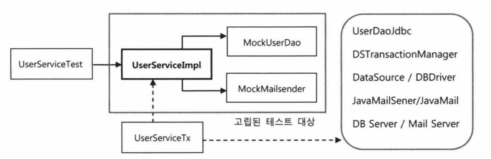

## 개요

`AOP`는 `IoC/DI`, `서비스 추상화`와 더불어 스프링의 3개 기반기술의 하나입니다.

스프링에 적용된 가장 인기 있는 `AOP`의 적용 대상은 바로 선언적 트랜잭션 기능입니다.

이번 포스팅에서는 서비스 추상화로 많은 근본적인 문제를 해결했던 트랜잭션 경계 설정 기능을 `AOP`를 이용해 더 깔끔한 방식으로 바꿔보겠습니다.

## 1. 트랜잭션 코드의 분리

여러 기술과 환경에 독립적인 깔끔한 UserService 코드이지만, 한가지 찜찜한 문제가 있습니다.  
바로 트랜잭션 경계설정 부분입니다.

**트랜잭션과 비즈니스 로직이 공존하는 메소드**

```java:title=Java
public void upgradeLevels() throws Exception {
    // 트랜잭션 전 처리
    PlatformTransactionManager transactionManager
        = new DataSourceTransactionManager(dataSource);
    TransactionStatus status =
        transactionManager.getTransaction(new DefaultTransactionDefinition());
    try {
        // 비즈니스 로직
        List<User> users = userDao.getAll();
        for (User user : users) {
            if (canUpgradeLevel(user)) {
                upgradeUser(user);
            }
        }
        // 트랜잭션 후 처리
        transactionManager.commit(status);
    } catch (Exception e) {
        transactionManager.rollback(status);
        throw e;
    }
}
```

비즈니스 로직 코드를 사이에 두고 트랜잭션 시작과 종료를 담당하는 코드가 전후로 존재합니다.  
UserService 클래스에서는 비즈니스 로직만 담는 것이 이상적인 설계입니다.

#### 1) DI를 이용한 클래스의 분리

그렇다면, `트랜잭션 처리 부분을 분리`하는 것은 어떨까?!

현재 UserService는 클래스로 되어있어 다른 코드에서 사용한다면 UserService를 직접 참조하게 되어 `강한 결합도`를 가지게 됩니다.  
따라서, 이전에 계속 반복했던 `인터페이스`를 활용하여 강한 결합도를 분리합니다.

또한, UserService의 비즈니스 처리 구현체인 UserServiceImpl과 트랜잭션 구현체인 UserServiceTx 2가지 클래스를 만듭니다.

- UserServiceImpl: UserService의 순수한 비즈니스 로직 구현체
- UserServiceTx : 트랜잭션 처리 책임을 맡고 있는 구현체

앞서 말한 구조는 다음과 같습니다.


#### 2) 분리된 트랜잭션 기능

**UserService 인터페이스**

```java:title=Java
public interface UserService {
    void add(User user);
    void upgradeLevels();
}
```

**트랜잭션 코드를 제거한 UserService 구현 클래스**

```java:title=Java
public class UserServiceImpl implements UserService {
    // ...

    @Override
    public void upgradeLevels() {
        List<User> users = userDao.getAll();
        for (User user : users) {
            if (canUpgradeLevel(user)) {
                upgradeLevel(user);
            }
        }
    }
    // ...
}
```

**위임 기능을 가진 UserServiceTx 트랜잭션 클래스**

```java:title=Java
public class UserServiceTx {
    // ...

    public void add(User user) {
        userService.add(user);
    }

    public void upgradeLevels() {
        TransactionStatus status = this.transactionManager
            .getTransaction(new DefaultTransactionDefinition());
        try {
            userService.upgradeLevels();
            this.transactionManager.commit(status);
        } catch (RuntimeException e) {
            this.transactionManager.rollback(status);
            throw e;
        }
    }
}
```

트랜잭션 로직의 `역할`은 비즈니스 로직 처리 전후로 `트랜잭션 경계설정`을 해주고 실행될 비즈니스 로직을 `위임하는 역할`입니다.  
이제 비즈니스 로직과 트랜잭션 로직 처리 코드가 깔끔하게 분리되었습니다.

#### 3) 트랜잭션 적용을 위한 DI 설정

기본적으로 `@Autowired`는 타입이 일치하는 빈을 가져오는데 현재는 UserService를 구현한 두 개의 빈이 존재합니다.  
그렇기에 Spring의 DI기능을 사용하기 위해서는 같은 타입의 빈을 구별할 수 있도록 필드 이름을 수정해주어야합니다.

DI 규칙은 다음과 같습니다.

1. 스프링 컨테이너가 같은 `Class Type`으로 빈을 찾습니다.
2. `Class Type`이 중복된다면, `필드명`으로 빈을 찾습니다.

#### 4) 트랜잭션 처리 코드 분리의 장점

비즈니스 코드와 트랜잭션 처리 코드를 분리했을 때의 `장점`은 다음과 같습니다.

- 비즈니스 로직을 담당하는 코드를 작성할 때는 트랜잭션과 관련된 내용에 대해 신경쓰지 않아도 됩니다.
- 비즈니스 로직에 대한 테스트 코드를 작성하기 쉬워집니다.

## 2. 고립된 단위 테스트

가장 편하고 좋은 테스트 방법은 `가능한 한 작은 단위`로 쪼개서 테스트하는 것입니다.  
작은 단위의 테스트가 좋은 이유는 테스트가 실패했을 때 그 `원인`을 찾기 쉬워지기 때문입니다.


하지만, 위의 그림처럼 여러 의존 관계를 가진 객체들이 존재하기에 원하는 대로 쪼갤 수 없는 경우가 있습니다.

UserServiceTest는 오직 UserService의 기능만을 테스트하기 위한 테스트입니다.  
하지만, 여러 의존 객체가 있어서 불필요한 리소스가 들고 UserService에는 문제가 없더라도 다른 의존 객체에 문제가 생겨 테스트에 실패할 수도 있습니다.

#### 1) 테스트 대상 고립시키기

테스트 대상을 고립(의존성을 제거)시키길 원한다면, MailSender에 적용했던 것 처럼 `목 오브젝트`를 만들어 검증하는 방법을 이용하면 됩니다.



**UserDao 목 오브젝트**

```java:title=Java
public class MockUserDao implements UserDao {

    private List<User> users;
    private List<User> updated = new ArrayList<>();

    public MockUserDao(List<User> users) {
        this.users = users;
    }

    @Override
    public List<User> getAll() {
        return this.users;
    }

    @Override
    public void update(User user) {
        this.updated.add(user);
    }

    public List<User> getUpdated() {
        return updated;
    }

    // 테스트에 사용되지 않는 메소드
    @Override
    public void add(User user) { throw new UnsupportedOperationException(); }
    @Override
    public User get(String id) { throw new UnsupportedOperationException(); }
}
```

#### 2) 고립 단위 테스팅의 장점

- 테스트만을 위해 완전히 독립적으로 동작하는 테스트 대상을 사용하기 때문에 스프링 컨테이너에서 빈을 가져올 필요가 없습니다.
- DB 연동, 실행 & 메일 서버 등을 이용하지 않으므로 테스트의 수행 성능이 향상됩니다.

#### 3) 단위 테스트와 통합 테스트

이처럼 테스트 대상 클래스를 목 오브젝트 등의 테스트 대역을 사용해 의존 오브젝트나 외부의 리소스를 사용하지 않도록 고립시키는 테스트를 `단위 테스트`라고 합니다.

반면에, 다른 오브젝트가 연동하도록 만들어 테스트하거나, 외부의 DB나 파일, 서비스 등의 리소스가 참여하는 테스트를 `통합 테스트`라고 합니다.

#### 4) 목 프레임워크

단위 테스트를 만들기 위해서는 스텁이나 목 오브젝트의 사용이 필수적입니다.  
단위 테스트가 많은 장점을 지니고 가장 우선시해야 할 테스트 방법이지만 작성이 번거롭다는 단점이 있습니다.  
이러한 단점을 해결해주도록 도와주는 다양한 목 오브젝트 프레임워크가 있습니다.

**Mockito 프레임워크**

Mockito와 같은 목 프레임워크의 특징은 목 클래스를 일일이 준비해둘 필요가 없다는 점입니다.  
간단한 메소드 호출만으로 다이내믹하게 특정 인터페이스를 구현한 테스트용 목 오브젝트를 생성할 수 있습니다.

```java:title=Java
UserDao mockUserDao = mock(UserDao.class);
```

> mock() 메소드는 org.mockito.Matchers 클래스에 정의된 스태틱 메소드

`getAll()` 메소드가 불려올 때 사용자 목록을 리턴하도록 스텁 기능을 추가해주고 싶다면 다음의 코드면 충분합니다.

```java:title=Java
when(mockUserDao.getAll()).thenReturn(this .users);
```

또한, Mockito를 통해 만들어진 목 오브젝트는 메소드의 호출과 관련된 모든 내용을 자동으로 저장해두고, 이를 간단한 메소드로 검증할 수 있게 해줍니다.

```java:title=Java
verify(mockUserDao, times(2)).update(any(User.class));
```

Mockito 목 오브젝트는 아래의 4 단계를 거칩니다.

- 인터페이스를 이용해 목 오브젝트를 만든다.
- 목 오브젝트가 리턴할 값이 있으면 이를 지정해준다. 메소드가 호출되면 예외를 강제로 던지게 만들수도 있다.
- 테스트 대상 오브젝트에 DI 해서 목 오브젝트가 테스트 중에 사용되도록 만든다.
- 테스트 대상 오브젝트를 사용한 후에 목 오브젝트의 특정 메소드가 호출됐는지, 어떤 값을 가지고 몇 번 호출됐는지를 검증한다.

## 3. 다이내믹 프록시와 팩토리 빈

#### 1) 프록시

트랜잭션이라는 기능은 비즈니스 로직과는 성격이 다르기 때문에 밖으로 분리할 수 있습니다.  
트랜잭션 같은 부가기능은 원래 핵심기능을 가진 클래스로 `위임`해줘야 합니다.  
즉, `부가기능이 핵심기능을 사용하는 구조`가 되는것입니다.

문제는 이렇게 구성했더라도 클라이언트가 핵심 기능을 가진 클래스를 직접 사용해버리면 부가기능이 적용될 기회가 없습니다.  
그래서 클라이언트는 `인터페이스`를 통해서만 핵심기능을 사용하게 하고, 부가기능 자신도 같은 `인터페이스`를 구현한 뒤에 자신이 그 사이에 끼어드는 구조를 만들어야합니다.

이런 구조가 `프록시`입니다.


- 프록시 : 마치 자신이 클라이언트가 사용하려고 하는 실제 대상인 것처럼 위장해서 클라이언트의 요청을 받아주는 것을 대리자, 대리인과 같은 역할 (UserServiceTx)
- 타깃 : 프록시를 통해 최종적으로 요청을 위임받아 처리하는 실제 오브젝트 (UserServiceImpl)

프록시는 사용 목적에 따라 2가지로 분류할 수 있습니다.

1. 클라이언트가 타깃에 접근하는 방법을 제어하기 위해서
2. 타깃에 부가적인 기능을 부여해주기 위해서

#### 2) 데코레이터 패턴

`데코레이터 패턴`은 타깃에 부가적인 기능을 런타임 시 다이내믹하게 부여해주기 위해 프록시를 사용하는 패턴입니다.  
'다이내믹하게 기능을 부가한다'는 의미는 코드상에서는 '어떤 방법과 순서로 프록시와 타깃이 사용되는지 정해져 있지 않다'는 뜻입니다.


자바 IO 패키지의 `InputStream`과 `OutputStream` 이 데코레이터 패턴의 대표적인 예입니다.

```java:title=Java
InputStream is = new BufferedInputStream(new FileInputStream("a.txt"));
```

이러한 `데코레이터 패턴`은 타깃의 코드에 `손대지 않고`, 클라이언트가 호출하는 방법도 `변경하지 않은 채`로 `새로운 기능을 추가`할 때 유용한 방법입니다.

#### 3) 프록시 패턴

`프록시 패턴`의 프록시는 기존코드에 영향을 주지 않으면서 타깃의 기능을 확장하거나 `접근 방법을 제어`할 수 있는 유용한 방법입니다.

##### 프록시 구성과 역할

- 프록시는 타깃과 같은 기능을 구현하고 있다가 메소드가 호출되면 타깃 오브젝트로 위임합니다.
- 또한, 지정된 특정 요청에 대해서 부가 기능을 수행합니다.

##### 프록시 작성의 문제점

- 부가기능이 필요 없는 메소드도 구현해서 타깃으로 위임하는 코드를 일일이 만들어줘야해서 `번거롭다`.
- 부가기능 코드가 `중복`될 가능성이 많다.

#### 4) 다이내믹 프록시

자바에는 `java.lang.reflect` 패키지 안에 프록시를 손쉽게 만들수 있도록 지원해주는 클래스들이 있습니다.  
목 프레임워크로 모든 Mock 객체를 생성하지 않은 것처럼, 프록시 클래스를 매번 정의하지 않고도 프록시처럼 동작하는 오브젝트를 다이내믹하게 생성할 수 있습니다.

##### 다이내믹 프록시 적용

다이내믹 프록시는 리플렉션 기능을 이용해서 프록시를 만들어줍니다.

> 리플렉션은 자바의 코드 자체를 추상화해서 접근하도록 만든 것  
> 참고 : [자바의 리플렉션이란?](https://medium.com/msolo021015/%EC%9E%90%EB%B0%94-reflection%EC%9D%B4%EB%9E%80-ee71caf7eec5)

프록시로서 필요한 부가기능 제공 코드는 `InvocationHandler를 구현한 클래스`에 직접 작성해야 합니다.  
`InvocationHandler` 인터페이스는 아래 메소드 하나만 가진 간단한 인터페이스입니다.

```java:title=Java
public Object invoke(Object proxy, Method method, Object[] args) throws Throwable;
```

**InvocationHandler의 동작**


동작 과정을 요약하면 다음과 같습니다.

1. Hello 인터페이스를 파라미터로 넘겨주면서 프록시 팩토리에게 다이내믹 프록시를 만들어달라고 요청하면 Hello 인터페이스의 모든 메소드를 구현한 프록시 오브젝트를 생성해줍니다.
2. InvocationHandler 인터페이스를 구현한 오브젝트를 제공해주면 다이내믹 프록시가 받는 모든 요청을 InvocationHandler의 invoke() 메소드로 보내줍니다.
3. 결과적으로, Hello 인터페이스의 메소드가 아무리 많더라도 invoke() 메소드 하나로 처리할 수 있습니다.

그러면, 이제 위에서 만들었던 트랜잭션 기능을 `다이내믹 프록시`를 적용해 만들어봅시다.

```java:title=Java
public class TransactionHandler implements InvocationHandler {
    @Autowired
    private PlatformTransactionManager transactionManager;

    private Object target;
    private String pattern;

    public void setTarget(Object target) {
        this.target = target;
    }

    public void setPattern(String pattern) {
        this.pattern = pattern;
    }

    @Override
    public Object invoke(Object proxy, Method method, Object[] args) throws Throwable {
        // 트랜잭션 적용 대상 메소드 선별하여 트랜잭션 경계설정 기능 부여해준다.
        if (method.getName().startsWith(pattern)) {
            return invokeInTransaction(method, args); // 트랜잭션 적용 O
        } else {
            return method.invoke(target, args); // 트랜잭션 적용 X
        }
    }

    private Object invokeInTransaction(Method method, Object[] args) throws Throwable {
        TransactionStatus status = this.transactionManager
            .getTransaction(new DefaultTransactionDefinition());

        try {
            // 트랜잭션을 시작하고 타깃 오브젝트의 메소드를 호출한다.
            Object ret = method.invoke(target, args);
            this.transactionManager.commit(status);
            return ret;
        } catch (InvocationTargetException e) {
            this.transactionManager.rollback(status);
            throw e.getTargetException();
        }
    }
}
```

**테스트**

```java:title=Java
@Test
public void upgradeAllOrNothing() throws Exception{
    // ...
    // 핸들러가 필요한 정보와 오브젝트를 DI
    TransactionHandler txHandler = new TransactionHandler();
    txHandler.setTransactionManager(transactionManager);
    txHandler.setTarget(testUserService);
    txHandler.setPattern("upgradeLevels");

    // UserService 인터페이스 타입의 다이내믹 프록시 생성
    UserService txUserService = (UserService) Proxy.newProxyInstance(
        getClass().getClassLoader(), new Class[] {UserService.class}, txHandler);
    // ...
}
```

이렇게 생성된 다이내믹 프록시는 일반적인 방법으로는 스프링의 빈으로 등록할 수 없습니다.  
그래서 스프링은 디폴트 생성자, Setter 이외에도 빈으로 만들 수 있는 방법을 제공하는데, 대표적으로 팩토리 빈을 이용한 빈 생성 방법입니다.  
팩토리 빈을 만드는 방법에는 여러 가지가 있는데, 가장 간단한 방법은 스프링의 FactoryBean이라는 인터페이스를 구현하는 방법이 있습니다.

## 4. 스프링의 프록시 팩토리 빈

#### 1) ProxyFactoryBean

자바에는 JDK에서 제공하는 다이내믹 프록시 외에도 편리하게 프록시를 만들 수 있도록 지원해주는 다양한 기술이 존재합니다.

스프링이 트랜잭션 기술과 메일 발송 기술에 적용했던 서비스 추상화를 프록시 기술에 동일하게 적용해 프록시 오브젝트를 생성해주는 기술을 `추상화한 팩토리 빈`을 제공합니다.

ProxyFactoryBean이 생성하는 프록시에서 사용할 부가기능은 Methodlnterceptor 인터페이스를 구현해서 만듭니다.

##### Methodlnterceptor 와 InvocationHandler의 차이점

**InvocationHandler**

- InvocationHandler의 invoke() 메소드는 타깃 오브젝트에 대한 정보를 제공하지 않습니다.  
  따라서 타깃은 InvocationHandler를 구현한 클래스가 직접 알고 있어야 합니다.

**Methodlnterceptor**

- Methodlnterceptor의 invoke() 메소드는 ProxyFactoryBean으로부터 `타깃 오브젝트에 대한 정보`까지도 함께 제공받습니다.

##### ProxyFactoryBean 예제

```java:title=Java
// ...
@Test
public void proxyFactoryBean() {
    ProxyFactoryBean pfBean =new ProxyFactoryBean();
    pfBean.setTarget(new HelloTarget()); // 타깃 설정
    pfBean.addAdvice(new UpperCaseAdvice()); // 부가 기능 어드바이스 설정

    Hello proxiedHello = (Hello) pfBean.getObject(); // 생성된 프록시를 가져온다.
    assertThat(proxiedHello.sayHi("woowon"), is("HI WOOWON"));
}

static class UppercaseAdvice implements MethodInterceptor {

    @Override
    public Object invoke(MethodInvocation invocation) throws Throwable {
        // MethodInvocation은 메소드 정보와 타깃 오브젝트를 모두 가지고 있다.
        return invocation.proceed().toString().toUpperCase();
    }
}
// ...
```

#### 2) 어드바이스 : 타깃이 필요 없는 순수한 부가기능

스프링에서는 타깃 오브젝트에 적용하는 부가기능을 담은 오브젝트를 `어드바이스(advice)`라고 부릅니다.

Methodlnterceptor에는 메소드 정보와 함께 타깃 오브젝트가 담긴 Methodlnvocation 오브젝트가 전달됩니다.

> Methodlnvocation은 일종의 콜백 오브젝트로, proceed() 메소드를 실행하면 타깃 오브젝트의 메소드를 내부적으로 실행해주는 기능

ProxyFactoryBean은 작은 단위의 `템플릿/콜백 구조`를 응용해서 적용했기 때문에 템플릿 역할을 하는 Methodlnvocation을 `싱글톤`으로 두고 `공유`할 수 있습니다.

addAdvice() 메소드를 통해 ProxyFactoryBean에는 여러 개의 Methodlnterceptor를 추가할 수 있습니다.

> ProxyFactoryBean 하나만으로 여러 개의 부가 기능을 제공해주는 프록시를 만들 수 있다는 의미

#### 3) 포인트컷 : 부가기능 적용 대상 메소드 선정 방법

스프링에서는 메소드 선정 알고리즘을 담은 오브젝트를 `포인트컷(pointcut)`이라고 부릅니다.

**기존의 JDK 다이내믹 프록시 방식**


**기존 방식의 문제점**

- 부가 기능을 가진 InvocationHandler가 타깃과 메소드 선정 알고리즘에 의존하고 있다는 점입니다.

---

만약 타깃이 다르고 메소드 선정 방식이 다른 경우, InvocationHandler 오브젝트를 여러 프록시가 공유할 수 없습니다.

이러한 `문제점을 해결하기 위해` 스프링의 ProxyFactoryBean 방식은 두 가지 확장 기능인 `부가기능`과 `메소드 선정 알고리즘`을 활용하는 `독립적인 구조`를 제공한다.

**ProxyFactoryBean의 동작 방식**


```java:title=Java
@Test
public void proxyFactoryBean() {
    ProxyFactoryBean pfBean = new ProxyFactoryBean();
    pfBean.setTarget(new HelloTarget());

    // 메소드 이름을 비교해서 대상을 선정하는 포인트 컷 설정
    NameMatchMethodPointcut pointcut = new NameMatchMethodPointcut();
    pointcut.setMappedName("sayH*"); // 이름 비교 조건 설정

    // 포인트컷과 어드바이스를 Advisor로 묶어서 추가
    pfBean.addAdvisor(new DefaultPointcutAdvisor(pointcut, new UpperCaseAdvice()));

    Hello proxiedHello = (Hello) pfBean.getObject();
    // 부가 기능 적용
    assertThat(proxiedHello.sayHi("woowon"), is("HI WOOWON"));

    // 포인트컷 선정조건에 맞지 않아서 부가 기능이 적용 안됨
    assertThat(proxiedHello.sayThankYou("woowon"), is("Thank You woowon"));
}
```

포인트 컷과 어드바이스를 묶은 오브젝트를 `어드바이저(advisor)`라고 합니다.  
두 가지를 묶어서 등록하는 이유는 따로 등록하면 어떤 어드바이스에 대해 포인트컷을 적용할지 애매해지기 때문에 함께 묶어서 등록합니다.

##### 어드바이스와 포인트컷의 재사용

ProxyFactoryBean은 스프링의 DI와 템플릿/콜백 패턴, 서비스 추상화 등의 기법이 모두 적용되어서 `독립적`이며 여러 프록시가 `공유`할 수 있는 `어드바이스`와 `포인트컷`으로 확장 기능을 분리할 수 있었다.


