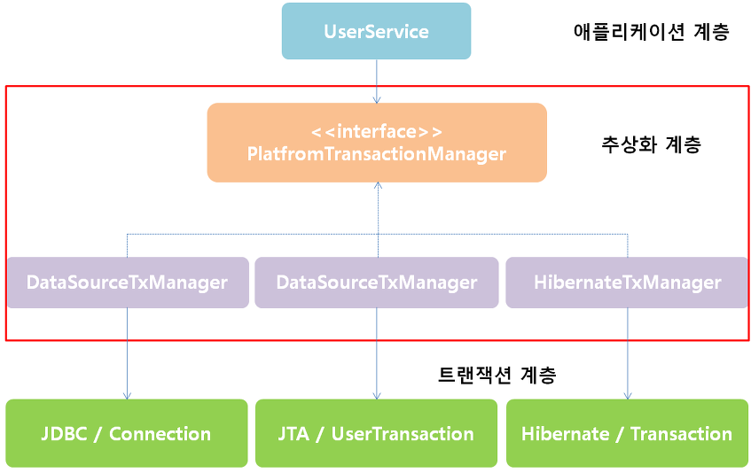

## 개요

5장에서는 지금까지 만든 DAO에 트랜잭션을 적용해보면서 스프링이 어떻게 비슷한 여러 종류의 기술을 추상화하며 일관된 방법으로 기술을 사용할 수 있도록 지원하는지를 살펴볼 예정 !

## 5-1. 비즈니스 로직

5-1장에서는 다음과 같은 새로운 비즈니스 로직(Service)을 추가합니다.

1. 사용자의 레벨은 `BASIC`, `SILVER`, `GOLD` 세 가지 중 하나다.
2. 사용자가 처음 가입하면 `BASIC`, 이후 활동에 따라서 단계가 업그레이드
3. 가입 후 50회 이상 로그인시 `BASIC -> SILVER`
4. `SILVER`이면서 30번 이상 추천받으면 `GOLD`로 업그레이드
5. 사용자 레벨 변경 작업은 일정한 주기를 가지고 일괄적으로 적용된다.

**위의 기능을 메소드화 없이, 한 곳에 로직을 몰아서 구현하면 ?!**

```java:title=UserService.java
// 전체 유저 조회 후 레벨 업그레이드 판단
public void upgradeLevels() {
    List<User> users = userDao.getAll();

    for (User user : users) {
        Boolean changed = null;
        Level level = user.getLevel(); // 현재 레벨
        int login = user.getLogin(); // 로그인 수
        int recommend = user.getRecommend(); // 추천 수

        if (level == Level.BASIC && login >= 50) {
            user.setLevel(Level.SILVER);
            changed = true;
        } else if (level == Level.SILVER && recommend >= 30) {
            user.setLevel(Level.GOLD);
            changed = true;
        } else if (level == Level.GOLD) changed = false;
        else changed = false;
        if (changed) userDao.update(user);
    }
}
```

코드를 보면 이 코드가 무엇을 하는지 정확히 알기 어렵습니다.  
`for-loop` 속에 들어있는 `if/elseif/else` 블록들과 플래그를 두고 확인하는 작업은 깔끔해보이지 않습니다.

따라서, 작성된 코드를 살펴볼 때는 다음과 같은 질문을 해볼 필요가 있습니다.

1. 코드에 중복된 부분은 없는지?
2. 코드가 무엇을 하는 것인지 단번에 알 수 있는지?
3. 코드가 자신이 있어야 할 자리에 있는지?
4. 변경이 일어난다면, 그 변화에 쉽게 대응할 수 있도록 작성되어 있는지?

이번 5-1장의 핵심은 위와 같은 질문을 가지고 코드를 리팩토링하는 것입니다.

#### 무엇을 하는지 단번에 알 수 있도록 리팩토링

코드의 전체 로직은 다음과 같이 요약이 가능합니다.

1. 현재 레벨 확인 후 업그레이드 가능한지 알려주는 로직
2. 다음 레벨 확인, 설정 로직

```java:title=UserService.java
// 기본 작업 흐름만 남겨둔 메소드
public void upgradeLevels() {
    List<User> users = userDao.getAll();

    for (User user : users) {
        // 1. 현재 레벨 확인 후 업그레이드 가능한지 알려주는 로직
        if (canUpgradeLevel(user)) {
            // 2. 다음 레벨 확인, 설정 로직
            upgradeLevel(user);
        }
    }
}
```

`플래그 설정`과 같은 로직이 들어갈 때, 해당 로직을 메소드로 빼기만 하면 플래그를 매번 확인해 작업을 처리하는 로직을 없앨 수 있습니다.

이제, 해당 메소드가 어떤 작업을 하는지 단번에 이해할 수 있습니다.

#### 숫자의 중복 제거하는 리팩토링

**업그레이드 가능 확인 로직**

```java:title=UserService.java
public static final int MIN_LOGCOUNT_FOR_SILVER = 50;
public static final int MIN_RECOMMEND_FOR_GOLD = 30;

// ...
private boolean canUpgradeLevel(User user) {
    Level currentLevel = user.getLevel();

    switch (currentLevel) {
        case BASIC:
            return (user.getLogin() >= MIN_LOGCOUNT_FOR_SILVER);
        case SILVER:
            return (user.getRecommend() >= MIN_RECOMMEND_FOR_GOLD);
        case GOLD:
            return false;
        default:
            throw new IllegalArgumentException("Unknown Level: " + currentLevel);
    }
}
```

여러 곳에 중복되어 사용되는 것도 중복이지만, 한 가지 변경 이유가 발생했을 때, 여러 곳을 고치게 만드는 것도 중복입니다.  
따라서, 이러한 숫자들은 `상수화` 시켜 사용하는 것이 좋습니다.

`장점`은 변경이 일어났을 때 `상수값만 하나만 변경`하면 되고, 숫자가 `어떤 의미를 가지는지`도 파악할 수 있어 가독성에 더 좋습니다.

#### 자신이 있어야 할 자리로 옮기는 리팩토링

**현재 레벨을 파악해 다음 레벨로 업그레이드하는 로직**

```java:title=UserService.java
private void upgradeLevel(User user) {
    if (user.getLevel() == Level.BASIC)
        user.setLevel(Level.SILVER)
    else if (user.getLevel() == Level.SILVER)
        user.setLevel(Level.GOLD)
    userDao.update(user);
}
```

위 코드의 문제점은 `다음 단계가 무엇인지 확인하는 로직` + `사용자 Level 필드 변경 로직`이 함께 있습니다.

`개선 방법`은 다음 단계가 무엇인지 확인하는 로직을 `UserService`가 아닌 `Level` 객체에서 확인하면 됩니다.

**Level enum 객체**

```java:title=Level.java
public enum Level{
    // 다음 단계의 레벨 정보도 함께 추가한다.
    GOLD(3, null), SILVER(2, GOLD), BASIC(1, SILVER);

    // ...
    // getter, setter
}
```

**User의 레벨 업그레이드 작업용 메소드**

```java:title=User.java
public void upgradeLevel() {
    Level nextLevel = this.level.nextLevel();

    if (nextLevel == null) {
        throw new IllegalStateException(this.level + "은 업그레이드가 불가능합니다.");
    } else {
        this.level = nextLevel;
    }
}
```

**간결해진 UserService의 'upgradeLevel()'**

```java:title=UserService.java
private void upgradeLevel(User user) {
    user.upgradeLevel();
    userDao.update(user);
}
```

이제 작업 내용이 명확하게 드러나고 각자 자기 책임에 충실한 작업만 하고 있어 코드를 이해하기 쉬워졌습니다.

#### 레벨업 정책 추상화

더 개선 해보자면, 다음처럼 `연말 이벤트`나, `새로운 서비스 홍보기간` 중에는 레벨업 정책을 다르게 적용할 수 있도록 추상화하는 것도 생각해 볼 수 있습니다.

```java:title=Java
public interface UserLevelUpgradePolicy {
    boolean canUpgradeLevel(User user);
    void upgradeLevel(User user);
}
```

## 5-2. 트랜잭션에서의 서비스 추상화

#### 트랜잭션이란 ?

더 이상 나눌 수 없는 단위인 작업을 말합니다.

작업을 쪼개서 작은 단위로 만들 수 없다는 것은 트랜잭션의 핵심 속성인 `원자성`을 의미합니다.  
따라서, 중간에 예외가 발생해서 작업을 완료할 수 없다면 아예 `작업이 시작되지 않던 초기 상태`로 돌려놔야합니다.

[[info | 추가) 트랜잭션의 특징 - ACID]]
| [1] 원자성 ( Atomicity )  
| [2] 일관성 ( Consistency )  
| [3] 독립성 ( Isolation )  
| [4] 지속성 ( Durability )

#### 트랜잭션 경계 설정

`DB`는 그 자체로 완벽한 트랜잭션을 지원합니다.

하나의 `SQL` 명령어를 처리하는 경우는 `DB`가 트랜잭션을 보장해준다고 믿을 수 있습니다.  
하지만, `여러 개의 SQL`이 사용되는 작업을 하나의 트랜잭션으로 취급해야 하는 경우가 있습니다.  
(은행 시스템의 계좌 이체 로직)

문제는 첫번째 작업은 성공했지만 다음 작업이 실패하는 경우입니다.  
이런 경우는 앞에서 처리한 `SQL` 작업도 취소 되어야합니다.

이런 취소 작업을 `트랜잭션 롤백`(transaction rollback)이라고 합니다.  
또한, 트랜잭션이 성공적으로 마무리되어 `DB`에 반영하는 작업을 `트랜잭션 커밋`(transaction commit)이라고 합니다.

#### UserService와 UserDao의 트랜잭션 문제

데이터 액세스 코드를 DAO로 만들어서 분리해놓았을 경우에는 DAO 메소드를 호출할 때마다 하나의 `새로운 트랜잭션`이 만들어지는 구조가 될 수밖에 없습니다.  
DAO 메소드에서 DB 커넥션을 매번 만들기 때문에 어쩔 수 없이 나타나는 결과입니다.

**여러번 DB에 업데이트를 해야하는 작업을 하나의 트랜잭션으로 묶으려면 ?**

`트랜잭션`은 Connection 오브젝트 안에서 만들어지기 때문에 어떤 일련의 작업이 하나의 트랜잭션으로 묶이려면 그 작업이 진행되는 동안 DB 커넥션이 하나만 사용되면 됩니다.

하지만, 현재는 UserService에서 DB커넥션을 다룰 수 있는 방법이 없습니다.

#### 비즈니스 로직 내의 트랜잭션 경계 설정

UserService와 UserDao를 그대로 둔 채로 트랜잭션을 적용하려면 결국 트랜잭션의 경계설정 작업을 UserService 쪽으로 가져와야 합니다.

**비즈니스 로직 내의 경계 설정**

```java:title=Java
public void upgradeLevels() throws Exception {
    // (1) DB Connection 생성
    // (2) 트랜잭션 시작
    try (
        // (3) DAO 메소드 호출
        // (4) 트랜잭션 커밋
    catch(Exception e) {
        // (5) 트랜잭션 롤백
        throw e;
    finally {
        // (6) DB Connection 종료
    }
}
```

**Connection Object 전달**

UserService에서 만든 Connection 오브젝트를 UserDao에서 사용하려면 DAO 메소드를 호출할 때마다 Connection 오브젝트를 파라미터로 전달해줘야 합니다.

```java:title=Java
public interface UserDao {
    void add(Connection c, User user);
    void get(Connection c, String id);
    // ...
    void update(Connection c, User user);
}
```

이렇게 Connection 오브젝트를 전달해서 사용하면 UserService의 'upgradeLevels()' 안에서 시작한 트랜잭션에 UserDao의 메소드들도 참여하게 할 수 있습니다.

#### UserService 트랜잭션 경계설정의 문제점

1. DB 커넥션을 비롯한 리소스의 깔끔한 처리를 가능하게 했던 `JdbcTemplate`을 더 이상 활용할 수 없음

2. DAO의 메소드와 비즈니스 로직을 담고 있는 UserService의 메소드에 Connection `파라미터가 추가`돼야 함

3. Connection 파라미터가 UserDao 인터페이스 메소드에 추가되면 UserDao는 더 이상 `데이터 액세스 기술`에 독립적일 수가 없다는 점  
   JPA나 하이버네이트로 UserDao의 구현 방식을 변경하려고 하면 Connection 대신 EntityManager나 Session 오브젝트를 UserDao 메소드가 전달받도록 해야 합니다.

4. DAO 메소드에 Connection 파라미터를 받게 하면 `테스트 코드`에도 영향을 줌

## 트랜잭션 동기화

**비즈니스 로직에서 트랜잭션 경계를 설정하려면 어떻게 해야할까?**

스프링은 이 문제를 해결할 수 있는 멋진 방법을 제공해줍니다.

#### Connection 파라미터 제거

파라미터를 제거하기 위해 스프링이 제안하는 방법은 `트랜잭션 동기화`(transaction synchronization) 방식입니다.

`트랜잭션 동기화`란 UserService에서 트랜잭션을 시작하기 위해 만든 Connection 오브젝트를 특별한 저장소에 보관해두고, 이후에 호출되는 DAO의 메소드에서는 저장된 Connection을 가져다가 사용하게 하는 것입니다.

`트랜잭션 동기화 저장소`는 `작업 스레드마다 독립적`으로 Connection 오브젝트를 저장하고 관리하기 때문에 다중 사용자를 처리하는 서버의 멀티스레드 환경에서도 충돌이 날 염려는 없습니다.

#### 트랜잭션 동기화 적용

스프링은 JdbcTemplate과 더불어 이런 트랜잭션 동기화 기능을 지원하는 간단한 유틸리티 메소드를 제공하고 있다.

```java:title=Java
@Service
public class UserService {
    @Autowired
    DataSource dataSource;

    public void upgradeLevels() throws Exception {
        // 트랜잭션 동기화 관리자를 이용해 동기화 작업을 초기화
        TransactionSynchronizationManager.initSynchronization();
        // DB 커넥션을 생성하고 트랜잭션을 시작
        // 이후의 DAO 작업은 모두 여기서 시작한 트랜잭션 안에서 진행
        Connection c = DataSourceUtils.getConnection(dataSource);
        c.setAutoCommit(false);

        try {
            List<User> users = userDao.getAll();
            for (User user : users) {
                if (canUpgradeLevel(user)) {
                    upgradeUser(user);
                }
            }
            c.commit();
        } catch (Exception e) {
            c.rollback(); // 예외가 발생하면 롤백
            throw e;
        } finally {
            // 스프링 유틸리티 메소드를 이용해 DB 커넥션을 안전하게 닫는다.
            DataSourceUtils.releaseConnection(c, dataSource);
            // 동기화 작업 종료 및 정리
            TransactionSynchronizationManager.unbindResource(this.dataSource);
            TransactionSynchronizationManager.clearSynchronization();
        }
    }
}
```

**스프링이 제공하는 유틸리티 메소드를 쓰는 이유?**

DataSource에서 Connection을 직접 가져오지 않고, 스프링이 제공하는 유틸리티 메소드를 쓰는 이유는 `DataSourceUtils`의 getConnection() 메소드는 `Connection 오브젝트를 생성`해줄 뿐만 아니라 트랜잭션 동기화에 사용하도록 `저장소에 바인딩`해주기 때문에 사용합니다.

**만약 여러 개의 DB에 접근하고 싶다면?**

한 개 이상의 DB로의 작업을 하나의 트랜잭션으로 만드는 것은 JDBC의 Connection을 이용한 트랜잭션 방식인 로컬 트랜잭션으로는 불가능합니다.  
따라서, 별도의 트랜잭션 관리자를 통해 `글로벌 트랜잭션` 방식을 사용해야합니다.

> 자바에서는 글로벌 트랜잭션 매니저인 `JTA`를 제공 !!

## 기술과 환경에 종속되는 트랜잭션

또 다른 새로운 문제는 `하이버네이트`를 이용한 트랜잭션 관리 코드는 `JDBC`나 `JTA`의 코드와는 또 다르다는 것입니다.  
`하이버네이트`는 Connection을 직접 사용하지 않고 `Session`이라는 것을 사용하고, 독자적인 트랜잭션 관리 API를 사용합니다.

#### 스프링의 트랜잭션 서비스 추상화

스프링은 트랜잭션 기술의 공통점을 담은 트랜잭션 추상화 기술을 제공합니다.



출처 : https://yangbongsoo.gitbooks.io

#### 트랜잭션 서비스 추상화 적용

```java:title=Java
@Service
public class UserService {
    // ...
    @Autowired
    private PlatformTransactionManager transactionManager;

    public void upgradeLevels() throws SQLException {
        TransactionStatus status = this.transactionManager.getTransaction(new DefaultTransactionDefinition());

        try {
            List<User> users = userDao.getAll();
            for (User user : users) {
                if (canUpgradeLevel(user)) {
                    upgradeLevel(user);
                }
            }
            transactionManager.commit(status);
        } catch (RuntimeException e) {
            transactionManager.rollback(status);
            throw e;
        }
    }
    // ...
}
```

## 정리

- 비즈니스 로직을 담은 코드는 데이터 액세스 로직 코드와 분리되어야 함
- DAO를 사용하는 비즈니스 로직에는 단위 작업을 보장해주는 트랜잭션이 필요
- 스프링이 제공하는 트랜잭션 동기화 기법, 트랜잭션 추상화 기법을 활용

## 마무리

다음은 포스트에서는 `단일 책임 원칙`과 `테스트를 위한 서비스 추상화`에 대해 알아보겠습니다.
