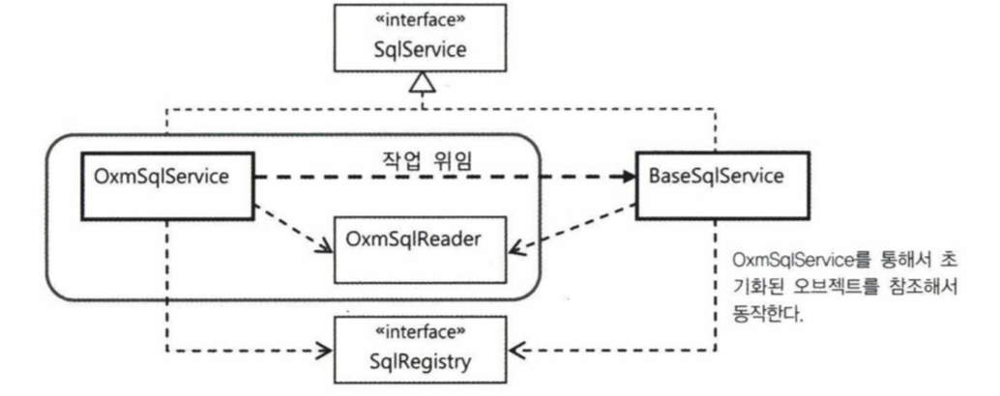
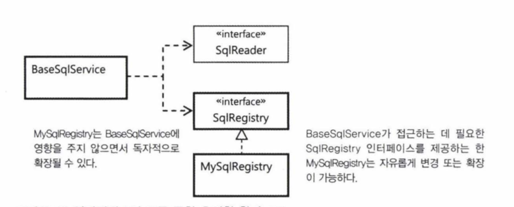
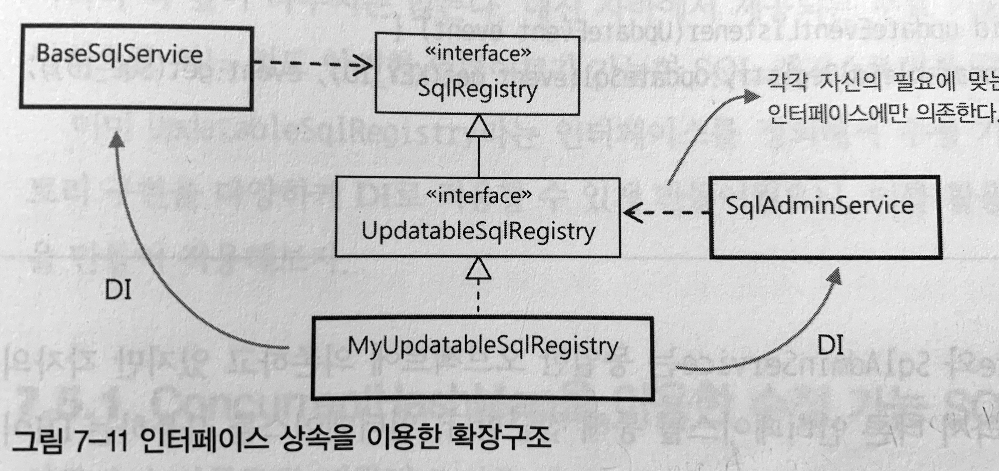

## 개요

7-3 파트에서는 다음과 같은 두 가지 개선 사항을 다룹니다.

- 자바에는 JAXB 외에도 다양한 XML과 자바 오브젝트를 매핑하는 기술이 있다.  
  필요에 따라 다른 기술로 손쉽게 바꿔서 사용할 수 있게 해야 한다.

- XML 파일을 좀 더 다양한 소스에서 가져올 수 있게 만든다.

7-4 파트에서는 스프링의 DI와 인터페이스의 관계에 대해서 더 자세히 알아 볼 예정입니다.

## 7.3 서비스 추상화 적용

#### 1. OXM 서비스 추상화

`JAXB`가 비록 JavaSE, JavaEE의 표준이긴 하지만 다음과 같은 다양한 `OXM` 기술이 있습니다.

`Castor XML`, `JiBX`, `XmlBeans`, `Xstream` 은 모두 `JAXB`와 동일하게 XML 바인딩 기술들입니다.

기능이 같은 여러가지 기술이 존재한다는 이야기는 구체적인 기술과 API에 종속되지 않고 추상화된 레이어와 API를 제공해 구현 기술에 대해 독립적인 코드를 작성하게 해줄 수 있는 `서비스 추상화`가 필요합니다.

스프링에서는 `데이터 액세스 기술`, `트랜잭션` 등에서 살펴 봤던 것 처럼 `OXM`을 위한 `서비스 추상화` 기능 또한 제공합니다.

**OXM이란 ?**

XML과 자바 오브젝트를 매핑해서 상호 변환해주는 기술을 `OXM(Object-XML Mapping)`이라고 합니다.

---

##### OXM 서비스 인터페이스

스프링이 제공하는 `OXM` 추상화 서비스 인터페이스에는 다음과 같은 2가지 인터페이스가 있습니다.

1. `Marshaller` : 자바 오브젝트 -> XML 변환

   ```java:title=Java
   public interface Marshaller {
       public void marshal( Object jaxbElement, javax.xml.transform.Result result )
            throws JAXBException;
   }
   ```

   XML로 변환할 자바 오브젝트와 결과값을 담을 Result 타입의 오브젝트를 넘겨주면 XML 결과를 Result 타입의 result 변수에 돌려줍니다.

2. `Unmarshaller` : XML -> 자바 오브젝트 변환

   ```java:title=Java
   public interface Unmarshaller {
       public Object unmarshal( javax.xml.transform.Source source )
            throws JAXBException;
   }
   ```

   Source 타입의 오브젝트를 주면, 설정에서 지정한 OXM 기술을 이용해 자바오브젝트 트리로 변환하고, 루트 오브젝트를 돌려줍니다.

##### JAXB 구현 테스트

JAXB를 이용하도록 만들어진 Marshaller, Unmarshaller 구현 클래스는 `Jaxb2Marshaller`입니다.

> Marshaller 인터페이스와 Unmarshaller 인터페이스를 모두 구현하고 있다

각 OXM 기술을 변경하더라도 Unmarshaller 타입의 변수를 사용하는 클라이언트 코드들은 수정될 필요가 없어집니다.

#### 2. OXM 서비스 추상화 적용

- 스프링의 OXM 추상화 기능을 이용하는 SqlService를 만들어보자.
- SqlReader와 SqlRegistry라는 두 개의 전략을 활용하는 구조를 적용해봤으므로, 이를 그대로 유지하되 SqlReader 구현 오브젝트에 대한 의존관계를 고정시켜버리는 방법을 생각해볼 수 있다.
  - SQL을 읽는 방법을 `OXM으로 제한`시켜 OXM을 이용하는 서비스 구조로 최적화 해 `하나의 빈 설정`으로 프로퍼티 설정이 가능 하도록 하기 위해서

```java:title=Java
public class OxmSqlService implements SqlService {

    private final OxmSqlReader sqlReader = new OxmSqlReader(); // 의존 관계 고정

    public void setUnmarshaller(Unmarshaller unmarshaller) {
        this.sqlReader.setUnmarshaller(unmarshaller);
    }

    public void setSqlmapFile(String sqlmapFile) {
        this.sqlReader.setSqlmapFile(sqlmapFile);
    }

    @Override
    public String getSql(String key) throws SqlRetrievalFailureException {
        // ...
    }

    // 외부에서 사용 못하도록 private 선언
    private static class OxmSqlReader implements SqlReader {
        private Unmarshaller unmarshaller;
        private String sqlmapFile;

        public void setUnmarshaller(Unmarshaller unmarshaller) {
            this.unmarshaller = unmarshaller;
        }

        public void setSqlmapFile(String sqlmapFile) {
            this.sqlmapFile = sqlmapFile;
        }

        @Override
        public void read(SqlRegistry sqlRegistry) {
            // ...
        }
    }
}
```

OxmSqlService와 OxmSqlReader는 구조적으로는 강하게 결합되어 있지만 논리적으로 명확하게 분리되는 구조입니다.  
밖에서 볼 때는 하나의 오브젝트로 보이지만 내부에서는 의존관계를 가진 두 개의 오브젝트가 깔끔하게 결합돼서 사용됩니다.

유연성은 조금 손해를 보더라도 내부적으로는 `낮은 결합도`와 `높은 응집도`를 가진 구현을 가집니다.

- 낮은 결합도 : OxmSqlService는 모두 인터페이스를 통해 접근하므로
- 높은 응집도 : 독점하니 하나의 빈으로 등록 가능

#### 3. 위임을 이용한 BaseSqlService의 재사용

OxmSqlService와 BaseSqlService의 `loadSql()` 메소드와 `getSql()` 메소드가 중복이 생기는 문제점 발생 !

물론 이정도의 중복은 무시해도 괜찮지만 `loadSql()`와 `getSql()` 메소드의 작업이 매우 복잡하다면 ?

- 수정이 필요할 때마다 양쪽을 함께 변경해야하고 실수할 가능성도 높아짐

##### 해결 방법

이런 경우에는 `위임 구조`를 이용해 코드의 중복을 제거할 수 있습니다.

위임 구조라면, `프록시`를 만들 때 사용해봤습니다.  
하지만, 위임구조를 만들기 위해 OxmSqlService와 BaseSqlService 두 개를 빈으로 등록하는 것은 불편한 일이고 부가기능 프록시처럼 많은 타깃에 적용할 것도 아니고 특화된 서비스를 위해 한 번만 사용할 것이기 때문에 유연한 DI방식이 아닌 두 개의 클래스를 하나로 묶는 방법을 설계합니다.



---

아래 코드는 위임 구조를 이용한 OxmSqlService 코드입니다.

```java:title=Java
public class OxmSqlService implements SqlService {

    private final OxmSqlReader sqlReader = new OxmSqlReader();
    private final BaseSqlService sqlService = new BaseSqlService();
    private SqlRegistry sqlRegistry = new HashMapSqlRegistry();

    public void setSqlRegistry(SqlRegistry sqlRegistry) {
        this.sqlRegistry = sqlRegistry;
    }

    public void setUnmarshaller(Unmarshaller unmarshaller) {
        this.sqlReader.setUnmarshaller(unmarshaller);
    }

    public void setSqlmapFile(String sqlmapFile) {
        this.sqlReader.setSqlmapFile(sqlmapFile);
    }

    // 빈 후처리 시 위임을 이용한 초기화
    @PostConstruct
    public void loadSql() {
        this.sqlService.setSqlReader(this.sqlReader);
        this.sqlService.setSqlRegistry(this.sqlRegistry);

        this.sqlService.loadSql();
    }

    @Override
    public String getSql(String key) throws SqlRetrievalFailureException {
        return sqlService.getSql(key);
    }
    ...
}
```

## 3. 리소스 추상화

위의 추상화 접근과 동일하게 리소드 또한 리소스에 접근할 방법이 `클래스 패스`, `파일 시스템`, `http`, `ftp` 프로토콜 등 여러가지가 있습니다.

스프링은 이러한 여러 기술에 종속적이지 않도록 자바에 존재하는 일관성 없는 `리소스 접근 API`를 추상화해서 `Resource`라는 추상화 인터페이스를 제공합니다.

```java:title=Java
public interface Resource extends InputStreamSource {
    // 리소스의 존재나 읽기 가능한지에 대한 여부 확인 가능 or 스트림이 열려 있는지 확인 가능
    boolean exists();
    boolean isReadable();
    boolean isOpen();

    // JDK의 URI, URL, File 형태로 전환 가능한 리소스에 사용
    URL getURL() throws IOException;
    URI getURI() throws IOException;
    File getFile() throws IOException;

    // 리소스에 대한 이름과 부가적인 정보 제공
    long lastModified() throws IOException;
    String getFilename();
    String getDescription();
}

public interface InputStreamSource {
    // 모든 리소스는 InputStream형태로 가져올 수 있다.
    InputStream getInputStream() throws IOException;
}
```

- `애플리케이션 컨텍스트`가 사용할 설정정보 파일을 지정하는 것부터 시작해서 스프링의 거의 모든 API는 외부의 리소스 정보가 필요할 때는 항상 이 `Resource 추상화`를 이용합니다.
- Resource는 스프링에서 빈이 아니라 `값`으로 취급됩니다.
  리소스는 OXM이나 트랜잭션처럼 서비스를 제공해주는 것이 아니라 단순한 정보를 가진 값으로 지정합니다.

값으로 취급하기 때문에 `<property>`를 통해서만 설정이 가능합니다.  
하지만, `value` 애트리뷰트는 `단순한 문자열`만 넣을 수 있습니다.

##### 리소스 로더

그래서 스프링에는 URL 클래스와 유사하게 접두어를 이용해 Resource 오브젝트를 선언하는 방법을 제공합니다.

- `classpath:`
  - 클래스패스 루트부터 절대위치
- `file:`
  - 파일 시스템 루트 디렉토리부터 시작하는 위치
- `http:`
  - 접근 가능한 웹 리소스 위치

`ResourceLoader`의 대표적인 예는 바로 스프링의 애플리케이션 컨텍스트입니다.  
스프링 설정 정보가 담긴 XML 파일도 리소스 로더를 이용해 Resource 형태로 읽어옵니다.

## 7.4 인터페이스 상속을 통한 안전한 기능 확장

만약, 애플리케이션을 새로 시작하지 않고 특정 SQL의 내용만을 변경하고 싶다면 어떻게 해야 할지 `스프링 답게` 접근하는 방법이 무엇인지 생각해봅시다.

#### 1. DI와 기능의 확장

스프링과 같은 DI 프레임워크를 적용하고 빈 설정파일을 이용해 애플리케이션을 구성했다고 해서 `DI`를 바르게 활용하고 있다고 볼 수는 없습니다.  
`DI`의 가치를 제대로 얻으려면 먼저 `DI`에 적합한 오브젝트 설계가 필요하다.

##### DI를 의식하는 설계

객체 지향 설계를 잘하는 방법은 다양하겠지만, 그중에서 추천하고 싶은 한가지는 바로 `DI`를 의식하면서 설계하는 방식입니다.

- `DI`는 런타임시에 의존 오브젝트를 다이내믹하게 연결해줘서 유연한 확장을 꾀하는게 목적이기 때문에 항상 확장을 염두에 두고 오브젝트 사이의 관계를 생각해야 합니다.

- `DI`는 확장을 위해 필요한 것이므로 항상 미래에 일어날 변화를 예상하고 고민해야 적합한 설계가 가능해집니다.

**DI란 결국 미래를 프로그래밍하는 것이다.**

##### DI와 인터페이스 프로그래밍

DI를 적용할 때는 가능한 한 `인터페이스`를 사용하게 해야 합니다.

인터페이스를 사용해야하는 이유는 `2가지`가 있습니다.

1. 다형성을 얻기 위해서
   - 하나의 인터페이스를 통해 여러 개의 구현을 바꿔가면서 사용할 수 있게 하는 것이 DI가 추구하는 첫번째 목적
2. 인터페이스 분리 원칙을 통해 클라이언트와 의존 오브젝트 사이의 관계를 명확하게 해줄 수 있기 때문
   - A와 B가 인터페이스로 연결되었다는 의미는 A는 B를 해당 인터페이스라는 `창`을 통해서만 바라본다는 뜻

DI는 특별한 이유가 없는 한 항상 인터페이스를 사용한다고 기억해둡시다 !

---

**# 인터페이스 분리 원칙이란?**

오브젝트가 그 자체로 충분히 응집도가 높은 작은 단위로 설계됐더라도, 목적과 관심이 각기 다른 클라이언트가 있다면 인터페이스를 통해 이를 적절하게 분리해줄 필요가 있고 이를 객체지향 설계 원칙에서는 `인터페이스 분리 원칙`이라고 부릅니다.

#### 2. 인터페이스 상속

BaseSqlService는 SqlReader와 SqlRegistry라는 두 개의 인터페이스를 통해 의존 오브젝트들을 DI 하도록 되어 있고 아래 그림은 인터페이스와 DI가 적용된 전형적인 구조를 보여줍니다.



이렇게 인터페이스 분리 원칙이 주는 장점은 2가지가 있습니다.

1. 모든 클라이언트가 자신의 관심에 따른 접근 방식을 불필요한 간섭 없이 유지할 수 있다는 점
2. SqlRegistry의 구현 클래스인 MySqlRegistry의 오브젝트가 또 다른 제3의 클라이언트를 위한 인터페이스를 가질 수 있다는 점

---

```java:title=Java
public interface SqlRegistry {
    void registerSql(String key, String vale);
    String findSql(String key) throws SqlNotFoundException;
}
```

- 여기에 이미 등록된 SQL을 변경할 수 있는 기능을 넣어서 확장하고 싶다고 생각해볼때, 기존의 인터페이스에 기능을 추가하는 것은 바람직하지 않습니다.

- 새롭게 추가하는 기능은 새로운 인터페이스에 기존 `SqlRegistry`를 상속 받아 확장하는 게 바람직합니다.

```java:title=Java
public interface UpdatableSqlRegistry extends SqlRegistry {
    void updateSql(String key, String value) throws SqlUpdateFailureException;
    void updateSql(Map<String, String> sqls) throws SqlUpdateFailureException;
}
```

- 아마도 관리자가 사용할 SQL 관리 기능을 받은 오브젝트가 새로운 클라이언트가 될 것입니다.

새로운 관리 기능을 받은 클래스를 `SqlAdminService`라고 하고 새로운 SQL 업데이트 기능을 구현한 SQL 클래스를 `MyUpdateSqlRegistry` 라고 하면 구조는 다음과 같습니다.



중요한 것은 클라이언트가 정말 필요한 기능을 가진 인터페이스를 통해 오브젝트에 접근하도록 만들었는가입니다.

---

_잘 적용된 DI는 결국 잘 설계된 오브젝트 의존관계에 달려 있습니다.  
인터페이스를 적절하게 분리하고 확장하는 방법을 통해 오브젝트 사이의 의존관계를 명확하게 해주고, 기존 의존관계에 영향을 주지 않으면서 유연한 확장성을 얻는 방법이 무엇인지 항상 고민해야 합니다._
